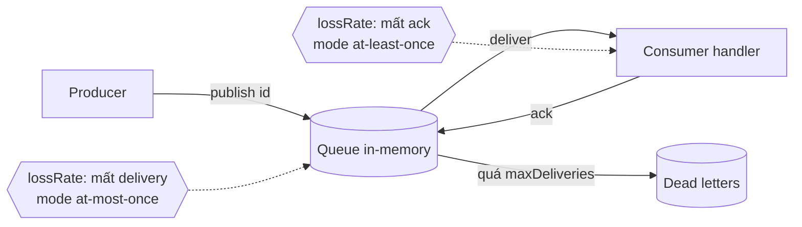
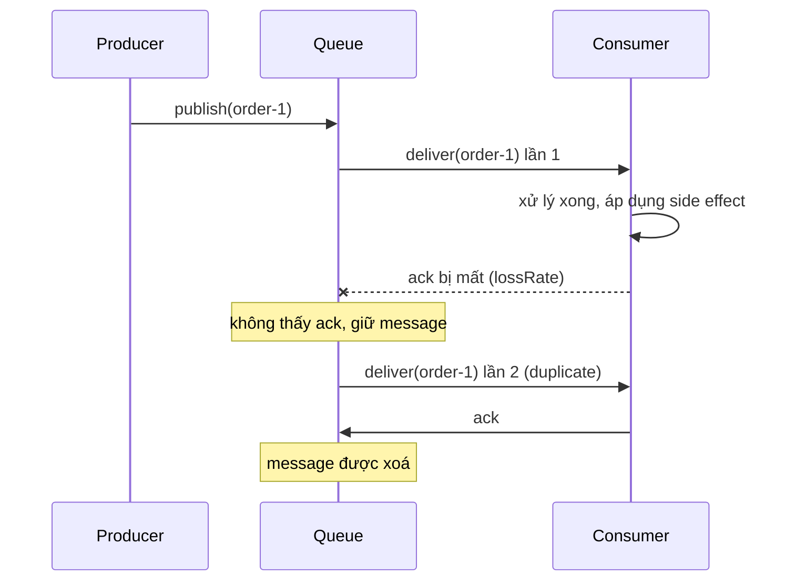

# Lab 01 - Delivery semantics

## Mục tiêu

Tự tay tạo ra ba hành vi mà mọi broker đều phải chọn giữa, bằng một broker in-memory có thể tiêm lỗi:

- at-most-once làm mất message khi giao hoặc khi consumer crash.
- at-least-once không mất message nhưng giao trùng khi ack bị mất.
- idempotent consumer biến at-least-once thành effectively-once bằng cách bỏ qua id đã xử lý.

Lab không cần broker hay Docker.
Lý thuyết nền tảng nằm ở [theory.md](../theory.md).

## Kiến trúc



Luồng lỗi của at-least-once: consumer xử lý xong nhưng ack bị mất, broker không biết nên giao lại.



## Giao diện

TypeScript (`ts/lab.ts`):

```ts
createQueue(opts: {
  mode: "at-most-once" | "at-least-once";
  lossRate: number; // 0..1
  rand?: () => number; // mặc định Math.random
  maxDeliveries?: number; // mặc định 5, chỉ dùng cho at-least-once
}): Queue;
// Queue: publish(id), consume(handler), drain(): Promise<void>, deadLetters(): string[]
createIdempotentHandler(apply: (id: string) => void): (id: string) => void;
```

Go (`go/lab.go`): `NewQueue(Options{Mode, LossRate, Rand, MaxDeliveries}) *Queue` với `Publish`, `Consume`, `Drain`, `DeadLetters`, và `NewIdempotentHandler(apply Handler) Handler`.
`Handler` là `func(id string) error`, `Rand` mặc định là `rand.Float64`.

Ý nghĩa của `lossRate`:

- `at-most-once`: xác suất delivery bị mất, handler không bao giờ thấy message.
- `at-least-once`: xác suất ack bị mất, nên message được giao lại và handler thấy duplicate.
- `lossRate = 1` nghĩa là luôn mất (xác định, không ngẫu nhiên), `lossRate = 0` nghĩa là không bao giờ mất.

Mô hình consumer crash: handler ném lỗi (TS) hoặc trả `error` (Go) trong lúc xử lý.
Ở at-most-once, broker đã quên message nên công việc mất vĩnh viễn.
Ở at-least-once, broker không nhận được ack nên giao lại.

`maxDeliveries` là thứ phải thêm vào so với interface gốc, vì với `lossRate = 1` thì redelivery sẽ không bao giờ dừng.
Sau số lần giao này message được đưa vào `deadLetters()`, tương ứng trạng thái `dead` trong theory.

Thứ tự: message giao lại được xếp sau các message đang chờ, nên thứ tự nhận không bảo toàn thứ tự gửi.

## Chạy

```bash
pnpm vitest run 01-fundamentals/lab-01-delivery-semantics/ts
go test -race ./01-fundamentals/lab-01-delivery-semantics/go/...
make lab-ts LAB=01-fundamentals/lab-01-delivery-semantics
make lab-go LAB=01-fundamentals/lab-01-delivery-semantics
```

## Kết quả mong đợi

Test (cùng tên ở TS và Go, Go dùng CamelCase):

| Test                                                        | Chứng minh                                                                                  |
| ----------------------------------------------------------- | ------------------------------------------------------------------------------------------- |
| `at_most_once_loses_messages_when_consumer_crashes`         | handler crash ở message thứ hai, message đó không bao giờ được giao lại                     |
| `at_most_once_drops_every_delivery_when_loss_rate_is_one`   | `lossRate = 1` làm mất toàn bộ delivery                                                     |
| `at_least_once_redelivers_when_consumer_crashes`            | không ack thì broker giao lại và lần sau xử lý được                                         |
| `at_least_once_duplicates_when_ack_is_lost`                 | `lossRate = 1`: mọi ack mất, mỗi id được giao đúng `maxDeliveries` lần rồi vào dead letters |
| `at_least_once_stops_redelivering_once_an_ack_gets_through` | rand có kịch bản: một ack mất, ack thứ hai tới, đúng một duplicate                          |
| `idempotent_consumer_applies_each_id_once`                  | nhận `4n` delivery nhưng mỗi id chỉ được áp dụng một lần                                    |
| `idempotent_consumer_retries_an_id_whose_apply_failed`      | apply lỗi thì id không bị coi là trùng, lần sau được thử lại                                |

Go có thêm `TestQueueIsSafeForConcurrentPublish` để chạy với `-race`.

Demo in ra, cho cùng 6 message và `lossRate = 0.4`, ba khối: at-most-once có `never applied` khác `none`, at-least-once có `duplicates applied` lớn hơn 0, và at-least-once kèm idempotent consumer có `applied: 6` và `duplicates applied: 0`.
Demo TS và Go dùng PRNG khác nhau nên con số cụ thể khác nhau, nhưng ba kết luận trên luôn đúng.

## Bài tập mở rộng

1. Đặt `lossRate = 0` ở at-most-once rồi tăng dần lên 0.5, 0.9 và đếm tỉ lệ message được xử lý.
2. Đổi thứ tự trong `createIdempotentHandler`: ghi marker sau khi `apply` thành công, rồi chứng minh crash giữa hai bước làm side effect bị áp dụng hai lần.
3. Thêm chế độ "ack trước khi xử lý" ở at-least-once và so sánh với at-most-once.
4. Tăng `maxDeliveries` và quan sát số duplicate theo `lossRate`.
