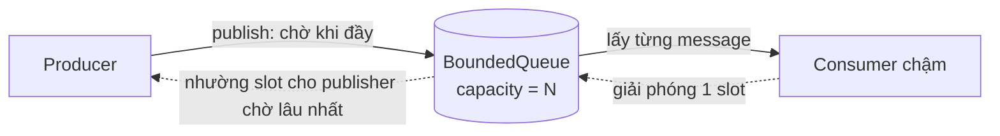
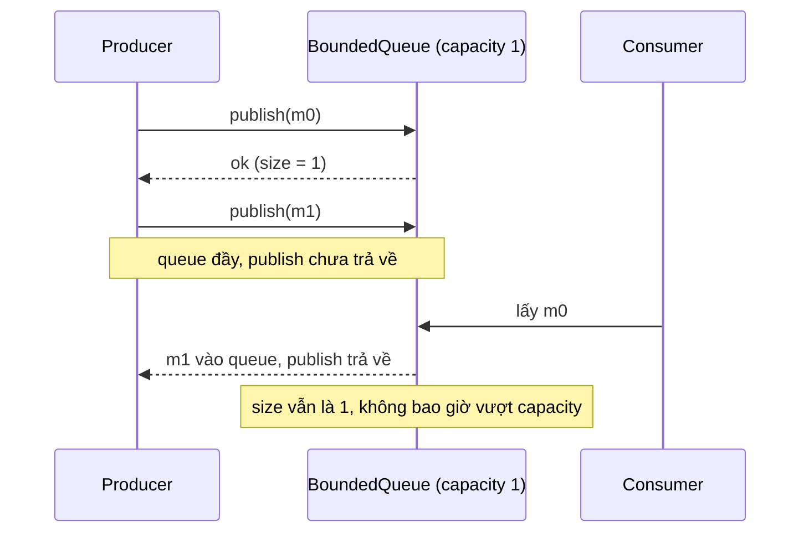

# Lab 02 - Backpressure

## Mục tiêu

Thấy tận mắt vì sao queue phải có giới hạn:

- Khi producer nhanh hơn consumer, queue không giới hạn chỉ che giấu quá tải bằng cách lớn dần và tăng latency.
- Bounded queue làm `publish` chờ khi đầy, nên producer bị kéo chậm về nhịp của consumer.
- Kích thước queue không bao giờ vượt capacity, kể cả khi consumer rất chậm.

Lab không cần broker hay Docker.
Lý thuyết nền tảng nằm ở [theory.md](../theory.md).

## Kiến trúc



Diễn biến khi queue đầy với `capacity = 1`:



## Giao diện

TypeScript (`ts/lab.ts`):

```ts
class BoundedQueue<T> {
  constructor(capacity: number); // số nguyên >= 1, nếu không thì ném RangeError
  publish(msg: T): Promise<void>; // chờ khi đầy
  consume(handler: (msg: T) => void | Promise<void>): void;
  size(): number;
}
```

Go (`go/lab.go`): `NewBoundedQueue[T](capacity)` với `Publish(ctx, msg) error`, `Consume(handler func(T))`, `Size() int`, và `Close()`.
`Publish` trả `ctx.Err()` nếu context kết thúc khi đang chờ, trả `ErrClosed` sau `Close`.
`Close` chỉ có ở Go vì `Consume` mở một goroutine cần điểm dừng, và nó cũng cho `Publish` đang chờ một lối thoát.

Quy ước chung của hai bản:

- Consumer chạy tuần tự, một message tại một thời điểm.
- Message đang được consumer xử lý đã rời queue nên không tính vào `size()`.
- Slot trống được nhường cho publisher đang chờ lâu nhất, nên thứ tự FIFO được giữ.
- Ở TS, handler ném lỗi thì message bị bỏ (xử lý lỗi là chủ đề của lab 01).

## Chạy

```bash
pnpm vitest run 01-fundamentals/lab-02-backpressure/ts
go test -race ./01-fundamentals/lab-02-backpressure/go/...
make lab-ts LAB=01-fundamentals/lab-02-backpressure
make lab-go LAB=01-fundamentals/lab-02-backpressure
```

## Kết quả mong đợi

Test (cùng tên ở TS và Go, Go dùng CamelCase):

| Test                                             | Chứng minh                                                                                                                                              |
| ------------------------------------------------ | ------------------------------------------------------------------------------------------------------------------------------------------------------- |
| `publish_blocks_when_queue_full`                 | với `capacity = 1` và `capacity = 3`: publish thứ `capacity + 1` không hoàn thành cho tới khi consumer lấy một message, rồi hoàn thành và queue lại đầy |
| `size_never_exceeds_capacity_with_slow_consumer` | 20 message, `capacity = 3`, consumer bị giữ: `size()` đạt `capacity` nhưng không bao giờ vượt, thứ tự FIFO được giữ                                     |
| `publish_rejects_a_capacity_below_one` (chỉ TS)  | capacity 0 hoặc không nguyên bị từ chối                                                                                                                 |
| `TestPublishReturnsErrClosedAfterClose` (chỉ Go) | `Publish` sau `Close` trả `ErrClosed`                                                                                                                   |

Cách test không dùng sleep cố định:

- TS cho publish đang chờ chạy đua với một promise đã resolve sẵn và để event loop quay một vòng, rồi dùng `eventually` để chờ publish hoàn thành sau khi consumer lấy message.
- Go chứng minh blocking bằng cách `Publish` với context có deadline trên queue đầy phải trả `DeadlineExceeded`, rồi dùng `Eventually` để chờ publish hoàn thành sau khi consumer lấy message.
- Consumer chậm là một handler bị giữ bằng gate do test mở, không phải một lần ngủ.

Demo (`capacity = 3`, consumer mất 40ms mỗi message, 10 message) in một dòng cho mỗi sự kiện.
Bốn message đầu được nhận ngay (một đang ở consumer, ba trong queue), sau đó mỗi lần consumer lấy một message thì producer mới được nhận thêm một message, khoảng cách giữa các dòng `accepted` bằng nhịp consumer.
Dòng `size` của producer không bao giờ vượt `3/3`.

## Bài tập mở rộng

1. Đổi capacity thành 1, 10 và 100 rồi so sánh thời gian producer hoàn thành so với thời gian consumer hoàn thành.
2. Thêm `tryPublish` trả `false` ngay khi đầy (load shedding) thay vì chờ.
3. Cho `publish` nhận `AbortSignal` ở TS, tương đương với `context` ở Go.
4. Thêm nhiều consumer song song và kiểm tra FIFO còn đúng không.
