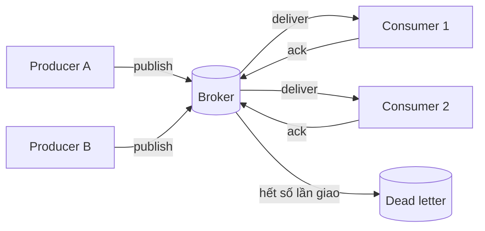
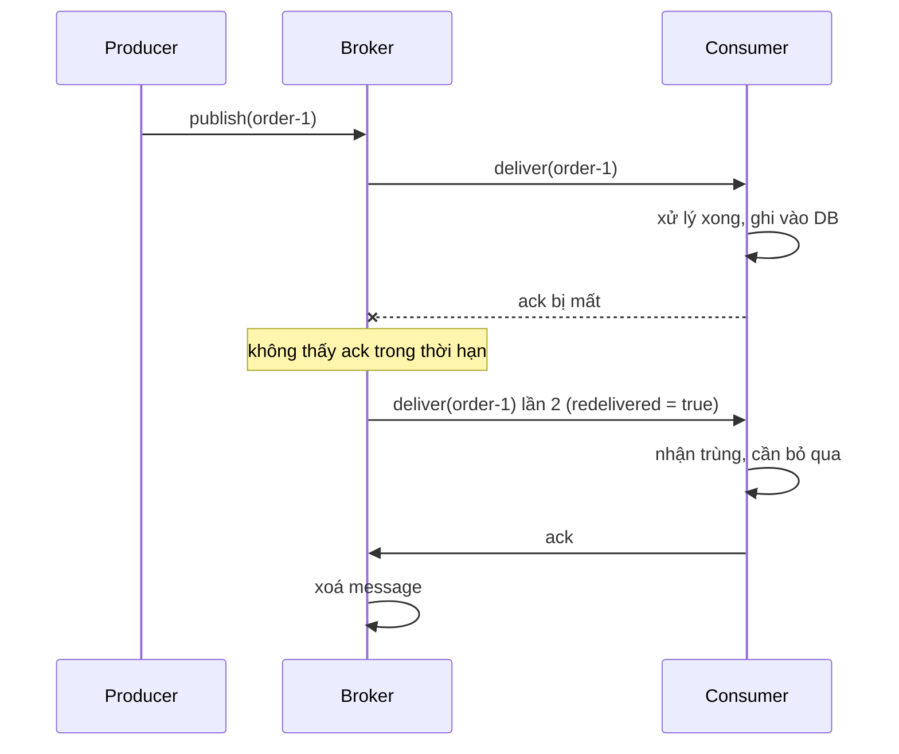
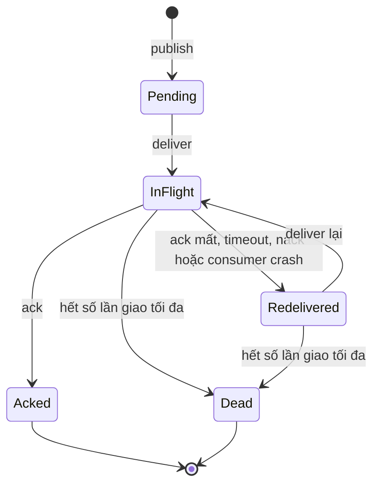

# Chủ đề 01 - Fundamentals

Chương này dựng bộ từ vựng dùng cho cả handbook: vì sao cần message queue, các mô hình giao message, delivery semantics, ordering và backpressure.
Hai lab đi kèm chạy in-memory, không cần broker:

- [Lab 01 - Delivery semantics](./lab-01-delivery-semantics/README.md)
- [Lab 02 - Backpressure](./lab-02-backpressure/README.md)

## Vì sao dùng message queue

Queue đặt giữa producer và service đóng vai trò buffer.
Service xử lý theo nhịp của nó, còn producer không bị chậm khi service tạm không sẵn sàng.
Hai lợi ích chính:

- Load leveling: queue hấp thụ các đợt tăng tải đột ngột, consumer xử lý đều đặn.
- Decoupling: producer và consumer không cần cùng online, cùng ngôn ngữ hay cùng tốc độ.

Cái giá phải trả: nếu tốc độ trung bình của producer lớn hơn consumer thì queue tăng dần và latency tăng.
Vì vậy phải theo dõi queue depth, scale consumer trong giới hạn an toàn hoặc shed work ở producer.
Autoscale consumer mà không giới hạn tốc độ downstream chỉ chuyển quá tải sang dependency phía sau.

Nguồn: https://learn.microsoft.com/en-us/azure/architecture/patterns/queue-based-load-leveling

## Mô hình tổng quát

Broker nhận message từ producer, giữ lại, giao cho consumer và chờ ack.
Mọi quyết định về mất mát, trùng lặp, thứ tự và tốc độ đều nằm ở ba đoạn: publish, deliver và ack.

## Queue, pub/sub và log

Ba mô hình khác nhau ở chỗ ai nhận message và message còn lại bao lâu:

- Queue (competing consumers): mỗi message chỉ một consumer nhận.
  Thêm consumer để tăng throughput.
- Publish/subscribe: mọi subscriber nhận mọi message.
  Thêm subscriber để thêm người nghe, không tăng throughput của một người nghe.
- Log: lưu trữ append-only có offset, consumer tự giữ vị trí đọc và có thể đọc lại.
  Khác queue ở chỗ message không bị xoá sau khi ack.

Nguồn: https://learn.microsoft.com/en-us/azure/architecture/patterns/competing-consumers

Redis Pub/Sub là at-most-once: message đẩy đi một lần, subscriber lỗi hoặc rớt kết nối thì message mất vĩnh viễn và không có history.
Redis docs khuyên dùng Streams khi cần đảm bảo mạnh hơn, vì message trong stream được persist và hỗ trợ cả at-most-once lẫn at-least-once.

Nguồn: https://redis.io/docs/latest/develop/pubsub/

Kafka tổng quát hoá queue và pub/sub bằng consumer group.
Mỗi partition chỉ được một consumer trong một group đọc tại một thời điểm, còn nhiều group cùng đọc một topic cho ra hành vi pub/sub.
Cách mô tả log là suy ra từ mô hình offset của Kafka design doc, không phải một định nghĩa chính thức.

Nguồn: https://kafka.apache.org/41/design/design/

| Tiêu chí             | Queue                   | Pub/sub                   | Log                                                          |
| -------------------- | ----------------------- | ------------------------- | ------------------------------------------------------------ |
| Ai nhận một message  | Một consumer            | Mọi subscriber            | Mọi consumer group, mỗi group một consumer cho mỗi partition |
| Sau khi xử lý xong   | Xoá sau ack             | Không giữ (Redis Pub/Sub) | Giữ lại, đọc lại được bằng offset                            |
| Vị trí đọc do ai giữ | Broker (trạng thái ack) | Không có                  | Consumer (offset)                                            |
| Đọc lại (replay)     | Không                   | Không                     | Có                                                           |
| Ví dụ trong handbook | RabbitMQ queue, BullMQ  | Redis Pub/Sub, NATS core  | Kafka, Redis Streams, JetStream                              |

## Delivery semantics

Có ba mức, mô tả điều gì xảy ra với một message khi có lỗi:

| Mức           | Mất message | Giao trùng | Khi nào chọn                                                       |
| ------------- | ----------- | ---------- | ------------------------------------------------------------------ |
| At-most-once  | Có thể      | Không      | Dữ liệu chịu được mất (metric, trạng thái tạm)                     |
| At-least-once | Không       | Có thể     | Mặc định của hầu hết queue, kèm consumer idempotent                |
| Exactly-once  | Không       | Không      | Chỉ đạt được trong phạm vi hệ thống kiểm soát toàn bộ, xem mục sau |

- At-most-once: message có thể mất nhưng không bao giờ redeliver.
- At-least-once: message không mất nhưng có thể bị giao nhiều lần, và là mặc định của Kafka.
- Exactly-once theo định nghĩa lý tưởng: mỗi message được giao đúng một lần, không mất, không đọc hai lần dù có lỗi.

Nguồn: https://docs.confluent.io/kafka/design/delivery-semantics.html

Redis Streams cho at-least-once: message nằm trong Pending Entries List cho tới khi `XACK`.
Consumer chết trước `XACK` thì message vẫn trong PEL và consumer khác có thể `XCLAIM` hoặc `XAUTOCLAIM`.

Nguồn: https://redis.io/docs/latest/develop/data-types/streams/

### Ack bị mất dẫn tới redeliver

Producer và broker không phân biệt được ba tình huống: message chưa tới, ack bị mất, và consumer chết sau khi xử lý.
Với broker, cả ba trông giống nhau: không thấy ack.
Chọn gửi lại thì có thể trùng, chọn không gửi lại thì có thể mất.

[Lab 01](./lab-01-delivery-semantics/README.md) tái hiện đúng đường lỗi này bằng `lossRate`, và chứng minh `lossRate = 1` làm mọi ack mất.

### Vòng đời của một message

- `Pending`: broker đã nhận, chưa giao.
- `InFlight`: đã giao cho consumer, chờ ack.
- `Acked`: consumer xác nhận, broker xoá message (với queue) hoặc đẩy offset (với log).
- `Redelivered`: không nhận được ack, đang chờ giao lại.
  Message giao lại mang cờ `redelivered`, ví dụ `redeliver = true` ở RabbitMQ.
- `Dead`: vượt số lần giao tối đa, chuyển sang dead letter hoặc bị bỏ.

## Exactly-once và effectively-once

Không thể có exactly-once delivery end to end qua mạng không tin cậy, vì lý do ở mục ack bị mất: phải chọn gửi lại (có thể trùng) hoặc không gửi lại (có thể mất).

Nguồn: https://bravenewgeek.com/you-cannot-have-exactly-once-delivery/

Hệ thống thực tế "giả lập" exactly-once bằng at-least-once delivery cộng với xử lý idempotent hoặc dedup, còn gọi là effectively-once hoặc exactly-once processing.
Phạm vi exactly-once của Kafka là Kafka-to-Kafka:

- Idempotent producer (từ 0.11.0.0) dedup bằng producer ID và sequence number.
- Transactions ghi nhiều partition một cách atomic.
- Khi ghi ra hệ thống ngoài, Kafka khuyên lưu offset cùng chỗ với output trong cùng một transaction thay vì two-phase commit.

Nguồn: https://kafka.apache.org/41/design/design/ và https://docs.confluent.io/kafka/design/delivery-semantics.html

Điều kiện để đạt effectively-once:

1. At-least-once delivery: chỉ ack sau khi xử lý xong.
2. Consumer idempotent hoặc dedup bằng key ổn định do producer sinh ra.
3. Cập nhật dedup record và side effect trong cùng một transaction nếu có thể.

[Lab 01](./lab-01-delivery-semantics/README.md) cho thấy bước 2 trong bộ nhớ: nhận `4n` delivery nhưng mỗi id chỉ được áp dụng một lần.
Chương 08 đi tiếp với Inbox pattern và Redis `SET NX EX`, nơi bước 3 được giải quyết đúng.

## So sánh at-most-once, at-least-once và exactly-once theo hành vi

| Tình huống                | At-most-once                 | At-least-once          | Effectively-once                      |
| ------------------------- | ---------------------------- | ---------------------- | ------------------------------------- |
| Delivery bị mất           | Message mất                  | Broker giao lại        | Broker giao lại                       |
| Ack bị mất                | Không áp dụng (không có ack) | Giao trùng             | Giao trùng, consumer bỏ qua           |
| Consumer crash giữa chừng | Message mất                  | Giao lại, xử lý lại    | Giao lại, side effect áp dụng một lần |
| Chi phí                   | Thấp nhất                    | Cần ack và lưu message | Thêm bộ nhớ dedup và transaction      |

## Ordering

Với competing consumers, thứ tự nhận message không được đảm bảo và không nhất thiết phản ánh thứ tự tạo.
Nên thiết kế consumer idempotent để loại bỏ phụ thuộc thứ tự.
Muốn strict ordering phải gom message của cùng một key về một consumer, ví dụ message sessions của Azure Service Bus.
Queue có nhiều consumer song song cũng không bảo toàn thứ tự gốc trong mọi điều kiện.
Message giao lại càng làm thứ tự xáo trộn, vì nó quay lại sau các message đã chờ (lab 01 cố ý mô phỏng điều này).

Nguồn: https://learn.microsoft.com/en-us/azure/architecture/patterns/competing-consumers và https://learn.microsoft.com/en-us/azure/architecture/patterns/queue-based-load-leveling

Kafka giữ thứ tự theo partition, không giữ thứ tự giữa các partition.
Vì vậy key hoá message (cùng key vào cùng partition) là cách giữ thứ tự theo entity.

Nguồn: https://kafka.apache.org/41/design/design/

## Backpressure và bounded queue

Queue không giới hạn chỉ che giấu quá tải.
Khi producer nhanh hơn consumer thì phải shed work hoặc giới hạn ở producer.
Mỗi hệ thống có một cơ chế khác nhau:

- Kafka dùng mô hình pull: consumer tự kéo dữ liệu theo nhịp của mình, trong khi push-based khó xử lý consumer đa dạng vì broker quyết định tốc độ.
- RabbitMQ dùng prefetch (QoS) để giới hạn số message chưa ack đang bay tới một consumer.
  Docs nêu giá trị 100-300 thường cho throughput tối ưu, và 0 là không giới hạn.
- Redis Streams giới hạn kích thước bằng `XADD MAXLEN` (có dạng xấp xỉ `~`) hoặc `XTRIM`.
  Cần nhớ rằng trim có thể xoá message chưa được xử lý.

Nguồn: https://kafka.apache.org/41/design/design/
Nguồn: https://www.rabbitmq.com/docs/confirms
Nguồn: https://redis.io/docs/latest/develop/data-types/streams/

[Lab 02](./lab-02-backpressure/README.md) dựng bounded queue với `publish` chờ khi đầy, và chứng minh `size()` không bao giờ vượt capacity kể cả với `capacity = 1`.

## Acknowledgements

RabbitMQ có hai chế độ ack:

- Automatic: coi là đã giao ngay khi gửi, mất message nếu consumer rớt trước khi xử lý (tương ứng at-most-once trong lab 01).
- Manual: `basic.ack`, `basic.nack`, `basic.reject` (tương ứng at-least-once).

Delivery chưa ack sẽ tự động requeue khi channel đóng, và message redeliver mang cờ `redeliver = true`.
`requeue=false` đẩy message tới Dead Letter Exchange hoặc bỏ.
Publisher confirms là cơ chế độc lập với consumer ack: với message persistent trên durable queue, confirm nghĩa là đã ghi đĩa.

Nguồn: https://www.rabbitmq.com/docs/confirms

Lệnh `XNACK` của Redis (nhả message về lại group không cần ack) có trang riêng và ghi "since 8.8.0".
Chỉ dùng trong lab khi server là Redis 8.8 trở lên, mà stack của handbook dùng Redis 8.10.2.

Nguồn: https://redis.io/docs/latest/commands/xnack/

## Nguồn tham khảo

Phiên bản đã kiểm tra ngày 2026-10-06.
Các lab ở chương này là in-memory nên không phụ thuộc phiên bản broker, các phiên bản dưới đây là của tài liệu được trích dẫn.

- Azure Architecture Center, Queue-Based Load Leveling pattern
  Nguồn: https://learn.microsoft.com/en-us/azure/architecture/patterns/queue-based-load-leveling
- Azure Architecture Center, Competing Consumers pattern
  Nguồn: https://learn.microsoft.com/en-us/azure/architecture/patterns/competing-consumers
- Redis docs (nhánh latest, Redis server 8.10.2): Pub/Sub
  Nguồn: https://redis.io/docs/latest/develop/pubsub/
- Redis docs (Redis server 8.10.2): Streams
  Nguồn: https://redis.io/docs/latest/develop/data-types/streams/
- Redis docs: lệnh `XNACK` (từ Redis 8.8.0)
  Nguồn: https://redis.io/docs/latest/commands/xnack/
- Apache Kafka design documentation, bản 4.1 (stack lab dùng Kafka 4.3.1)
  Nguồn: https://kafka.apache.org/41/design/design/
- Confluent, Kafka delivery semantics
  Nguồn: https://docs.confluent.io/kafka/design/delivery-semantics.html
- Tyler Treat, You Cannot Have Exactly-Once Delivery (bài viết, không gắn phiên bản sản phẩm)
  Nguồn: https://bravenewgeek.com/you-cannot-have-exactly-once-delivery/
- RabbitMQ docs: Consumer Acknowledgements and Publisher Confirms (stack lab dùng RabbitMQ 4.3.6)
  Nguồn: https://www.rabbitmq.com/docs/confirms
