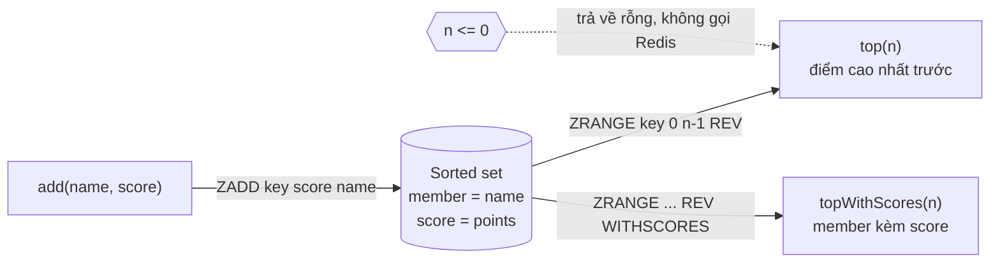

# Lab 01 - Data types và leaderboard

## Mục tiêu

Làm quen với năm kiểu dữ liệu cốt lõi của Redis và dùng sorted set để dựng một leaderboard thật:

- string, hash, list, set và sorted set, mỗi kiểu một ví dụ ngắn trong demo.
- `Leaderboard.add` ghi điểm bằng `ZADD`, `Leaderboard.top` đọc N điểm cao nhất bằng `ZRANGE ... REV`.
- đo hình dạng reply thật của client dưới RESP3 thay vì tin vào tutorial cũ.

Lab cần Redis chạy bằng `make up`.
Lab đọc `REDIS_URL` (mặc định `redis://127.0.0.1:6379`) và chỉ tạo key có prefix duy nhất, xoá hết khi kết thúc.
Lý thuyết nằm ở [theory.md](../theory.md).

## Kiến trúc



Sorted set giữ các member theo thứ tự score tăng dần, nên `ZRANGE ... REV` đọc từ cuối về đầu.
Thêm một name đã có sẽ ghi đè score của member đó chứ không tạo member thứ hai.

## Giao diện

TypeScript (`ts/lab.ts`):

```ts
class Leaderboard {
  constructor(redis: Redis, key: string);
  add(name: string, score: number): Promise<void>;
  top(n: number): Promise<string[]>;
  topWithScores(n: number): Promise<{ name: string; score: number }[]>;
}
```

Go (`go/lab.go`): `NewLeaderboard(rdb *redis.Client, key string) *Leaderboard` với `Add(ctx, name, score)`, `Top(ctx, n) ([]string, error)` và `TopWithScores(ctx, n) ([]Entry, error)`.

`top(0)` và `top(-1)` trả về danh sách rỗng mà không gọi Redis.
Lý do: `ZRANGE key 0 -1 REV` nghĩa là "toàn bộ", nên nếu đổi `n` thành `stop = n - 1` một cách máy móc thì `n = 0` sẽ trả về cả bảng.

## Hình dạng reply dưới RESP3

ioredis 6.0.0 và go-redis v9.23.0 nói RESP3 mặc định.
Hình dạng dưới đây là do test đo trên Redis 8.10.2, không phải suy đoán:

| Lệnh                           | ioredis 6 (TypeScript)             | go-redis 9.23 (`Do`, reply thô)   |
| ------------------------------ | ---------------------------------- | --------------------------------- |
| `ZRANGE k 0 -1 REV WITHSCORES` | mảng phẳng `["b","20.5","a","10"]` | mảng lồng `[["b",20.5],["a",10]]` |
| `ZSCORE k b`                   | string `"20.5"`                    | `float64` `20.5`                  |
| `HGETALL k`                    | object `{ a: "1" }`                | `map[interface{}]interface{}`     |

Hệ quả: đừng parse thô.
Ở TypeScript, `topWithScores` ghép lại từng cặp và đổi score từ string sang number.
Ở Go, `ZRevRangeWithScores` đã trả `[]redis.Z` với `Score float64`.

## Chạy

```bash
make up
pnpm vitest run 02-redis-core/lab-01-datatypes/ts
go test -race ./02-redis-core/lab-01-datatypes/go/...
make lab-ts LAB=02-redis-core/lab-01-datatypes
make lab-go LAB=02-redis-core/lab-01-datatypes
```

## Kết quả mong đợi

| Test (Go dùng CamelCase)                                           | Chứng minh                                                       |
| ------------------------------------------------------------------ | ---------------------------------------------------------------- |
| `top3_returns_highest_scores_in_order`                             | `top(3)` trả 3 name có điểm cao nhất, điểm cao đứng trước        |
| `top_on_empty_board_returns_empty_list`                            | bảng rỗng trả danh sách rỗng, không lỗi (Go: slice rỗng non-nil) |
| `top_returns_fewer_names_when_the_board_is_smaller_than_n`         | `n` lớn hơn số member thì chỉ trả những gì có                    |
| `top_with_non_positive_n_returns_empty_list`                       | `n = 0` không bị biến thành "toàn bộ"                            |
| `adding_an_existing_name_updates_its_score_instead_of_duplicating` | ghi lại cùng name thì cập nhật score, không nhân đôi member      |
| `top_with_scores_parses_the_reply_shape_of_the_client`             | cặp member/score được dựng đúng, score là number                 |
| `resp3_reply_shape_of_zrange_withscores_is_measured_not_assumed`   | khoá hình dạng reply RESP3 đã đo ở bảng trên                     |

Demo in từng kiểu dữ liệu rồi leaderboard: `top(3)` ra `bob, erin, carol`, reply thô `WITHSCORES` cho thấy khác biệt giữa hai client, và bảng rỗng ra `[]`.

## Bài tập mở rộng

1. Thêm `rank(name)` bằng `ZREVRANK` và `scoreOf(name)` bằng `ZSCORE`, rồi xử lý trường hợp name không tồn tại (reply `null`).
2. Thêm `increment(name, delta)` bằng `ZINCRBY` và chứng minh hai lần gọi đồng thời không mất điểm.
3. Chạy lại `zrange ... REV WITHSCORES` với `protocol: 2` (ioredis) hoặc `Protocol: 2` (go-redis) và so hình dạng reply với RESP3.
4. Thêm phân trang `page(offset, count)` bằng `ZRANGE key offset offset+count-1 REV` và so sánh với `ZRANGEBYSCORE ... LIMIT` (từ Redis 6.2 có thể viết bằng `ZRANGE ... BYSCORE REV LIMIT`).
