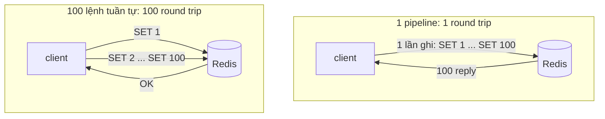
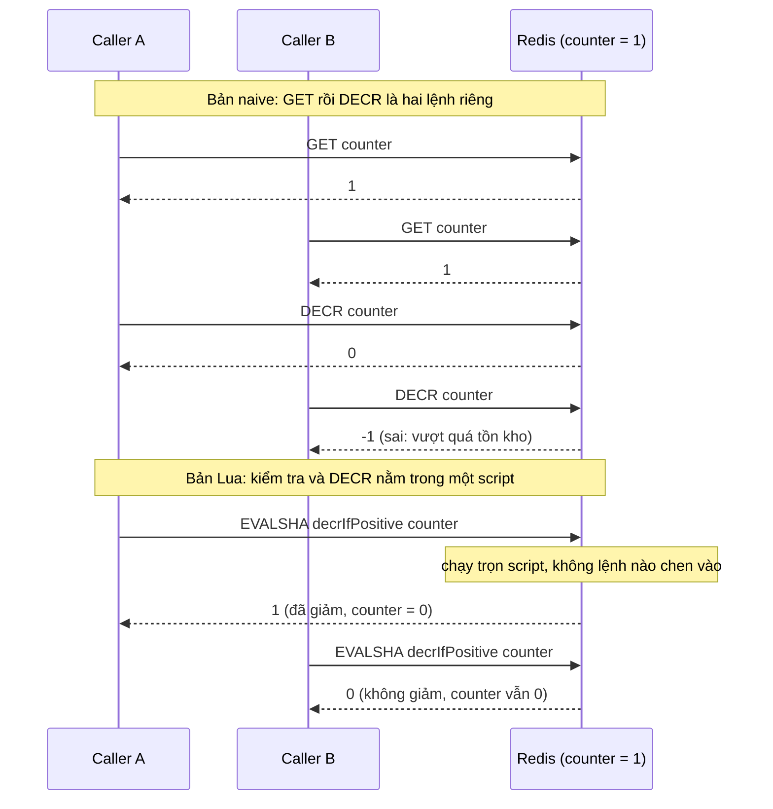

# Lab 02 - Pipeline và Lua

## Mục tiêu

Hai kỹ thuật giảm chi phí và tránh race khi nói chuyện với Redis:

- Pipeline gửi nhiều lệnh trong một lần ghi socket, nên 100 lệnh tốn 1 round trip thay vì 100.
- Lua script gộp "kiểm tra rồi giảm" thành một bước atomic, nên 50 caller tranh một counter không bao giờ làm nó âm.

Lab cần Redis chạy bằng `make up`.
Lab đọc `REDIS_URL` (mặc định `redis://127.0.0.1:6379`) và dùng key có prefix duy nhất, xoá khi kết thúc.
Lý thuyết nằm ở [theory.md](../theory.md).

## Kiến trúc



Đường lỗi: đọc rồi quyết định ở phía client thì hai caller cùng thấy `1` và cùng giảm, counter xuống `-1`.
Lua script chạy liền một mạch trên server nên caller thứ hai thấy `0`.



## Giao diện

TypeScript (`ts/lab.ts`):

```ts
decrIfPositive(redis: Redis, key: string): Promise<boolean>; // Lua, atomic
setSequential(redis: Redis, prefix: string, n: number): Promise<void>;
setPipelined(redis: Redis, prefix: string, n: number): Promise<void>;
countSocketWrites(redis: Redis): Promise<{ writes(): number; reset(): void }>;
```

Go (`go/lab.go`): `DecrIfPositive(ctx, rdb, key) (bool, error)`, `SetSequential`, `SetPipelined` và `NewCountingClient(opts) (*redis.Client, *WriteCounter)`.
Hai hàm `DecrIfPositiveNaive` (Go) và `decrIfPositiveNaive` (TS) là bản sai để demo, test không dùng chúng.

Interface gốc của task viết `decrIfPositive(key)`.
Lab thêm tham số `redis` ở đầu để hàm dùng chung một connection với test, giống chữ ký Go và lab 03.

Lua script (cùng nội dung ở cả hai ngôn ngữ):

```lua
local value = tonumber(redis.call('GET', KEYS[1]))
if value and value > 0 then
  redis.call('DECR', KEYS[1])
  return 1
end
return 0
```

Key được truyền qua `KEYS`, không ghép trong script, để script chạy đúng cả trên Cluster.
Key không tồn tại hoặc đang ở `0` thì script trả `0` và không tạo key.
ioredis dùng `defineCommand` và go-redis dùng `redis.NewScript`: cả hai gửi `EVALSHA`, và khi server báo `NOSCRIPT` thì nạp lại script rồi gọi lại.
Test `noscript_after_script_flush_is_recovered_by_the_client` đo điều này bằng `SCRIPT FLUSH`.

## Cách đếm round trip (không dùng đồng hồ)

Test không đo thời gian vì thời gian phụ thuộc máy và mạng, nên dễ flaky.
Thay vào đó test đếm số lần client ghi vào socket:

- TypeScript: `countSocketWrites` bọc `redis.stream.write` (socket của ioredis) bằng một hàm tăng biến đếm.
- Go: `NewCountingClient` đặt `redis.Options.Dialer` trả về một `net.Conn` bọc, mỗi lần `Write` tăng một `atomic.Int64`.

Một lệnh gửi riêng là một lần ghi rồi chờ reply, nên 100 lệnh `await` lần lượt cho đúng 100 lần ghi.
Pipeline gom 100 lệnh vào một buffer và ghi một lần, nên cho đúng 1 lần ghi.
Test khẳng định `100` và `1`, rồi kiểm tra cả 100 key đều tồn tại để chứng minh hai cách cho cùng kết quả.

Hai lưu ý khi đếm:

- Handshake khi mở connection (`HELLO`, `CLIENT SETINFO`) cũng là ghi socket, nên bản Go chạy khởi động hai pool (đơn lẻ và pipeline) trước rồi mới `Reset`, còn bản TS `ping` trước khi bọc `write`.
- go-redis v9.23.0 có pipeline pool riêng với pool thường, vì vậy phải khởi động cả hai.

## Chạy

```bash
make up
pnpm vitest run 02-redis-core/lab-02-pipeline-lua/ts
go test -race ./02-redis-core/lab-02-pipeline-lua/go/...
make lab-ts LAB=02-redis-core/lab-02-pipeline-lua
make lab-go LAB=02-redis-core/lab-02-pipeline-lua
```

## Kết quả mong đợi

Test (cùng tên ở TS và Go, Go dùng CamelCase):

| Test                                                                   | Chứng minh                                                                             |
| ---------------------------------------------------------------------- | -------------------------------------------------------------------------------------- |
| `pipeline_uses_fewer_round_trips_than_sequential`                      | 100 lệnh tuần tự là 100 lần ghi socket, một pipeline 100 lệnh là 1 lần ghi             |
| `decr_if_positive_never_goes_below_zero_under_50_concurrent_callers`   | 50 caller đồng thời tranh counter `10`: counter dừng đúng ở `0`, không bao giờ âm      |
| `exactly_n_callers_succeed_when_counter_is_n`                          | counter bằng `1`, `20` rồi `50`: đúng ngần ấy caller nhận `true`, phần còn lại `false` |
| `decr_if_positive_returns_false_and_creates_nothing_for_a_missing_key` | key không tồn tại thì trả `false` và không tạo key                                     |
| `decr_if_positive_returns_false_at_zero`                               | counter đang `0` thì trả `false` và giữ nguyên                                         |
| `noscript_after_script_flush_is_recovered_by_the_client`               | `SCRIPT FLUSH` xoá cache, lần gọi sau vẫn chạy nhờ nạp lại script                      |

"Đồng thời" nghĩa là thật sự song song:

- TypeScript dùng `Promise.all` với 50 lời gọi chia đều trên 10 connection, vì một socket duy nhất sẽ tuần tự hoá lời gọi phía client và che mất race.
- Go dùng 50 goroutine, `sync.WaitGroup` và một channel `start` đóng đúng một lần để thả tất cả cùng lúc, chạy với `-race`.

Hai test đồng thời có tác dụng bắt lỗi: khi thay `decrIfPositive` bằng bản naive (GET rồi DECR), cả hai fail (counter ra `-40` ở TS, `-7` ở Go trong lần thử).

Demo in số lần ghi socket của hai cách (`100` và `1`), rồi chạy 50 caller trên counter `10` với bản naive (counter thường âm, số caller thành công lớn hơn `10`) và bản Lua (đúng `10` caller thành công, counter `0`).
Con số của bản naive thay đổi từng lần chạy vì nó là race thật.

## Bài tập mở rộng

1. Dùng `MULTI`/`EXEC` thay cho pipeline và so số lần ghi: kết quả vẫn là 1, nhưng lệnh được thực thi liền mạch.
2. Viết bản `WATCH`/`MULTI`/`EXEC` của `decrIfPositive`, thử với 50 caller và đếm số lần phải retry.
3. Đổi script để nhận số lượng cần giảm trong `ARGV[1]` và chỉ giảm khi đủ.
4. Chạy `redis-cli EVAL "return type(redis.call('GET', 'khong-ton-tai'))" 0` để thấy `GET` trên key không tồn tại trả về `boolean` (`false`) trong Lua, rồi giải thích vì sao script kiểm tra `value and value > 0`.
