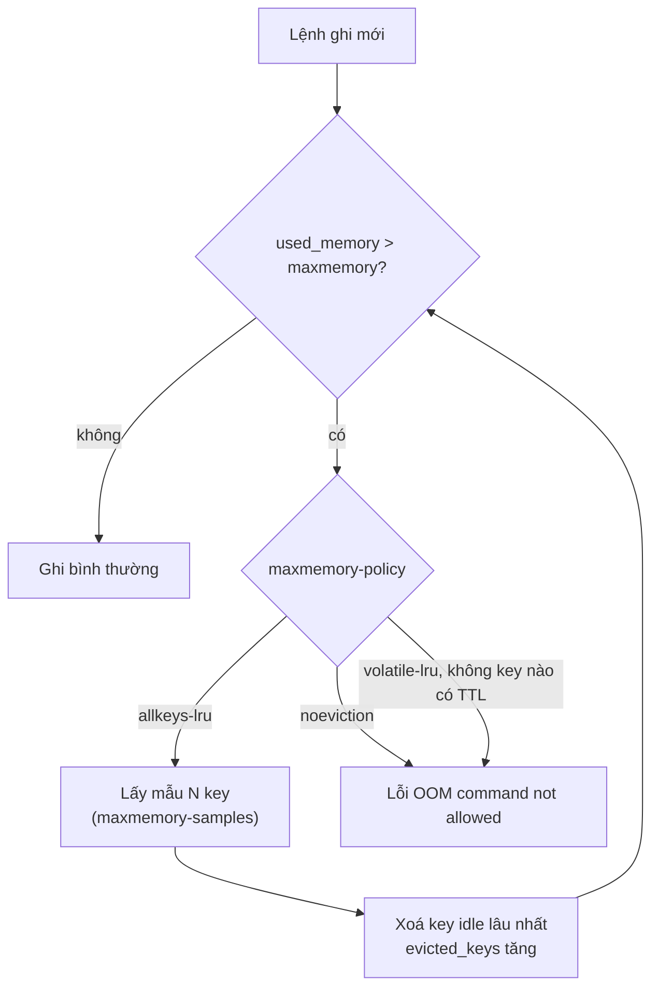
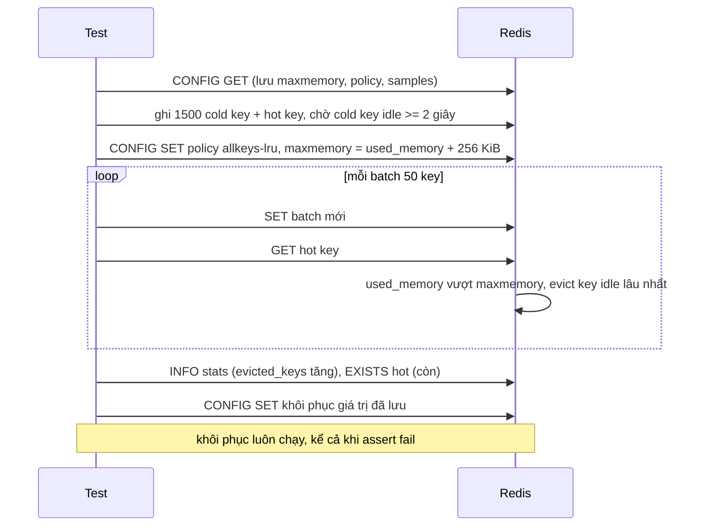

# Lab 03 - Eviction

## Mục tiêu

Quan sát Redis xử lý thế nào khi hết bộ nhớ, bằng cách đặt `maxmemory` thấp tạm thời:

- `allkeys-lru` đẩy các key lâu không dùng ra để nhường chỗ, key "nóng" được đọc liên tục thì sống sót.
- `noeviction` (mặc định của Redis) từ chối lệnh ghi bằng lỗi `OOM`, lệnh đọc vẫn chạy.
- `volatile-lru` mà không key nào có TTL thì hành xử như `noeviction`.

Lý thuyết nằm ở [theory.md](../theory.md).

## Cảnh báo an toàn

Lab này chạy `CONFIG SET maxmemory`, `maxmemory-policy` và `maxmemory-samples` trên server mà nó kết nối, rồi khôi phục giá trị cũ.
Chỉ chạy với Redis của stack compose trong repo này (`make up`, project `mq-handbook`, container `mq-handbook-redis-1`).
Không đặt `REDIS_URL` trỏ tới một Redis dùng chung hoặc Redis của dự án khác.
Config được lưu trước lệnh `CONFIG SET` đầu tiên và được khôi phục trong `afterEach` và `afterAll` (TS), hay `t.Cleanup` (Go), kể cả khi test fail.
Nếu tiến trình bị kill giữa chừng thì config có thể còn sót, cách sửa nhanh là `make down && make up`.

Vì config là của cả server, test của các lab khác không được chạy song song với lab này.
Repo đã tắt song song giữa các file test của vitest (`fileParallelism: false`) và chạy `go test -p 1`.
Nếu tự chạy TS và Go cùng lúc ở hai terminal thì cần tự tránh chồng lên nhau.

## Kiến trúc



Đường lỗi: `noeviction` chặn ghi nhưng giữ nguyên dữ liệu, còn `allkeys-lru` ghi được nhưng có thể xoá dữ liệu mà ứng dụng cần.



## Giao diện

TypeScript (`ts/lab.ts`):

```ts
fillUntilEviction(rdb: Redis, prefix: string, maxKeys: number, opts?: { valueSize?, touchKey?, minEvicted? }): Promise<number>;
// trả số key bị đẩy ra (hiệu của evicted_keys trước và sau)
fillUntilRejected(rdb, prefix, maxKeys, valueSize?): Promise<string | null>; // message lỗi đầu tiên
limitMemory(rdb, policy, headroomBytes): Promise<number>; // maxmemory = used_memory + headroomBytes
readConfig(rdb) / writeConfig(rdb, config); seedKeys; evictedKeys; deleteByPrefix;
```

Go (`go/lab.go`): `FillUntilEviction(ctx, rdb, prefix, maxKeys, FillOptions{TouchKey, MinEvicted}) (int64, error)`, `FillUntilRejected`, `LimitMemory`, `ReadConfig`, `WriteConfig`, `SeedKeys`, `EvictedKeys`, `DeleteByPrefix`.

`touchKey` / `TouchKey` là thứ phải thêm vào so với interface gốc `fillUntilEviction(rdb, prefix, maxKeys)`: nó giữ cho hot key luôn "vừa được dùng" trong lúc ghi.

`maxmemory` được chọn tương đối: `used_memory` hiện tại cộng 256 KiB, nên lab chạy đúng với mọi baseline.
`maxmemory-samples` được đặt tạm là 10 để LRU xấp xỉ gần LRU thật hơn.

## Vì sao test chờ cold key "cũ" trước khi giới hạn bộ nhớ

LRU của Redis đo idle time với độ phân giải 1 giây.
Nếu ghi mọi key trong cùng một giây thì hot key và cold key có idle time bằng nhau, và eviction chọn gần như ngẫu nhiên.
Vì vậy test ghi cold key trước, chờ bằng `eventually` tới khi `OBJECT IDLETIME` của cold key >= 2 giây (không dùng sleep cố định), đọc hot key để đưa idle về 0, rồi mới giới hạn bộ nhớ.

Đối chứng đo trên Redis 8.10.2 (8 lần chạy mỗi trường hợp, 1500 cold key):

| Cấu hình                       | Hot key còn sống |
| ------------------------------ | ---------------- |
| không đọc hot key, evict 900   | 2 trên 8         |
| đọc hot key sau mỗi batch, 900 | 8 trên 8         |

Vì vậy test đòi evict ít nhất 900 key (60% cold key): với ngưỡng thấp hơn thì hot key không đọc cũng thường sống sót và test không chứng minh được gì.

## Persistence chỉ giải thích trong theory

RDB và AOF không được thử trong lab này.
Stack compose chạy Redis với `--save "" --appendonly no`, và `appendonly` mặc định cũng là `no`, nên không có gì được ghi ra đĩa.
Lý do giữ nguyên: bật persistence làm kết quả phụ thuộc vào đĩa và `fork()`, và `CONFIG SET appendonly yes` kích hoạt một lần rewrite chạy nền, đều làm test khó lặp lại.
Cách hoạt động và đánh đổi của RDB và AOF nằm ở [theory.md](../theory.md).

## Chạy

```bash
make up
pnpm vitest run 02-redis-core/lab-03-eviction/ts
go test -race ./02-redis-core/lab-03-eviction/go/...
make lab-ts LAB=02-redis-core/lab-03-eviction
make lab-go LAB=02-redis-core/lab-03-eviction
```

## Kết quả mong đợi

| Test (Go dùng CamelCase)                               | Chứng minh                                                                                          |
| ------------------------------------------------------ | --------------------------------------------------------------------------------------------------- |
| `allkeys_lru_evicts_cold_keys_and_keeps_hot_key`       | `evicted_keys` tăng (> 0, không assert số chính xác), hot key còn, ít nhất một cold key bị mất      |
| `noeviction_policy_rejects_writes_when_full`           | lỗi ghi bắt đầu bằng `OOM`, GET vẫn chạy, `evicted_keys` không đổi, dữ liệu ghi trước đó còn nguyên |
| `volatile_policy_rejects_writes_when_no_key_has_a_ttl` | `volatile-lru` không có key TTL thì ghi bị từ chối như `noeviction`                                 |
| `config_is_restored_to_the_saved_values`               | `writeConfig` đưa `maxmemory`, policy và samples về đúng giá trị đã lưu                             |

Thông báo lỗi đo được trên Redis 8.10.2: `OOM command not allowed when used memory > 'maxmemory'.`
Docs chỉ nói "return an error", nên test chỉ assert prefix `OOM`.

Demo in config đã lưu, kết quả `allkeys-lru` (khoảng 910 key bị evict, hot key còn, khoảng 500 trên 1500 cold key còn), lỗi `OOM` của `noeviction`, rồi config đã khôi phục.
Số key bị evict là xấp xỉ nên thay đổi nhẹ giữa các lần chạy.

## Bài tập mở rộng

1. Đổi policy thành `allkeys-lfu` và đọc hot key ít hơn: LFU đếm tần suất thay vì thời điểm dùng gần nhất, nên kết quả khác.
2. Đặt `maxmemory-samples` về 1 rồi 5 và đo hot key sống sót bao nhiêu lần trên 20 lần chạy (không đọc hot key).
3. Đặt TTL cho cold key và chạy `volatile-lru`: chỉ key có TTL bị evict, hot key (không TTL) không bao giờ bị evict.
4. Theo dõi `keyspace_hits` và `keyspace_misses` trong `INFO stats` trước và sau khi evict để tính cache hit ratio.
