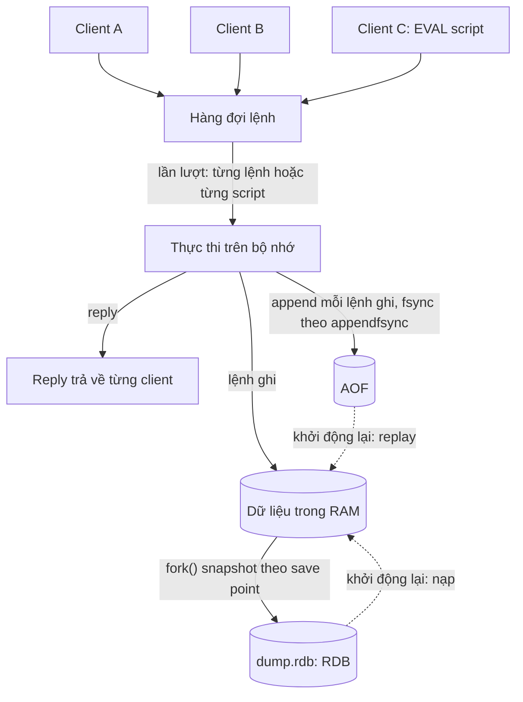
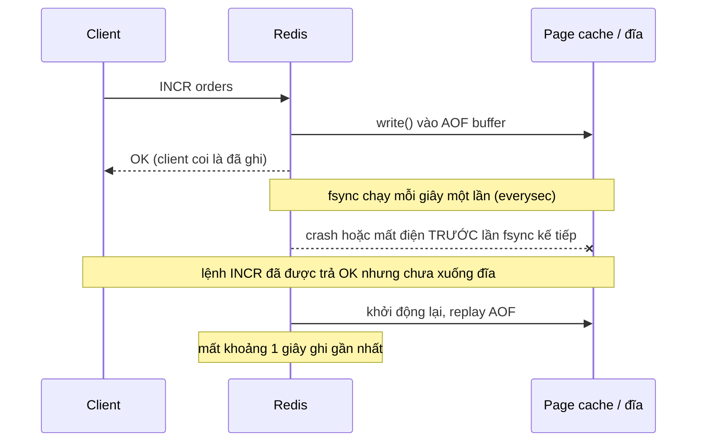
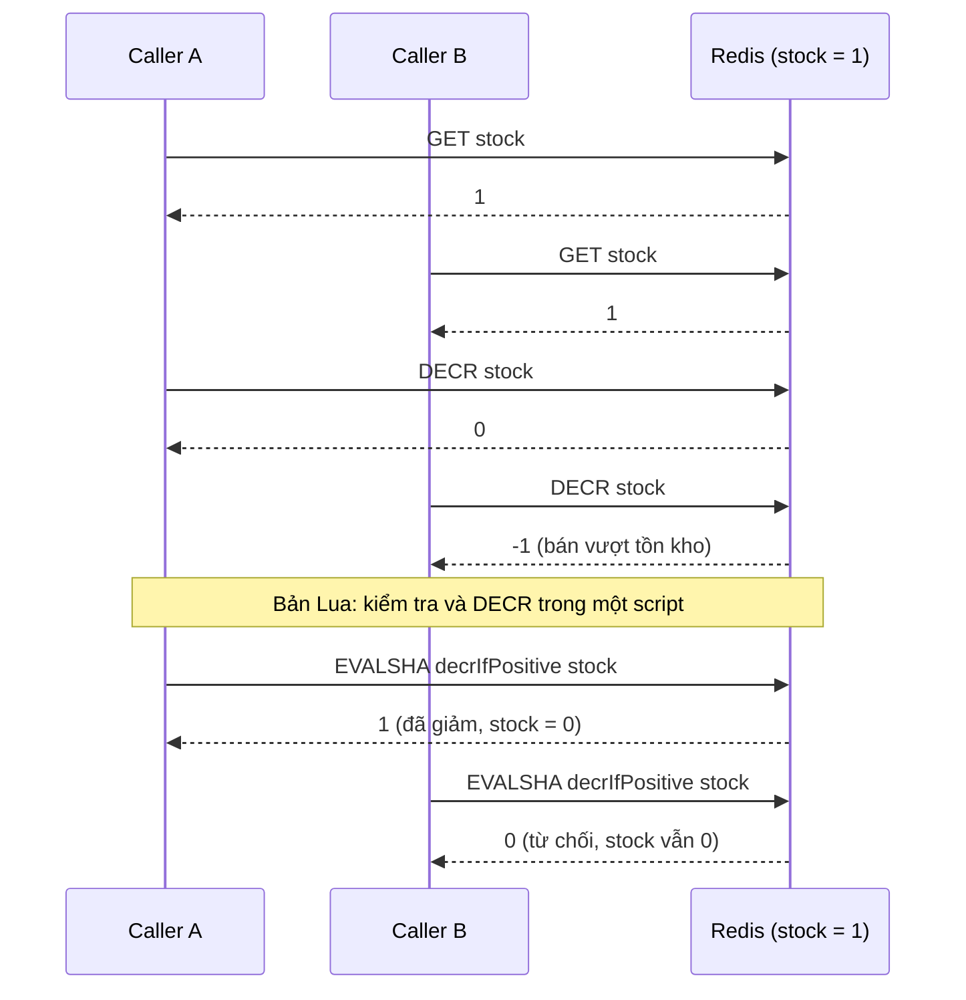

# Chủ đề 02 - Redis core

Chương này đi qua phần lõi của Redis mà mọi chương sau đều dựa vào: kiểu dữ liệu, persistence, eviction, transaction, Lua và pipelining.
Ba lab đi kèm cần Redis chạy bằng `make up` (Redis 8.10.2, client ioredis 6.0.0 và go-redis v9.23.0):

- [Lab 01 - Data types và leaderboard](./lab-01-datatypes/README.md)
- [Lab 02 - Pipeline và Lua](./lab-02-pipeline-lua/README.md)
- [Lab 03 - Eviction](./lab-03-eviction/README.md)

## Data types và keyspace

Redis là key-value store, giá trị có kiểu.
Năm kiểu dùng nhiều nhất:

| Kiểu       | Là gì                                      | Lệnh tiêu biểu                       | Dùng cho                              |
| ---------- | ------------------------------------------ | ------------------------------------ | ------------------------------------- |
| String     | Chuỗi nhị phân, kèm các lệnh số như `INCR` | `SET`, `GET`, `INCR`, `SET ... EX`   | Cache, counter, lock, flag            |
| Hash       | Map field-value trong một key              | `HSET`, `HGET`, `HGETALL`, `HINCRBY` | Một object, ví dụ user hoặc session   |
| List       | Danh sách string theo thứ tự insert        | `LPUSH`, `RPOP`, `LRANGE`            | Queue đơn giản, lịch sử gần đây       |
| Set        | Tập string không trùng và không có thứ tự  | `SADD`, `SISMEMBER`, `SCARD`         | Tag, tập duy nhất, quan hệ            |
| Sorted set | Tập string không trùng, sắp theo score     | `ZADD`, `ZRANGE ... REV`, `ZRANK`    | Leaderboard, lịch hẹn giờ, rate limit |

Nguồn: https://redis.io/docs/latest/develop/data-types/

Ngoài năm kiểu trên còn có Streams (log append-only, chương 03), Bitmaps và Bitfields (xây trên String), và HyperLogLog (đếm số phần tử khác nhau xấp xỉ).
Kiểu Arrays là mới từ Redis 8.8 và chương này không dùng.

Nguồn: https://redis.io/docs/latest/develop/data-types/ và https://redis.io/docs/latest/develop/whats-new/8-8/

Key là binary-safe, tối đa 512 MB, nhưng key rất dài là ý tưởng tệ vì tốn bộ nhớ và so sánh key tốn kém.
Nên đặt tên theo schema `object-type:id`, ví dụ `user:1000`.
Expire có độ phân giải 1 ms và được replicate cũng như lưu xuống đĩa theo thời điểm hết hạn tuyệt đối.
`KEYS` chặn server cho tới khi trả hết key nên không dùng trong code ứng dụng, hãy dùng `SCAN` để duyệt tăng dần.

Nguồn: https://redis.io/docs/latest/develop/using-commands/keyspace/

Lab 01 dùng sorted set làm leaderboard.
Sorted set giữ member theo score, nên `ZADD` ghi điểm và `ZRANGE key 0 n-1 REV` đọc N điểm cao nhất.
Test của lab còn khoá hai điều dễ sai: bảng rỗng trả danh sách rỗng, và `n = 0` không bị biến thành "toàn bộ" (vì `ZRANGE key 0 -1` nghĩa là đọc hết).

### Hình dạng reply dưới RESP3

ioredis 6.0.0 và go-redis v9.23.0 nói RESP3 mặc định, nên hình dạng reply có thể khác tutorial cũ.
Lab 01 đo trên Redis 8.10.2, ví dụ `ZRANGE k 0 -1 REV WITHSCORES` ra mảng phẳng toàn string ở ioredis (`["b","20.5","a","10"]`) nhưng ra mảng lồng `[["b",20.5],["a",10]]` với score `float64` ở go-redis khi gọi thô.
Bài học là dùng hàm typed của client hoặc parse có kiểm tra, và để test khoá hình dạng reply.

Nguồn: https://github.com/redis/ioredis/blob/main/CHANGELOG.md

## Thực thi lệnh: tuần tự, và hệ quả của nó

Hai tính chất của Redis được các mục sau dùng đi dùng lại:

- Một lệnh chạy xong rồi mới tới lệnh kế tiếp, nên một lệnh đơn lẻ luôn atomic.
- `MULTI`/`EXEC` và Lua script chạy liền một mạch, không có request của client khác chen giữa.

Tài liệu nghiên cứu không đi vào mô hình thread bên trong server, nên chương này chỉ dựa vào hệ quả quan sát được ở trên và không khẳng định gì thêm về số thread.

Nguồn: https://redis.io/docs/latest/develop/using-commands/transactions/ và https://redis.io/docs/latest/develop/programmability/eval-intro/

Hệ quả thực tế: lệnh hoặc script chạy lâu chặn toàn server.
Script vượt `busy-reply-threshold` (mặc định 5000 ms) bị coi là slow script, và client khác nhận lỗi `BUSY`.

## Persistence: RDB, AOF và kết hợp

Redis giữ dữ liệu trong RAM, persistence là tuỳ chọn và có hai cơ chế.

RDB là snapshot point-in-time, mặc định lưu ở `dump.rdb`.
Redis `fork()` một child ghi file tạm rồi thay file cũ, dựa trên copy-on-write.
Save point mặc định (redis.conf 8.10): 3600 giây nếu có ít nhất 1 thay đổi, 300 giây nếu có ít nhất 100, 60 giây nếu có ít nhất 10000.
`save ""` tắt snapshot.
Nếu crash thì có thể mất dữ liệu của vài phút gần nhất, và `fork()` với dataset lớn có thể làm Redis ngừng phục vụ từ vài mili giây tới khoảng một giây.

AOF ghi lại mọi lệnh ghi.
`appendonly` mặc định là `no` trong redis.conf.
Chính sách `appendfsync` có ba giá trị:

- `always`: fsync mỗi lệnh ghi, an toàn nhất và chậm nhất.
- `everysec`: mặc định và được khuyến nghị, có thể mất khoảng 1 giây dữ liệu.
- `no`: phó mặc cho hệ điều hành, Linux thường flush mỗi 30 giây.

Từ Redis 7.0, AOF là multi part: một base file (RDB hoặc AOF) cộng các incremental file, quản lý bằng manifest, rewrite chạy nền bằng `BGREWRITEAOF` hoặc tự động.

Khi cả hai bật và Redis khởi động lại, AOF được dùng để dựng lại dữ liệu vì nó đầy đủ nhất.
Tài liệu khuyên dùng cả hai nếu muốn mức an toàn gần với PostgreSQL.
Đổi từ RDB sang AOF trên server đang chạy phải bằng `CONFIG SET appendonly yes` rồi `CONFIG REWRITE`, chỉ sửa file config rồi restart có thể mất dữ liệu.

Nguồn: https://redis.io/docs/latest/operate/oss_and_stack/management/persistence/ và https://raw.githubusercontent.com/redis/redis/8.10/redis.conf

| Tiêu chí               | RDB                                | AOF `everysec`                  | AOF `always`           | RDB + AOF                     |
| ---------------------- | ---------------------------------- | ------------------------------- | ---------------------- | ----------------------------- |
| Mất tối đa khi crash   | Vài phút gần nhất                  | Khoảng 1 giây                   | Gần như không mất      | Khoảng 1 giây (AOF được dùng) |
| Chi phí ghi            | Thấp, nhưng có `fork()` định kỳ    | Thấp                            | Cao (fsync mỗi lệnh)   | Cộng hai chi phí              |
| Kích thước và phục hồi | File gọn, nạp nhanh                | File lớn hơn, replay lâu hơn    | Như `everysec`         | Cả hai file                   |
| Khi nào chọn           | Cache, mất vài phút chấp nhận được | Mặc định cho dữ liệu quan trọng | Cần mất ít nhất có thể | Muốn an toàn gần PostgreSQL   |

Handbook không bật persistence trong lab: stack compose chạy `--save "" --appendonly no` để kết quả test không phụ thuộc đĩa.
Phần này vì thế chỉ là lý thuyết.
Các cột về lượng dữ liệu mất lấy từ tài liệu Redis, còn cột chi phí và kích thước là nhận định chung, không do lab đo.

### Cửa sổ mất dữ liệu của AOF `everysec`

Với `appendfsync always`, bước trả `OK` chỉ xảy ra sau fsync nên cửa sổ này gần như không còn, đổi lại mỗi lệnh ghi chậm hơn.

## Eviction và `noeviction`

`maxmemory` giới hạn bộ nhớ dữ liệu, `maxmemory 0` là không giới hạn (mặc định trên 64-bit).
Khi vượt giới hạn, `maxmemory-policy` quyết định chuyện gì xảy ra.
Các giá trị: `noeviction`, `allkeys-lru`, `allkeys-lrm`, `allkeys-lfu`, `allkeys-random`, `volatile-lru`, `volatile-lrm`, `volatile-lfu`, `volatile-random`, `volatile-ttl`.
`allkeys-lrm` và `volatile-lrm` chỉ có từ Redis 8.6, còn LFU từ 4.0.

Policy mặc định là `noeviction`: lệnh thêm dữ liệu mới trả lỗi, lệnh chỉ đọc vẫn chạy.
Các policy `volatile-*` chỉ xoá key có TTL, nên khi không key nào có TTL chúng hành xử như `noeviction`.
LRU, LFU và `volatile-ttl` là thuật toán xấp xỉ bằng cách lấy mẫu, `maxmemory-samples` mặc định là 5.
Bộ nhớ buffer của replica và AOF không được tính vào so sánh với `maxmemory`, nên cần chừa RAM trống.

Nguồn: https://redis.io/docs/latest/develop/reference/eviction/ và https://raw.githubusercontent.com/redis/redis/8.10/redis.conf

Lab 03 đo các điều trên:

- `allkeys-lru` ghi vẫn được, `evicted_keys` tăng, hot key được đọc liên tục thì sống sót còn phần lớn cold key bị xoá.
- `noeviction` trả `OOM command not allowed when used memory > 'maxmemory'.` (docs chỉ ghi "return an error", test chỉ assert prefix `OOM`), đọc vẫn chạy và `evicted_keys` không đổi.
- `volatile-lru` khi không key nào có TTL cũng trả `OOM`.
- Không có số key bị evict "đúng": thuật toán xấp xỉ nên test chỉ assert `evicted_keys > 0`.

Đừng dùng một instance vừa làm cache (`allkeys-lru`) vừa làm queue, vì job hoặc stream có thể bị evict.
Hãy tách instance, hoặc dùng `noeviction` cho instance chứa queue và chấp nhận lỗi ghi khi đầy.

| Policy         | Khi đầy bộ nhớ                       | Rủi ro                               | Hợp với                            |
| -------------- | ------------------------------------ | ------------------------------------ | ---------------------------------- |
| `noeviction`   | Từ chối lệnh ghi bằng `OOM`          | Ứng dụng nhận lỗi ghi                | Queue, dữ liệu không được mất      |
| `allkeys-lru`  | Xoá key lâu không dùng nhất (xấp xỉ) | Mất dữ liệu chưa nhân bản ở nơi khác | Cache thuần                        |
| `allkeys-lfu`  | Xoá key ít dùng nhất (xấp xỉ)        | Như trên                             | Cache có hot key ổn định           |
| `volatile-lru` | Chỉ xoá key có TTL                   | Không key TTL thì như `noeviction`   | Trộn cache (có TTL) và dữ liệu bền |

## Transaction và Lua

`MULTI`/`EXEC` tuần tự hoá một nhóm lệnh và chạy liên tục, không có request khác chen giữa.
Nếu client mất kết nối trước `EXEC` thì không lệnh nào chạy.
Redis không có rollback:

- Lỗi trước `EXEC` (sai cú pháp, hết bộ nhớ khi có `maxmemory`) làm `EXEC` từ chối cả transaction.
- Lỗi sau `EXEC` (ví dụ `WRONGTYPE`) không dừng các lệnh còn lại, những lệnh trước đó vẫn đã ghi.

`WATCH` cho optimistic locking: nếu key bị sửa trước `EXEC`, `EXEC` trả Null reply và transaction bị huỷ, client tự retry.
Thay đổi do expire hay eviction cũng được tính (expire từ 6.0.9).

Nguồn: https://redis.io/docs/latest/develop/using-commands/transactions/

Lua script chạy atomic: mọi hoạt động khác của server bị chặn trong lúc script chạy, và script được viết bằng Lua 5.1.
Script đọc được kết quả giữa chừng và rẽ nhánh theo nó, điều `MULTI`/`EXEC` không làm được vì các lệnh trong transaction được xếp hàng trước khi biết reply.
Mọi key script truy cập phải truyền qua `KEYS` (tham số khác qua `ARGV`) để chạy đúng cả trên Cluster.
Cache script là volatile: có thể mất khi restart hoặc failover, nên client dùng `EVALSHA` và nạp lại khi gặp `NOSCRIPT`.
Lab 02 đo điều này sau `SCRIPT FLUSH`: cả `defineCommand` của ioredis và `redis.NewScript` của go-redis đều tự nạp lại.
Khi vượt `maxmemory`, lệnh ghi cần thêm bộ nhớ trong script làm script abort (trừ khi dùng `redis.pcall`).

Nguồn: https://redis.io/docs/latest/develop/programmability/eval-intro/

Từ Redis 8.4, `SET ... IFEQ` và `DELEX` cho compare-and-set và compare-and-delete trên một string đơn giản hơn `WATCH`.

Nguồn: https://redis.io/docs/latest/develop/using-commands/transactions/

### Race của read-modify-write và cách Lua sửa

Ví dụ giảm tồn kho chỉ khi còn hàng: nếu đọc rồi quyết định ở client thì hai caller cùng thấy `1`.
Lab 02 tái hiện điều này: với 50 caller đồng thời và counter bằng `10`, bản naive (GET rồi DECR) cho counter âm cỡ `-40`, bản Lua dừng đúng ở `0` và đúng 10 caller nhận `true`.

## Pipelining và transaction khác nhau

Pipelining gửi nhiều lệnh mà không chờ reply từng lệnh, nhằm giảm số round trip.
Tài liệu Redis ghi throughput tăng gần tuyến tính theo độ dài pipeline, tới khoảng 10 lần so với không pipeline, vì giảm syscall `read()` và `write()`.
Pipeline không phải transaction: lệnh chạy đúng thứ tự gửi nhưng lệnh của client khác có thể xen kẽ.
Server phải xếp hàng reply trong bộ nhớ, nên gửi theo batch hợp lý (khoảng 10 nghìn lệnh) chứ không phải hàng triệu lệnh một lần.
Pipeline không giúp pattern read-compute-write vì cần reply của lệnh đọc, hãy dùng script.

Nguồn: https://redis.io/docs/latest/develop/using-commands/pipelining/

Lab 02 đếm round trip bằng số lần ghi vào socket thay vì đồng hồ: 100 lệnh `await` lần lượt là 100 lần ghi, một pipeline 100 lệnh là 1 lần ghi.
Cách đo này không phụ thuộc máy và mạng, nên test không flaky.

| Tiêu chí                     | Lệnh tuần tự     | Pipeline              | `MULTI`/`EXEC`           | Lua script                        |
| ---------------------------- | ---------------- | --------------------- | ------------------------ | --------------------------------- |
| Round trip cho 100 lệnh      | 100              | 1                     | 1 nếu gửi liền nhau      | 1 (một `EVALSHA`)                 |
| Lệnh của client khác xen vào | Có               | Có                    | Không                    | Không                             |
| Đọc kết quả rồi rẽ nhánh     | Có (phía client) | Không                 | Không                    | Có (trong script)                 |
| Rollback khi lỗi             | Không áp dụng    | Không                 | Không                    | Không (lệnh đã chạy vẫn còn)      |
| Phù hợp                      | Logic đơn giản   | Ghi hàng loạt độc lập | Nhóm lệnh phải liền mạch | Check-and-set, logic có điều kiện |

## Lỗi thường gặp

- `noeviction` khi đầy bộ nhớ: lệnh ghi (kể cả `XADD`, `LPUSH`) trả `OOM`, trong khi lệnh đọc vẫn chạy.
  Hãy giám sát `used_memory` trên `maxmemory`.
- Dùng policy `volatile-*` nhưng key không có TTL: không key nào bị evict và ghi bị lỗi như `noeviction`.
- Hy vọng `MULTI`/`EXEC` rollback: một lệnh lỗi runtime vẫn để các lệnh khác ghi.
  Hãy validate trước hoặc dùng Lua.
- Lua script chạy lâu hoặc vòng lặp lớn: cả server bị chặn và client khác nhận lỗi `BUSY`.
- Script truy cập key không khai báo trong `KEYS`: chạy được ở standalone nhưng hỏng ở Cluster.
- `KEYS *`, `SMEMBERS` hoặc `HGETALL` trên collection lớn: latency tăng vọt.
  Hãy dùng `SCAN`, `SSCAN`, `HSCAN` và xoá bằng `UNLINK`.
- Chỉ dùng RDB hoặc AOF `everysec` rồi kỳ vọng không mất dữ liệu: sau crash mất vài phút (RDB) hoặc khoảng 1 giây (AOF `everysec`).

Nguồn: https://redis.io/docs/latest/develop/reference/eviction/, https://redis.io/docs/latest/develop/using-commands/transactions/ và https://redis.io/docs/latest/operate/oss_and_stack/management/persistence/

## Nguồn tham khảo

Phiên bản đã kiểm tra ngày 2026-10-06: Redis server 8.10.2 (stack lab), ioredis 6.0.0, go-redis v9.23.0 (yêu cầu Go 1.26 trở lên).
Các lab đo trực tiếp hình dạng reply RESP3, thông báo lỗi `OOM`, hành vi `NOSCRIPT` và eviction trên Redis 8.10.2.

- Redis docs: Data types
  Nguồn: https://redis.io/docs/latest/develop/data-types/
- Redis docs: Keyspace
  Nguồn: https://redis.io/docs/latest/develop/using-commands/keyspace/
- Redis docs: Persistence (RDB, AOF)
  Nguồn: https://redis.io/docs/latest/operate/oss_and_stack/management/persistence/
- Redis 8.10 redis.conf (save point, `appendonly`, `appendfsync`, `maxmemory-policy`, `busy-reply-threshold`)
  Nguồn: https://raw.githubusercontent.com/redis/redis/8.10/redis.conf
- Redis docs: Key eviction
  Nguồn: https://redis.io/docs/latest/develop/reference/eviction/
- Redis docs: Transactions
  Nguồn: https://redis.io/docs/latest/develop/using-commands/transactions/
- Redis docs: Scripting with Lua (EVAL)
  Nguồn: https://redis.io/docs/latest/develop/programmability/eval-intro/
- Redis docs: Pipelining
  Nguồn: https://redis.io/docs/latest/develop/using-commands/pipelining/
- Redis docs: `CONFIG SET`
  Nguồn: https://redis.io/docs/latest/commands/config-set/
- Redis 8.8 what's new (kiểu Arrays)
  Nguồn: https://redis.io/docs/latest/develop/whats-new/8-8/
- ioredis 6.0.0 changelog (RESP3 mặc định)
  Nguồn: https://github.com/redis/ioredis/blob/main/CHANGELOG.md
- go-redis v9.23.0 release (yêu cầu Go 1.26, pipeline pool riêng)
  Nguồn: https://github.com/redis/go-redis/releases/tag/v9.23.0
