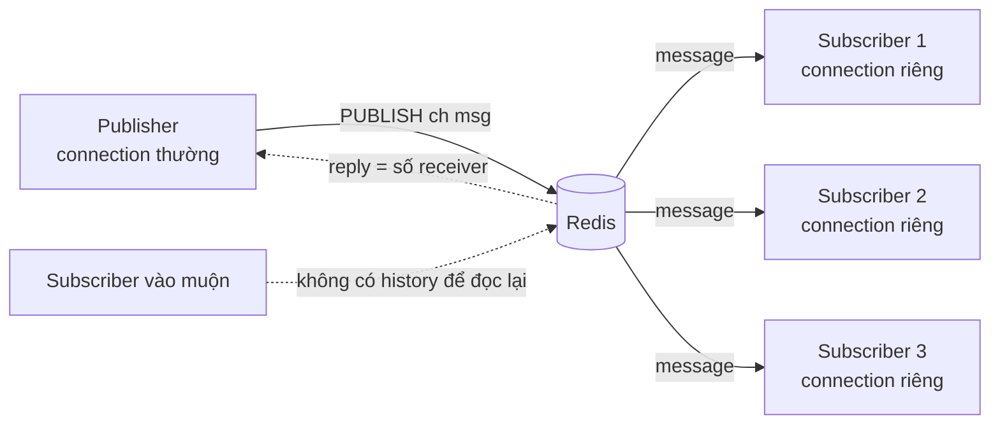
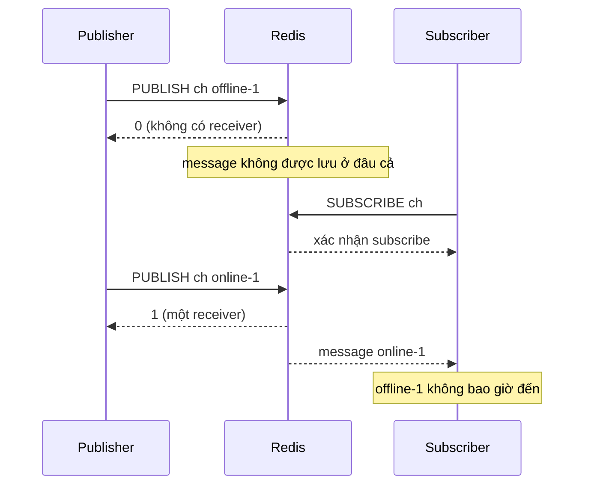

# Lab 01 - Pub/Sub

## Mục tiêu

Chứng minh bằng test hai tính chất cốt lõi của Redis Pub/Sub:

- Fire and forget: message chỉ đến những subscriber đang kết nối ngay lúc `PUBLISH`, subscriber vào muộn không nhận được gì từ trước đó.
- Fan-out: mỗi message đến mọi subscriber của channel, đúng thứ tự publish.

Lab cần Redis chạy bằng `make up`.
Lab đọc `REDIS_URL` (mặc định `redis://127.0.0.1:6379`) và dùng tên channel có prefix duy nhất.
Pub/Sub không tạo key nên lab không để lại gì trong keyspace.
Lý thuyết nằm ở [theory.md](../theory.md).

## Kiến trúc



Đường lỗi: subscriber offline thì message mất vĩnh viễn, và `PUBLISH` cho biết điều đó qua reply `0`.



## Giao diện

TypeScript (`ts/lab.ts`):

```ts
publish(redis: Redis, channel: string, message: string): Promise<number>; // số receiver
numSubscribers(redis: Redis, channel: string): Promise<number>; // PUBSUB NUMSUB
subscribe(connection: Redis, channel: string): Promise<Subscription>;
// Subscription: messages(): string[], close(): Promise<void>
```

Go (`go/lab.go`): `Publish(ctx, rdb, channel, message) (int64, error)`, `NumSubscribers(ctx, rdb, channel) (int64, error)` và `Subscribe(ctx, rdb, channel) (*Subscription, error)` với `Messages()` và `Close()`.

Task gốc không quy định interface cho lab này, nên giao diện trên là thiết kế của lab.

## Connection riêng cho subscriber

Subscriber luôn dùng connection riêng, không dùng chung với client chạy lệnh thường:

- TypeScript: `subscribe(connection, channel)` nhận một `Redis` chỉ dùng để subscribe, test tạo mới một connection cho mỗi subscriber.
- Go: mỗi `rdb.Subscribe` của go-redis tự mở một connection riêng ngoài pool, nên `rdb` vẫn dùng được để `PUBLISH`.

Lý do là một connection đang subscribe chỉ nhận message đẩy xuống từ server.
Với RESP2, connection ở trạng thái subscribed chỉ được chạy một tập lệnh hạn chế.
Đã đo: với RESP3 (mặc định của ioredis 6.0.0) trên Redis 8.10.2, `GET` trên connection đang subscribe vẫn chạy được và trả `null`, còn với `protocol: 2` thì ioredis báo `Connection in subscriber mode, only subscriber commands may be used`.
Tách connection vẫn là thực hành chuẩn và không phụ thuộc giao thức.

## Làm cho "subscriber đã sẵn sàng" mang tính xác định

Không dùng sleep để chờ subscriber.
Test dùng hai bằng chứng:

- `subscribe` chỉ trả về sau khi server xác nhận subscribe (ioredis: promise của `subscribe` resolve khi có reply, go-redis: `Receive` đầu tiên trả `*redis.Subscription`).
- Test gọi `PUBSUB NUMSUB <channel>` qua `eventually` cho tới khi bằng số subscriber mong đợi.
  Reply ở cả hai client đã được đo: ioredis trả mảng phẳng `["channel", 1]` với số nguyên, go-redis `PubSubNumSub` trả `map[string]int64`.

Từ đó `PUBLISH` trả về số receiver (`0`, `1` hoặc `3`) được dùng làm bằng chứng trực tiếp, không cần đoán.

## Chạy

```bash
make up
pnpm vitest run 03-redis-messaging/lab-01-pubsub/ts
go test -race ./03-redis-messaging/lab-01-pubsub/go/...
make lab-ts LAB=03-redis-messaging/lab-01-pubsub
make lab-go LAB=03-redis-messaging/lab-01-pubsub
```

## Kết quả mong đợi

Test (cùng tên ở TS và Go, Go dùng CamelCase):

| Test                                                 | Chứng minh                                                                                                                                                     |
| ---------------------------------------------------- | -------------------------------------------------------------------------------------------------------------------------------------------------------------- |
| `subscriber_misses_messages_published_while_offline` | Ba `PUBLISH` khi chưa có ai subscribe đều trả `0`. Sau khi subscribe, `PUBLISH` trả `1` và subscriber chỉ nhận `["online-1"]`, ba message cũ không bao giờ đến |
| `all_subscribers_receive_each_message`               | 3 subscriber, 20 message: mỗi `PUBLISH` trả `3`, và mỗi subscriber nhận đủ 20 message theo đúng thứ tự publish                                                 |

Demo in lại cùng câu chuyện: ba `PUBLISH` offline trả `0`, subscriber vào muộn chỉ thấy `online-1`, rồi ba subscriber nhận cùng năm message `fanout-0` tới `fanout-4`.

## Bài tập mở rộng

1. Dùng `PSUBSCRIBE lab03-*` và để ý một message tới subscriber dưới dạng `pmessage`, thêm `SUBSCRIBE` cùng channel để thấy message đến hai lần.
2. Đóng connection của một subscriber giữa chừng, publish tiếp, rồi mở lại và xác nhận các message trong khoảng đó mất.
3. Thử `SPUBLISH` và `SSUBSCRIBE` (Redis 7.0 trở lên) trên standalone và so reply.
4. Chạy `PUBLISH` ở database 10 và subscribe ở database 1 để kiểm chứng channel không gắn với database number.
