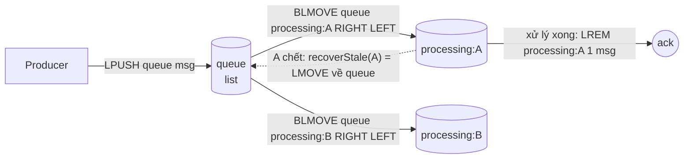
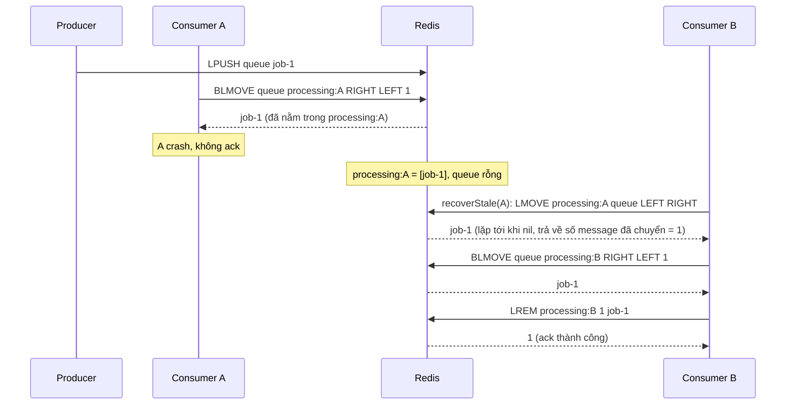

# Lab 02 - List queue với BLMOVE

## Mục tiêu

Xây một reliable queue trên Redis List và chứng minh bằng test hai điều:

- Message đã `dequeue` vẫn nằm trong processing list của consumer cho tới khi `ack`, nên consumer crash không làm mất message.
- Sau khi consumer chết, `recoverStale` đưa message về queue và consumer khác nhận lại đúng message đó (at-least-once).

Queue đơn giản bằng `LPUSH` rồi `BRPOP` không reliable: message đã pop ra khỏi Redis, nếu consumer crash ngay sau đó thì mất.
`BLMOVE` giải quyết bằng cách lấy message và cất vào processing list trong một bước atomic.

Lab cần Redis chạy bằng `make up`.
Lab đọc `REDIS_URL` (mặc định `redis://127.0.0.1:6379`) và mọi key đều có prefix duy nhất, xoá khi test kết thúc.
Lý thuyết nằm ở [theory.md](../theory.md).

## Kiến trúc



Đường lỗi: consumer A crash khi đang giữ message, message vẫn nằm trong `processing:A` và không bị mất.



## Giao diện

TypeScript (`ts/lab.ts`):

```ts
new ReliableQueue({ redis, blocking, queue, blockTimeoutSeconds? });
enqueue(msg: string): Promise<void>;
dequeue(consumerId: string): Promise<string | null>; // BLMOVE, null khi hết timeout
ack(consumerId: string, msg: string): Promise<boolean>; // LREM, false nếu msg không có trong processing list
recoverStale(consumerId: string): Promise<number>; // số message đã chuyển về queue
processingKey(consumerId: string): string;
```

Go (`go/lab.go`): `NewReliableQueue(Config{Commands, Blocking, Queue, BlockTimeout})` với `Enqueue(ctx, msg) error`, `Dequeue(ctx, consumerID) (msg string, ok bool, err error)`, `Ack(ctx, consumerID, msg) (bool, error)`, `RecoverStale(ctx, consumerID) (int64, error)` và `ProcessingKey(consumerID)`.
Go dùng `ok == false` thay cho `null` ở `Dequeue`.

Task gốc quy định `enqueue`, `dequeue`, `ack` và `recoverStale`.
Lab thêm hai phần: `ack` trả `boolean` (số bản ghi `LREM` gỡ được bằng 1) và `processingKey` để test đọc processing list bằng `LRANGE`.

Quy ước key: queue là `<queue>`, processing list của consumer là `<queue>:processing:<consumerId>`.
Trên Redis Cluster hai key này phải cùng hash slot, vì `BLMOVE` là lệnh nhiều key (xem chương 04).
Cách làm là đặt hash tag, ví dụ `{jobs}` và `{jobs}:processing:A`.

## Các điểm quan trọng

`enqueue` dùng `LPUSH` (đẩy vào đầu trái), `dequeue` lấy từ đầu phải (`RIGHT LEFT`), nên message cũ nhất ra trước (FIFO).
`LRANGE queue 0 -1` vì vậy liệt kê message mới nhất trước, và demo in theo đúng thứ tự đó.

`BLMOVE` có timeout là số giây kiểu double, hết timeout trả nil.
Lab mặc định block 1 giây để test không bao giờ treo.
Timeout `0` nghĩa là block vô hạn.

`recoverStale` lặp `LMOVE processing queue LEFT RIGHT` tới khi nil.
Mỗi `LMOVE` atomic nên process recovery crash giữa chừng cũng không làm mất message.
Hướng `LEFT RIGHT` giữ nguyên thứ tự gốc, test `recovered_messages_are_redelivered_in_their_original_order` khoá điều này: đổi thành `RIGHT RIGHT` thì test fail.

At-least-once: nếu gọi `recoverStale` cho consumer chỉ chậm chứ chưa chết, message được xử lý hai lần và `ack` muộn của consumer chậm trả `false`.
Lab không tự quyết định ai là "stale", việc đó cần heartbeat hoặc TTL key do người gọi quản lý (bài tập 2).

Queue kiểu List không có consumer group: không có theo dõi idle time, delivery count hay claim tự động như Streams (lab 03).

## Connection cho lệnh blocking

Lệnh blocking cần connection riêng, không dùng chung với client chạy lệnh thường:

- TypeScript: một connection ioredis chạy tuần tự các lệnh của nó, nên một `BLMOVE` đang chờ sẽ chặn mọi lệnh xếp sau trên cùng connection.
  Vì vậy `ReliableQueue` nhận hai connection: `redis` cho `LPUSH`, `LREM`, `LMOVE` và `blocking` chỉ dành cho `BLMOVE`.
- Go: `Config` cũng có hai client là `Commands` và `Blocking`.

Về timeout phía client của go-redis v9.23.0, lab đã đo bằng một client có `ReadTimeout` 500 ms và `BLMOVE` block 2 giây:

- Lệnh typed `rdb.BLMove(...)` chạy bình thường và trả nil sau 2,1 giây, vì go-redis tự cộng thời gian block vào read deadline.
- Lệnh thô `rdb.Do(ctx, "BLMOVE", ..., "2")` lỗi `i/o timeout` sau khoảng 2,2 giây (tổng thời gian dài hơn 500 ms, có thể do go-redis thử lại lệnh, lab không đo riêng điều này).

Vì vậy hãy dùng lệnh typed, hoặc đặt `ReadTimeout` lớn hơn thời gian block nếu phải dùng `Do`.
Test Go `TestTypedBlockingCommandOutlivesClientReadTimeout` (chỉ có ở Go) khoá hành vi của lệnh typed với `ReadTimeout` 300 ms và block 1 giây.

## Chạy

```bash
make up
pnpm vitest run 03-redis-messaging/lab-02-list-queue/ts
go test -race ./03-redis-messaging/lab-02-list-queue/go/...
make lab-ts LAB=03-redis-messaging/lab-02-list-queue
make lab-go LAB=03-redis-messaging/lab-02-list-queue
```

## Kết quả mong đợi

Test (cùng tên ở TS và Go, Go dùng CamelCase):

| Test                                                          | Chứng minh                                                                                                                                                     |
| ------------------------------------------------------------- | -------------------------------------------------------------------------------------------------------------------------------------------------------------- |
| `message_stays_in_processing_list_until_ack`                  | Sau `dequeue`: `LRANGE queue` rỗng và `LRANGE processing:<id>` còn message. Sau `ack`: processing list rỗng                                                    |
| `message_is_recovered_after_consumer_crash`                   | Consumer A dequeue rồi crash không ack, `recoverStale(A)` trả `1`, consumer B nhận lại đúng message và ack được                                                |
| `dequeue_on_empty_queue_returns_null_after_the_block_timeout` | Queue rỗng: `dequeue` trả `null` sau khi block khoảng 1 giây, không để lại gì trong processing list                                                            |
| `blocked_dequeue_wakes_up_when_a_message_arrives`             | `dequeue` đang block (`CLIENT LIST` báo đúng connection đó có `flags=b` và `cmd=blmove`) được đánh thức ngay khi `enqueue`, không phải chờ hết timeout 10 giây |
| `messages_are_delivered_in_fifo_order`                        | Enqueue `a`, `b`, `c` thì dequeue ra đúng thứ tự `a`, `b`, `c`                                                                                                 |
| `recover_stale_on_empty_processing_list_returns_zero`         | Processing list rỗng hoặc không tồn tại: `recoverStale` trả `0`                                                                                                |
| `recovered_messages_are_redelivered_in_their_original_order`  | Ba message của consumer chết được giao lại theo thứ tự `a`, `b`, `c`                                                                                           |
| `ack_of_a_message_not_in_the_processing_list_returns_false`   | Ack message không có trong processing list trả `false`                                                                                                         |

Không test nào dùng sleep cố định: test chờ bằng `eventually` hoặc dựa vào timeout của chính `BLMOVE`.
Mỗi connection blocking của test có tên riêng (`CLIENT SETNAME`), nên test tìm đúng connection của mình trong `CLIENT LIST`.
Cách đếm `blocked_clients` toàn server không dùng được vì các test và package khác có thể đang block cùng lúc (lỗi flaky đã gặp khi chạy song song nhiều package).
Việc giả lập crash là bỏ object consumer và đóng connection blocking của nó sau khi dequeue mà không ack.

Demo in trạng thái ba list sau mỗi bước: enqueue, `worker-a` dequeue và giữ `job-1`, crash, `recoverStale` chuyển `1` message về queue, `worker-b` xử lý hết rồi dequeue trên queue rỗng trả `null` sau khoảng 1 giây.

## Bài tập mở rộng

1. Thay `BLMOVE` bằng `BLMOVEM` (Redis 8.10) để lấy nhiều message mỗi lần, rồi so số round trip.
2. Thêm heartbeat: mỗi consumer `SET heartbeat:<id> 1 EX 10`, và một reaper chỉ gọi `recoverStale` cho consumer có heartbeat đã hết hạn.
3. Gọi `recoverStale` cho một consumer vẫn còn sống và quan sát message bị xử lý hai lần, rồi thêm idempotency key ở consumer.
4. Thêm đếm số lần giao lại bằng một hash, và chuyển message vào list `dead-letter` khi vượt ngưỡng.
