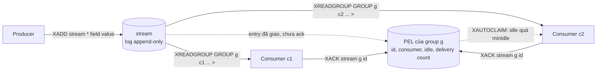
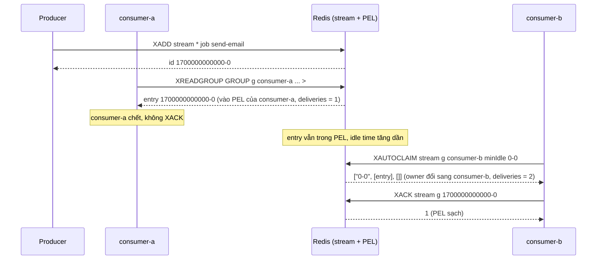

# Lab 03 - Streams với consumer group

## Mục tiêu

Dùng Redis Streams làm work queue có consumer group và chứng minh bằng test:

- Mỗi entry trong group chỉ giao cho đúng một consumer.
- Entry đã giao nhưng chưa `XACK` nằm trong pending list (PEL), `XACK` gỡ nó ra.
- Consumer chết thì consumer khác dùng `XAUTOCLAIM` để tiếp quản entry đang kẹt trong PEL, và delivery count tăng lên 2.

Lab cần Redis chạy bằng `make up` (Redis 8.10.2).
Lab đọc `REDIS_URL` (mặc định `redis://127.0.0.1:6379`) và mọi stream key đều có prefix duy nhất.
Khi test kết thúc, `DEL` xoá stream cùng các consumer group và PEL của nó.
Lý thuyết nằm ở [theory.md](../theory.md).

## Kiến trúc



Đường lỗi: consumer `consumer-a` đọc entry rồi chết trước khi ack, entry nằm lại trong PEL cho tới khi `consumer-b` claim.



## Giao diện

TypeScript (`ts/lab.ts`):

```ts
new StreamQueue({ redis, blocking, stream, blockMs? });
publish(fields: Record<string, string>): Promise<string>; // XADD, trả về id
createGroup(group: string, startId = "0"): Promise<void>; // XGROUP CREATE ... MKSTREAM, nuốt BUSYGROUP
consume(group: string, consumer: string, count: number): Promise<StreamMessage[]>; // XREADGROUP ... BLOCK ... >
ack(group: string, id: string): Promise<number>; // XACK, số id đã gỡ khỏi PEL
claimStale(group: string, consumer: string, minIdleMs: number): Promise<{ messages; deletedIds }>; // XAUTOCLAIM
pendingCount(group: string): Promise<number>; // XPENDING dạng summary
pendingEntries(group: string): Promise<PendingEntry[]>; // XPENDING dạng extended
```

Go (`go/lab.go`): `NewStreamQueue(Config{Commands, Blocking, Stream, BlockTime})` với `Publish`, `CreateGroup`, `Consume`, `Ack`, `ClaimStale`, `PendingCount` và `PendingEntries`, đều nhận `ctx` đầu tiên.
`ClaimStale` trả `ClaimResult{Messages, DeletedIDs}`.

Task gốc quy định `publish`, `consume`, `ack` và `claimStale`.
Lab thêm `createGroup` (task yêu cầu tạo group bằng `XGROUP CREATE ... MKSTREAM`), `pendingCount` và `pendingEntries` để test đọc PEL của server làm bằng chứng.
Kiểu trả về của `claimStale` là thiết kế của lab: `{ messages, deletedIds }`, rỗng khi không có gì để claim.

## Các điểm quan trọng

`createGroup` chạy `XGROUP CREATE stream group 0 MKSTREAM` và chỉ nuốt lỗi có tiền tố `BUSYGROUP`, nên gọi hai lần không lỗi còn lỗi khác (ví dụ `WRONGTYPE`) vẫn được báo.
Start id mặc định là `0`, nghĩa là group thấy cả những entry đã có trước khi tạo group.

`consume` dùng `XREADGROUP ... BLOCK ms STREAMS stream >`, tức chỉ đọc entry chưa từng giao cho group.
Hết thời gian block mà không có entry mới thì server trả nil và `consume` trả danh sách rỗng.
`XREADGROUP BLOCK` cần connection riêng (không dùng chung với client chạy lệnh thường), vì connection đang block không phục vụ được lệnh khác.
Lệnh typed `XReadGroup` của go-redis tự cộng thời gian block vào read deadline: đã đo với `ReadTimeout` 100 ms và block 500 ms, kết quả là nil sạch và không có lỗi timeout (giống `BLMove` ở lab 02).

`claimStale` lặp `XAUTOCLAIM` theo cursor tới khi nhận `0-0`, mỗi lần quét tối đa `COUNT 100` entry.
Claim làm entry đổi owner, đặt lại idle time về 0 và cộng một vào delivery count.
Nếu entry trong PEL đã bị `XDEL` hoặc trim khỏi stream, Redis 7.0 trở lên không claim nó mà gỡ khỏi PEL và trả id đó ở phần tử thứ ba của reply, test `xautoclaim_reports_ids_deleted_from_the_stream` đo điều này.

Test không chạm đúng biên của `min-idle-time`, vì docs của `XAUTOCLAIM` diễn đạt biên không nhất quán ("more than" và "less than or equal").
Test chờ bằng `eventually` cho tới khi `XPENDING` báo entry idle ít nhất `2 x minIdle`, rồi mới claim với `minIdle`, nên khoảng chênh luôn rõ rệt và không dùng sleep.

## Hình dạng reply dưới RESP3

Đo trên Redis 8.10.2 với ioredis 6.0.0 và go-redis v9.23.0 (cả hai nói RESP3 mặc định):

| Lệnh                | ioredis 6.0.0                                                                                     | go-redis v9.23.0                                                                                       |
| ------------------- | ------------------------------------------------------------------------------------------------- | ------------------------------------------------------------------------------------------------------ |
| `XADD`              | string id                                                                                         | typed: string id                                                                                       |
| `XREADGROUP`        | mảng `[[stream, [[id, [field, value, ...]]]]]`, `null` khi hết block                              | typed: `[]XStream`, nil reply thành `redis.Nil`. Gọi thô `Do` ra `map` theo tên stream                 |
| `XPENDING` summary  | `[count, minId, maxId, [[consumer, "count"]]]`, count là number, `[0, null, null, null]` khi rỗng | typed: `XPending{Count, Lower, Higher, Consumers}`, gọi thô ra `[]interface{}` cùng dạng               |
| `XPENDING` extended | `[[id, consumer, idleMs, deliveryCount]]`, hai số cuối là number                                  | typed: `XPendingExt{ID, Consumer, Idle (Duration), RetryCount}`                                        |
| `XAUTOCLAIM`        | mảng 3 phần tử `[cursor, entries, deletedIds]`                                                    | typed `XAutoClaim` chỉ trả `(messages, cursor)` và bỏ phần tử thứ ba. Gọi thô `Do` mới có đủ 3 phần tử |
| `XACK`              | number                                                                                            | `int64`                                                                                                |

Vì typed `XAutoClaim` của go-redis bỏ danh sách id đã xoá, bản Go của lab gọi `Do("XAUTOCLAIM", ...)` và tự parse, còn bản TS dùng thẳng reply của ioredis.
Test `xautoclaim_reports_ids_deleted_from_the_stream` khoá hành vi này ở cả hai ngôn ngữ.

## Chạy

```bash
make up
pnpm vitest run 03-redis-messaging/lab-03-streams/ts
go test -race ./03-redis-messaging/lab-03-streams/go/...
make lab-ts LAB=03-redis-messaging/lab-03-streams
make lab-go LAB=03-redis-messaging/lab-03-streams
```

## Kết quả mong đợi

Test (cùng tên ở TS và Go, Go dùng CamelCase):

| Test                                                                           | Chứng minh                                                                                                                                                   |
| ------------------------------------------------------------------------------ | ------------------------------------------------------------------------------------------------------------------------------------------------------------ |
| `each_message_goes_to_one_consumer_in_group`                                   | 2 consumer cùng group đọc đồng thời 20 entry: mỗi id được giao đúng một lần, hợp hai bên bằng đủ 20 id, và PEL ghi mỗi id một owner với delivery count 1     |
| `xack_removes_entry_from_pending_list`                                         | `XPENDING` đếm `3` trước ack, giảm theo từng `XACK`, về `0` khi ack hết, ack lặp trả `0`                                                                     |
| `xautoclaim_recovers_pending_from_dead_consumer`                               | Consumer A đọc không ack rồi chết, consumer B `claimStale` nhận entry, PEL ghi owner là B với delivery count `2` và idle time đã reset, B ack thì PEL về `0` |
| `claim_stale_with_nothing_pending_returns_empty_result`                        | Group chưa giao gì hoặc đã ack hết: kết quả rỗng, không lỗi                                                                                                  |
| `xautoclaim_skips_entries_that_are_not_idle_long_enough`                       | `minIdle` 1 phút với entry vừa giao: không claim, owner và delivery count giữ nguyên                                                                         |
| `xautoclaim_reports_ids_deleted_from_the_stream`                               | Entry bị `XDEL` khi còn trong PEL: không claim, id nằm ở `deletedIds`, PEL về `0`                                                                            |
| `consume_returns_empty_list_when_no_new_message_arrives_within_the_block_time` | Stream không có entry mới: `consume` trả danh sách rỗng sau khoảng thời gian block                                                                           |
| `create_group_is_idempotent`                                                   | Tạo group lần hai không lỗi (nuốt `BUSYGROUP`), nhưng `WRONGTYPE` vẫn được báo                                                                               |

Demo in PEL sau từng bước: `consumer-a` đọc hai entry không ack, crash, `consumer-b` claim cả hai (owner đổi, deliveries `2`), ack, rồi đọc tiếp entry chưa từng giao.
Cuối demo in reply thô của `XPENDING` và `XAUTOCLAIM` để thấy hình dạng RESP3 ở bảng trên.

## Bài tập mở rộng

1. Thêm dead letter queue: khi delivery count từ `pendingEntries` vượt ngưỡng thì `XADD` entry sang stream `<stream>:dlq` rồi `XACK`.
   Redis Streams không có DLQ sẵn (suy ra từ danh sách lệnh trong docs, không phải câu khẳng định trực tiếp).
2. Thêm hàm khởi động đọc lại PEL của chính consumer bằng `XREADGROUP ... STREAMS stream 0` cho tới khi rỗng, rồi mới chuyển sang `>`.
3. Thử `XTRIM stream MAXLEN ~ 100` trong lúc PEL còn entry và quan sát `deletedIds` của lần `XAUTOCLAIM` sau.
4. Thay `claimStale` bằng `XREADGROUP ... CLAIM min-idle-time` (Redis 8.4 trở lên) và so sánh số lệnh.
