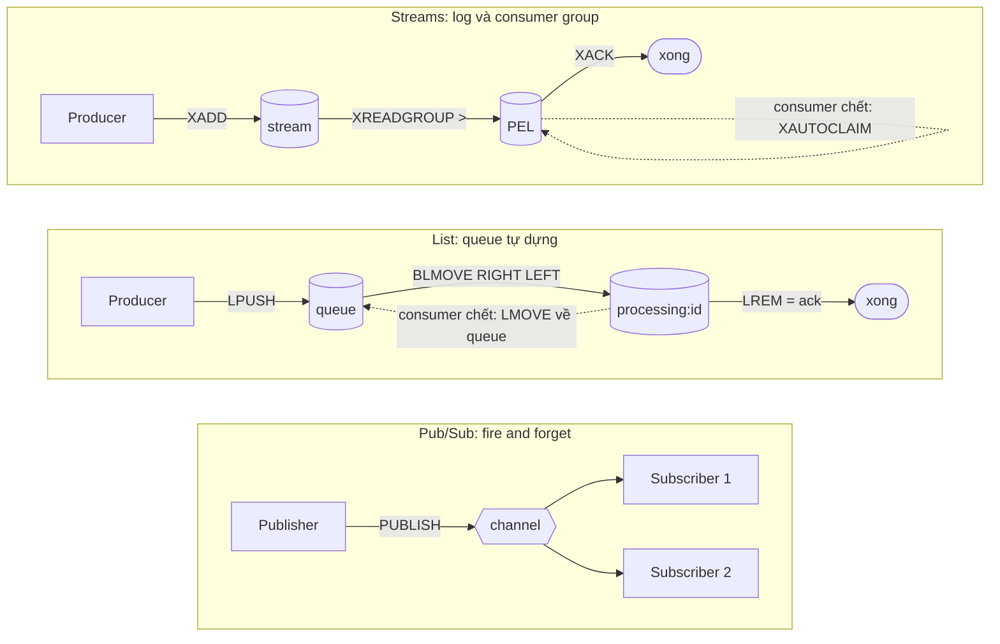
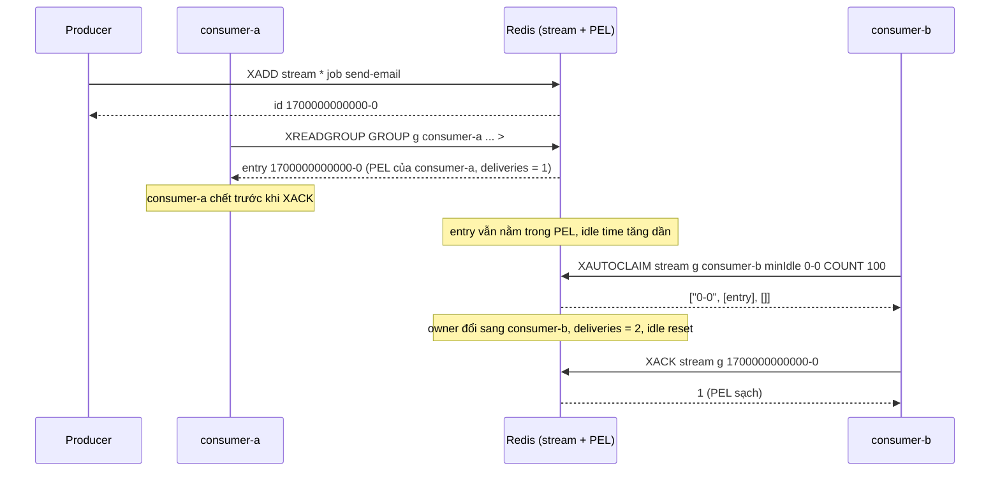
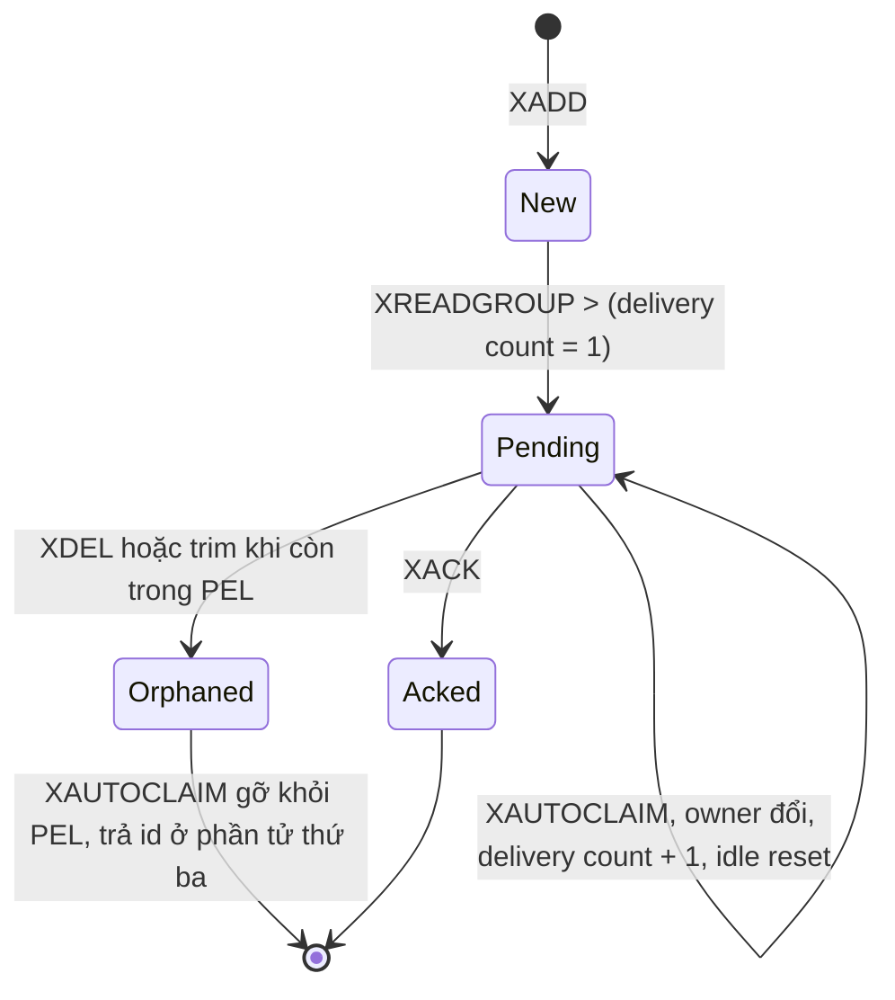

# Chủ đề 03 - Redis messaging

Redis có ba cách đưa message từ producer sang consumer, mỗi cách đánh đổi khác nhau giữa độ tin cậy, khả năng lưu trữ và tính năng:

- Pub/Sub: fire and forget, nhanh và đơn giản, không lưu gì.
- List: queue tự dựng, với `BLMOVE` và processing list thì không mất message khi consumer crash.
- Streams: log append-only có consumer group, PEL, ack và claim, là thứ gần nhất với một message broker thực thụ.

Ba lab đi kèm cần Redis chạy bằng `make up` (Redis 8.10.2, client ioredis 6.0.0 và go-redis v9.23.0):

- [Lab 01 - Pub/Sub](./lab-01-pubsub/README.md)
- [Lab 02 - List queue với BLMOVE](./lab-02-list-queue/README.md)
- [Lab 03 - Streams với consumer group](./lab-03-streams/README.md)

## Ba cơ chế trên một hình

## Pub/Sub

`PUBLISH channel message` đẩy message tới mọi client đang `SUBSCRIBE` channel đó vào đúng lúc publish.
Reply của `PUBLISH` là số receiver nhận được message, và `0` nghĩa là không ai nghe.

Tài liệu Redis ghi rõ ngữ nghĩa là at-most-once: message được giao một lần nếu có subscriber, còn nếu subscriber lỗi hoặc đứt mạng thì message mất vĩnh viễn.
Pub/Sub không lưu message, nên subscriber vào muộn không đọc lại được gì.
Subscriber nhận message theo đúng thứ tự publish, và mỗi message đến mọi subscriber (fan-out).

Nguồn: https://redis.io/docs/latest/develop/pubsub/

Lab 01 chứng minh hai điều trên bằng reply của `PUBLISH`:

- Ba `PUBLISH` khi chưa ai subscribe đều trả `0`.
  Subscriber vào sau chỉ nhận message publish sau đó, ba message cũ không bao giờ đến.
- Ba subscriber trên ba connection riêng cùng nhận đủ 20 message theo đúng thứ tự, và mỗi `PUBLISH` trả `3`.

Một số đặc điểm khác của Pub/Sub:

- Pub/Sub không liên quan tới keyspace và database number: publish ở db 10 thì subscriber ở db 1 vẫn nhận được, nên hãy prefix channel theo môi trường.
- Một message có thể đến nhiều lần nếu client vừa `SUBSCRIBE foo` vừa `PSUBSCRIBE f*` (một `message` và một `pmessage`).
- Trên Cluster, Pub/Sub thường gửi message tới mọi node qua cluster bus.
  Sharded Pub/Sub (Redis 7.0 trở lên: `SSUBSCRIBE`, `SPUBLISH`) gán channel vào hash slot và chỉ lan truyền trong shard.
- Subscriber nên dùng connection riêng.
  Với RESP2, connection đang subscribe chỉ chạy được một tập lệnh hạn chế, còn với RESP3 thì chạy được lệnh khác.

Lab 01 đo hai giao thức trên ioredis 6.0.0: với RESP3 (mặc định) lệnh `GET` trên connection đang subscribe chạy được và trả `null`, còn với `protocol: 2` ioredis báo `Connection in subscriber mode, only subscriber commands may be used`.

Nguồn: https://redis.io/docs/latest/develop/pubsub/
Nguồn: https://github.com/redis/ioredis/blob/main/CHANGELOG.md

Dùng Pub/Sub khi mất message là chấp nhận được: thông báo thời gian thực, invalidate cache, tín hiệu "có việc mới" mà consumer vẫn có cách đồng bộ lại.
Không dùng Pub/Sub làm job queue, vì job sẽ biến mất khi worker restart hoặc đứt mạng.

## List queue

Queue đơn giản nhất là `LPUSH` để thêm và `BRPOP` để lấy.
Cách này không reliable: message đã pop ra khỏi Redis, nên consumer crash ngay sau khi pop và trước khi xử lý xong thì message mất.

Pattern reliable queue dùng `BLMOVE source destination <LEFT|RIGHT> <LEFT|RIGHT> timeout`:

1. Producer `LPUSH queue msg`.
2. Consumer `BLMOVE queue processing:<id> RIGHT LEFT timeout`, tức lấy message cũ nhất và cất vào list `processing` của chính nó trong một bước atomic.
3. Xử lý xong thì `LREM processing:<id> 1 msg` để ack.
4. Một tiến trình khác theo dõi `processing` và đẩy lại message của consumer đã chết về queue.

`BLMOVE` có từ Redis 6.2.0 và thay thế `BRPOPLPUSH` (đã deprecated từ 6.2.0, `BLMOVE source destination RIGHT LEFT` tương đương).
Timeout là số giây kiểu double, `0` là block vô hạn, và hết timeout thì trả nil.
Nếu `source` rỗng thì `LMOVE` trả nil.

Nguồn: https://redis.io/docs/latest/commands/blmove/
Nguồn: https://redis.io/docs/latest/commands/brpoplpush/
Nguồn: https://redis.io/docs/latest/commands/lmove/

Lab 02 hiện thực pattern này và test:

- Sau `dequeue` thì `LRANGE queue` rỗng còn `LRANGE processing:<id>` giữ message cho tới khi `ack`.
- Consumer A dequeue rồi crash không ack.
  `recoverStale(A)` chuyển message về queue và trả `1`, consumer B nhận lại đúng message đó.
- Queue rỗng thì `dequeue` trả `null` sau khi block hết timeout, và `recoverStale` trên processing list rỗng trả `0`.
- Hướng `LEFT RIGHT` khi recover giữ nguyên thứ tự gốc của các message.

Giới hạn của List queue:

- Không có consumer group: không có theo dõi idle time, delivery count hay claim tự động.
  Hệ thống phải tự quyết định consumer nào đã chết, ví dụ bằng heartbeat.
- Chỉ có một nhóm consumer cạnh tranh: mỗi message bị lấy ra khỏi queue, nên không có fan-out và không đọc lại được.
- Delivery là at-least-once: recover nhầm một consumer chỉ chậm sẽ làm message chạy hai lần, nên consumer cần idempotent.
- Trên Cluster, `BLMOVE` là lệnh nhiều key nên `source` và `destination` phải cùng hash slot (dùng hash tag).
- Redis 8.10 thêm `LMOVEM` và `BLMOVEM` để chuyển nhiều phần tử một lần.
  Tính năng này mới nên lab không dựa vào nó.

Nguồn: https://redis.io/docs/latest/develop/using-commands/multi-key-operations/
Nguồn: https://redis.io/docs/latest/develop/whats-new/8-10/

## Streams

Stream là log append-only, mỗi entry có một ID và một danh sách field-value.

### XADD và entry ID

`XADD key * field value ...` thêm entry và để server sinh ID dạng `<millisecondsTime>-<sequenceNumber>`.
ID bắt buộc tăng dần: ID nhỏ hơn hoặc bằng ID cuối bị từ chối.
Entry không bị xoá khi được đọc, nên stream cho phép đọc lại (replay) bằng ID.

Nguồn: https://redis.io/docs/latest/develop/data-types/streams/

### Consumer group, PEL và XACK

Consumer group chia entry cho nhiều consumer: mỗi entry chỉ giao cho một consumer trong group.

- Tạo group bằng `XGROUP CREATE key group $|0 [MKSTREAM]`.
  Gọi lại khi group đã có thì Redis trả lỗi `BUSYGROUP`, nên code khởi động cần nuốt đúng lỗi đó.
- Consumer tự được tạo lần đầu nó xuất hiện trong `XREADGROUP`.
- `XREADGROUP GROUP g c ... STREAMS key >` đọc entry chưa từng giao cho consumer nào trong group.
  ID khác (ví dụ `0`) đọc lại pending của chính consumer đó.
- PEL (Pending Entries List) là danh sách ID đã giao nhưng chưa `XACK`.
  `XPENDING` cho xem PEL kèm idle time và delivery count, và `XACK` gỡ ID khỏi PEL.
- Streams và trạng thái group (last-delivered ID, PEL, consumer) được persist và replicate, mặc định là at-least-once.
- `NOACK` bỏ qua PEL và chấp nhận mất message, không dùng cho queue cần reliable.

Nguồn: https://redis.io/docs/latest/develop/data-types/streams/
Nguồn: https://redis.io/docs/latest/commands/xreadgroup/

Mỗi group giữ last-delivered ID và PEL riêng, nên (suy ra từ đó) hai group khác nhau trên cùng stream mỗi group đều thấy toàn bộ entry.
Đây là cách Streams làm fan-out, còn các consumer trong một group là cạnh tranh nhau.

Lab 03 đo bằng `XPENDING` của server:

- 2 consumer cùng group đọc đồng thời 20 entry: mỗi id được giao đúng một lần, hợp hai bên là đủ 20 id.
- Delivery count của entry mới giao là 1, `XACK` đưa số entry pending từ 3 về 0 theo từng lần ack, và ack lặp trả `0`.

### XAUTOCLAIM: tiếp quản entry của consumer đã chết

`XAUTOCLAIM key group consumer min-idle-time start [COUNT count] [JUSTID]` có từ Redis 6.2.0.
Lệnh này tương đương `XPENDING` rồi `XCLAIM`, nhưng gọn hơn.

- `min-idle-time` tính bằng mili giây, chỉ entry idle đủ lâu mới bị claim, và claim xong thì idle time được đặt lại về 0.
- Claim tăng delivery count của entry, trừ khi dùng `JUSTID`.
  Delivery count cao là dấu hiệu poison message.
- `COUNT` mặc định 100, và server chỉ quét tối đa `count * 10` entry PEL mỗi lần, nên một lần gọi có thể claim ít hơn `count`.
  Hãy lặp theo cursor.
- Reply gồm 3 phần tử từ Redis 7.0: cursor cho lần gọi sau (`0-0` nghĩa là đã quét hết PEL), danh sách entry đã claim, và danh sách ID đã không còn trong stream (bị trim hoặc `XDEL`) mà Redis đã gỡ khỏi PEL.
- Tài liệu diễn đạt biên của `min-idle-time` không nhất quán ("more than" và "less than or equal"), nên test không được chạm đúng biên.

Nguồn: https://redis.io/docs/latest/commands/xautoclaim/

Lab 03 đo các điều trên:

- Consumer A đọc không ack rồi chết, consumer B `claimStale` nhận entry, PEL ghi owner là B với delivery count 2 và idle time đã reset.
- Test chờ bằng `eventually` tới khi `XPENDING` báo idle ít nhất `2 x minIdle` rồi mới claim, nên không chạm biên và không dùng sleep.
- Entry bị `XDEL` khi còn trong PEL: `XAUTOCLAIM` không claim, gỡ nó khỏi PEL và trả ID ở phần tử thứ ba.
  Typed `XAutoClaim` của go-redis v9.23.0 bỏ phần tử này, nên bản Go parse reply thô.
- Claim với `minIdle` một phút lên entry vừa giao: không claim gì, owner và delivery count giữ nguyên.
  Claim khi PEL rỗng trả kết quả rỗng, không lỗi.

Redis 8.4 thêm `XREADGROUP ... CLAIM min-idle-time` để claim ngay trong lệnh đọc.
Redis 8.8 thêm `XNACK`, nhưng trang lệnh ghi "Not supported" cho Redis Software và Redis Cloud, nên chương này chỉ nhắc như tính năng tuỳ chọn.

Nguồn: https://redis.io/docs/latest/commands/xreadgroup/
Nguồn: https://redis.io/docs/latest/commands/xnack/

Vòng đời của một entry trong một consumer group:

### Trimming và xoá

`XTRIM key MAXLEN|MINID [=|~] threshold [LIMIT count]` giới hạn kích thước stream.
`MAXLEN` giữ tối đa N entry, `MINID` xoá entry có ID nhỏ hơn ngưỡng (từ Redis 6.2.0).
`=` là trim chính xác (mặc định), `~` là trim xấp xỉ rẻ hơn và có thể giữ thêm vài chục entry.

Từ Redis 8.2, `XTRIM` có thêm `KEEPREF` (mặc định), `DELREF` và `ACKED`:

- Mặc định `KEEPREF` xoá entry kể cả khi nó còn trong PEL của một group và giữ nguyên tham chiếu trong PEL.
- `DELREF` xoá luôn tham chiếu.
- `ACKED` chỉ xoá entry mà mọi group đã đọc và ack.

Hệ quả của mặc định: entry bị trim khi còn trong PEL sẽ khiến `XREADGROUP ... 0` trả `nil` thay cho payload, và `XAUTOCLAIM` dọn nó khỏi PEL từ Redis 7.0.
`XDEL` xoá entry theo ID, còn `XDELEX` và `XACKDEL` (Redis 8.2) điều khiển việc xoá với nhiều group.
`XINFO STREAM`, `XINFO GROUPS` và `XINFO CONSUMERS` dùng để quan sát.

Nguồn: https://redis.io/docs/latest/commands/xtrim/
Nguồn: https://redis.io/docs/latest/develop/data-types/streams/

### Dead letter queue

Redis Streams không có dead letter queue sẵn.
Đây là suy ra từ danh sách lệnh trong tài liệu (không có lệnh nào làm việc đó), không phải một câu khẳng định trực tiếp của Redis.
Cách tự làm: đọc delivery count từ `XPENDING`, khi vượt ngưỡng thì `XADD` entry sang stream `<stream>:dlq` rồi `XACK` entry gốc.

Nguồn: https://redis.io/docs/latest/develop/data-types/streams/

## Hình dạng reply dưới RESP3

ioredis 6.0.0 và go-redis v9.23.0 nói RESP3 mặc định, nên hình dạng reply thô có thể khác tutorial cũ.
Lab 03 đo trên Redis 8.10.2:

- `XREADGROUP`: ioredis trả mảng `[[stream, [[id, [field, value, ...]]]]]` hoặc `null` khi hết block.
  go-redis typed trả `[]XStream` và nil reply thành `redis.Nil`, còn gọi thô bằng `Do` thì ra `map` theo tên stream.
- `XPENDING` summary: `[count, minId, maxId, [[consumer, "count"]]]`, và `[0, null, null, null]` khi PEL rỗng.
  `XPENDING` extended: `[[id, consumer, idleMs, deliveryCount]]`.
- `XAUTOCLAIM`: mảng 3 phần tử ở ioredis.
  go-redis typed `XAutoClaim` chỉ trả hai giá trị `(messages, cursor)`, nên muốn thấy ID đã bị xoá phải dùng `Do`.
- `PUBSUB NUMSUB`: ioredis trả mảng phẳng `[channel, count]` với count là number, go-redis parse thành `map[string]int64`.

Bài học là dùng hàm typed khi nó đủ thông tin, và để test khoá hình dạng reply ở chỗ client có thể che mất dữ liệu.

## So sánh Pub/Sub, List và Streams

| Tiêu chí               | Pub/Sub                             | List (`BLMOVE` + processing list)                  | Streams (consumer group)                            |
| ---------------------- | ----------------------------------- | -------------------------------------------------- | --------------------------------------------------- |
| Delivery guarantee     | At-most-once                        | At-least-once (tự dựng, cần recover)               | At-least-once (mặc định), at-most-once với `NOACK`  |
| Persistence            | Không lưu message                   | Là key thường, theo cấu hình persistence của Redis | Persist và replicate, kèm trạng thái consumer group |
| Fan-out                | Có, mọi subscriber nhận mọi message | Không, mỗi message chỉ một consumer                | Qua nhiều group (suy ra từ state riêng mỗi group)   |
| Consumer group         | Không                               | Không, chỉ một nhóm cạnh tranh tự quản             | Có, kèm PEL, idle time, delivery count              |
| Replay                 | Không                               | Không, message bị lấy ra khỏi queue                | Có, entry giữ tới khi trim hoặc `XDEL`              |
| Ack                    | Không có                            | Thủ công bằng `LREM` khỏi processing list          | `XACK`                                              |
| Phục hồi consumer chết | Không, message mất                  | Tự viết reaper cho `recoverStale`                  | `XAUTOCLAIM` theo idle time                         |
| Ordering               | Đúng thứ tự publish                 | FIFO (`LPUSH` rồi lấy từ đầu phải)                 | Theo ID tăng dần                                    |
| Dead letter            | Không                               | Tự làm                                             | Không có sẵn, tự làm từ delivery count              |
| Độ phức tạp vận hành   | Thấp nhất                           | Trung bình, tự viết phần recover                   | Cao hơn, phải quản PEL, trim và giám sát            |

Các ô về delivery guarantee, persistence, ordering và tính năng của Streams lấy từ tài liệu Redis.
Các ô "tự dựng", "tự viết" và "độ phức tạp vận hành" là nhận định của handbook dựa trên lab, không phải câu trong tài liệu.

Gợi ý chọn:

- Cần thông báo tức thời tới nhiều bên và chấp nhận mất: Pub/Sub.
- Cần job queue đơn giản, một nhóm worker, và chấp nhận tự viết phần recover: List với `BLMOVE`.
- Cần at-least-once, nhiều consumer chia việc, theo dõi pending, claim và replay: Streams với consumer group.
- Cần retry theo lịch, DLQ, rate limit đầy đủ: cân nhắc broker chuyên dụng hoặc thư viện job queue xây trên Redis (các chương sau).

## Lỗi thường gặp

- Dùng Pub/Sub làm job queue: job biến mất khi worker restart hoặc đứt mạng.
  Hãy dùng List với `BLMOVE` hoặc Streams với consumer group.
- Queue bằng `LPUSH` và `BRPOP`: message mất khi consumer crash giữa lúc pop và xử lý.
  Hãy dùng `BLMOVE`, `LREM` khi xong và một reaper cho processing list.
- Dùng chung connection cho lệnh blocking (`BLMOVE`, `XREADGROUP BLOCK`, `SUBSCRIBE`) và lệnh thường: lệnh thường bị kẹt sau lệnh đang block.
  Mỗi consumer blocking cần connection riêng.
- Gọi lệnh blocking thô qua go-redis với `ReadTimeout` ngắn hơn thời gian block: lệnh lỗi `i/o timeout`.
  Lab 02 đo được lệnh typed `BLMove` thì không bị, vì go-redis tự cộng thời gian block vào deadline.
- Quên `XACK`: PEL phình to, `XPENDING` thấy hàng nghìn entry và delivery count tăng.
  Hãy luôn ack sau khi xử lý thành công và giám sát `XPENDING` cùng `XINFO GROUPS`.
- Chỉ đọc bằng `>` mà không đọc lại pending khi khởi động: entry của consumer cũ đã chết kẹt mãi trong PEL của nó.
  Hãy đọc với ID `0` tới khi rỗng và chạy `XAUTOCLAIM` định kỳ.
- Dừng vòng `XAUTOCLAIM` mãi mãi khi gặp `0-0`: entry đến hạn claim sau đó không bao giờ được nhặt.
  Hãy gọi lại từ `0-0` theo chu kỳ, vì thời gian trôi làm entry cũ đủ điều kiện.
- Bỏ qua phần tử thứ ba của reply `XAUTOCLAIM`: ID đã bị xoá nằm trong PEL vô hạn.
  Hãy đọc phần tử đó, và kiểm tra entry `nil` khi đọc lại pending.
- `XTRIM` hoặc `MAXLEN` quá tay khi consumer chậm: mất entry chưa xử lý, vì mặc định `KEEPREF` vẫn xoá entry còn trong PEL.
  Hãy trim theo `MINID` đủ xa hoặc dùng `ACKED` (Redis 8.2 trở lên).
- Dùng `NOACK` cho tiện: crash là mất message mà không dấu vết.
- Test claim đúng biên `min-idle-time`: test flaky vì tài liệu diễn đạt biên không nhất quán.
  Hãy dùng khoảng chênh lớn như lab 03.
- Redis đầy bộ nhớ với `noeviction`: `XADD` và `LPUSH` trả `OOM` (xem chương 02).
  Đừng đặt queue chung instance với cache dùng `allkeys-lru`.
- Tin rằng stream không bao giờ mất dữ liệu: replication của Redis là bất đồng bộ, nên failover có thể mất các ghi gần nhất, kể cả stream (xem chương 04).

Nguồn: https://redis.io/docs/latest/develop/pubsub/
Nguồn: https://redis.io/docs/latest/commands/lmove/
Nguồn: https://redis.io/docs/latest/commands/xreadgroup/
Nguồn: https://redis.io/docs/latest/commands/xautoclaim/
Nguồn: https://redis.io/docs/latest/commands/xtrim/

## Nguồn tham khảo

Phiên bản đã kiểm tra ngày 2026-10-06: Redis server 8.10.2 (stack lab), ioredis 6.0.0, go-redis v9.23.0 (yêu cầu Go 1.26 trở lên).
Các lab đo trực tiếp hình dạng reply RESP3, hành vi của `PUBLISH`, `BLMOVE`, `XAUTOCLAIM`, và timeout phía client của go-redis trên Redis 8.10.2.
Các phần được suy ra thay vì lấy trực tiếp từ tài liệu đã được đánh dấu trong bài: Streams không có DLQ sẵn, và fan-out của Streams qua nhiều group.

- Redis docs: Pub/Sub
  Nguồn: https://redis.io/docs/latest/develop/pubsub/
- Redis docs: `BLMOVE`
  Nguồn: https://redis.io/docs/latest/commands/blmove/
- Redis docs: `BRPOPLPUSH` (deprecated từ 6.2.0)
  Nguồn: https://redis.io/docs/latest/commands/brpoplpush/
- Redis docs: `LMOVE` (reliable queue)
  Nguồn: https://redis.io/docs/latest/commands/lmove/
- Redis docs: Multi-key operations (`BLMOVE` trên Cluster)
  Nguồn: https://redis.io/docs/latest/develop/using-commands/multi-key-operations/
- Redis docs: Streams
  Nguồn: https://redis.io/docs/latest/develop/data-types/streams/
- Redis docs: `XREADGROUP`
  Nguồn: https://redis.io/docs/latest/commands/xreadgroup/
- Redis docs: `XAUTOCLAIM`
  Nguồn: https://redis.io/docs/latest/commands/xautoclaim/
- Redis docs: `XTRIM`
  Nguồn: https://redis.io/docs/latest/commands/xtrim/
- Redis docs: `XNACK` (Redis 8.8)
  Nguồn: https://redis.io/docs/latest/commands/xnack/
- Redis 8.10 what's new (`LMOVEM`, `BLMOVEM`, `MAXCOUNT`, `MAXSIZE`)
  Nguồn: https://redis.io/docs/latest/develop/whats-new/8-10/
- Redis 8.8 what's new (`XNACK`)
  Nguồn: https://redis.io/docs/latest/develop/whats-new/8-8/
- ioredis 6.0.0 changelog (RESP3 mặc định)
  Nguồn: https://github.com/redis/ioredis/blob/main/CHANGELOG.md
- go-redis v9.23.0 release
  Nguồn: https://github.com/redis/go-redis/releases/tag/v9.23.0
