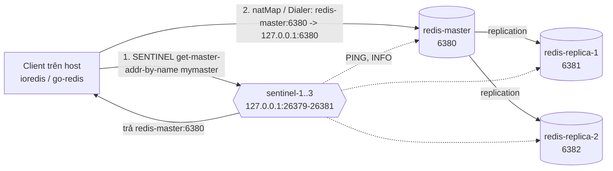
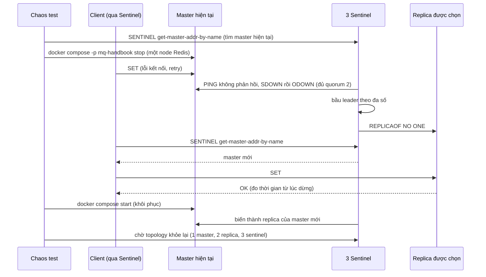

# Lab 01 - Sentinel failover với chaos test

## Mục tiêu

Chứng minh bằng test với Sentinel thật rằng:

- Client nối qua Sentinel tiếp tục ghi được sau khi master bị dừng, trong vòng 30 giây.
- Master cũ khi sống lại trở thành replica của master mới (không có hai master).
- Một client chạy trên máy host đi qua được topology Docker, nơi mọi node khai địa chỉ bằng tên Docker DNS.

Lab cần cả hai topology: `make up PROFILE="sentinel cluster"` (test chủ đề 04 cần cả `sentinel` lẫn `cluster`, dù lab này chỉ dùng `sentinel`).
Test kiểm tra các port `26379` đến `26381` và `6380` đến `6382` trước khi chạy và dừng ngay với thông báo rõ ràng nếu profile chưa chạy.
Lý thuyết nằm ở [theory.md](../theory.md).

## Kiến trúc



Đường lỗi: master bị dừng, ba Sentinel đồng ý, bầu leader, promote một replica, client hỏi lại Sentinel và ghi tiếp.



## Giao diện

TypeScript (`ts/lab.ts`, `ts/chaos.ts`):

```ts
connectViaSentinel(extra?: Partial<RedisOptions>): Redis; // ioredis: sentinels + name + natMap
currentMaster(): Promise<Address>; // SENTINEL get-master-addr-by-name, địa chỉ Docker DNS chưa map
readTopology(): Promise<Topology>; // SENTINEL master + SENTINEL replicas
isHealthy(topology: Topology): boolean; // 1 master, 2 replica "slave" link ok, 3 sentinel
hostAddress(announced: Address): Address; // redis-master:6380 -> 127.0.0.1:6380
stopService(service: string): Promise<unknown>; // docker compose -p mq-handbook ... stop
startService(service: string): Promise<unknown>; // docker compose -p mq-handbook ... start
```

Go (`go/lab.go`, `go/chaos.go`): `ConnectViaSentinel() *redis.Client` (dùng `redis.NewFailoverClient`), `CurrentMaster(ctx)`, `ReadTopology(ctx)` với `Topology.Healthy()`, `HostAddr`, `Dialer`, `StopService(ctx, service)` và `StartService(ctx, service)`.

Task gốc chỉ quy định `connectViaSentinel`.
Lab thêm `currentMaster`, `readTopology`, `isHealthy` để test tìm master hiện tại và kiểm tra topology khỏe, và `chaos` để dừng và khởi động container.

## natMap và Dialer

Sentinel và các node khai địa chỉ theo tên Docker DNS (`redis-master:6380`, `sentinel-2:26380`), mà host không phân giải được.
Client phải ánh xạ về `127.0.0.1` với cùng port:

- ioredis: option `natMap` với đủ ba node Redis và ba Sentinel.
  Phải có cả Sentinel: ioredis học danh sách Sentinel khác từ `SENTINEL SENTINELS` rồi áp `natMap` lên địa chỉ đó (mã nguồn `SentinelConnector.updateSentinels`), nên thiếu bảng cho Sentinel thì nó thêm địa chỉ `sentinel-2:26380` không dial được.
- go-redis không có `natMap`.
  `FailoverOptions.Dialer` được đặt vào cả client dial master (`masterReplicaDialer` gọi `opt.Dialer(ctx, network, addr)` với addr là địa chỉ Sentinel trả về) lẫn client nói chuyện với Sentinel, nên một hàm `Dialer` đổi địa chỉ trước khi `net.Dial` là đủ.
  Test `TestClientWritesThroughTheMasterThatSentinelReports` và hai test chaos chạy qua đúng đường này, nên nếu `Dialer` không thay được `natMap` trên go-redis v9.23.0 thì các test này fail.
  Các test này pass trên go-redis v9.23.0, nên cách dùng `Dialer` thay `natMap` đã được kiểm chứng bằng thực nghiệm (log của go-redis cho thấy nó học `sentinel-2:26380` và master `redis-replica-2:6382` rồi vẫn dial được).

## Chaos test hoạt động thế nào

- Mỗi test chaos tự tìm master hiện tại bằng `SENTINEL get-master-addr-by-name`, không giả định master là `redis-master`: sau một lần failover master có thể là bất kỳ node nào.
  Tên host Sentinel trả về chính là tên service trong compose.
- Chỉ dừng và khởi động container của compose project `mq-handbook`, qua `docker compose -p mq-handbook -f infra/docker-compose.yml stop|start <service>`, và chỉ với ba service `redis-master`, `redis-replica-1`, `redis-replica-2` (danh sách cho phép nằm trong `chaos.ts` và `chaos.go`).
  Không bao giờ dùng `docker kill` hay `docker stop` theo tên tự do.
- Khôi phục: mọi service đã dừng được start lại trong `afterEach` (TS) và `t.Cleanup` (Go), kể cả khi test lỗi giữa chừng.
  Sau đó test chờ bằng `eventually` tới khi Sentinel thấy 1 master, 2 replica (cờ `slave`, link `ok`, theo đúng master hiện tại) và 3 sentinel, rồi mới xóa key.
- Chạy lại hai lần liên tiếp vẫn pass, vì lần sau tự tìm master đã dời sang node khác.
- Thứ tự khôi phục: `docker compose start` của một replica chờ `redis-master` healthy theo `depends_on`, nên chaos chỉ dừng một node mỗi lần và khôi phục ngay sau test.
- Node vừa khôi phục có thể báo là replica của chủ cũ trong vài giây (replica container khởi động với `--replicaof redis-master 6380`, còn `redis-master` khởi động như một master mới), và Sentinel cấu hình lại.
  Test `chaos_old_master_rejoins_as_replica` chờ cho tới khi `ROLE` của node đó báo `slave` của đúng master mới, thay vì tin vào trạng thái nhất thời.

## Chạy

```bash
make up PROFILE="sentinel cluster"
pnpm vitest run 04-redis-advanced/lab-01-sentinel/ts
go test -race ./04-redis-advanced/lab-01-sentinel/go/...
make lab-ts LAB=04-redis-advanced/lab-01-sentinel
make lab-go LAB=04-redis-advanced/lab-01-sentinel
```

Test chaos dùng lệnh `docker`, nên `docker` phải có trong `PATH`.
Trên macOS với Docker Desktop, thêm `/Applications/Docker.app/Contents/Resources/bin` vào `PATH` nếu cần.
Mỗi test chaos phải đợi topology khỏe lại sau khi khôi phục container, nên lab chạy lâu hơn các lab khác.

## Kết quả mong đợi

Test (cùng ý nghĩa ở TS và Go, Go dùng CamelCase):

| Test                                                             | Chứng minh                                                                                                                          |
| ---------------------------------------------------------------- | ----------------------------------------------------------------------------------------------------------------------------------- |
| `client_writes_through_the_master_that_sentinel_reports`         | `SET` và `GET` qua `connectViaSentinel`, `ROLE` báo `master`, và giá trị đọc được trực tiếp trên master mà Sentinel báo             |
| `sentinel_sees_one_master_and_two_replicas`                      | Sentinel thấy 1 master, 2 replica khỏe và 3 sentinel                                                                                |
| `chaos_client_writes_succeed_within_30s_after_master_is_stopped` | Dừng master hiện tại, ghi lại thành công trong dưới 30 giây, giá trị nằm trên master mới khác node đã dừng, và in thời gian đo được |
| `chaos_old_master_rejoins_as_replica`                            | Master cũ khởi động lại thành replica của master mới, và topology trở lại 1 master, 2 replica                                       |

Test không dùng sleep cố định: mọi chỗ chờ dùng `eventually`.

## Kết quả đo

Thời gian failover phụ thuộc máy và cấu hình, nên đây là số đo một lần trên máy phát triển (Docker Desktop, Apple Silicon), chỉ để tham khảo.
Với compose của handbook (`down-after-milliseconds 2000`, `failover-timeout 10000`), thời gian từ lúc dừng master tới lần ghi thành công đầu tiên đo được:

| Công cụ               | Lần ghi thành công đầu tiên sau khi dừng master |
| --------------------- | ----------------------------------------------- |
| Test chaos TypeScript | 1904, 3085, 3099 và 3196 ms (bốn lần chạy)      |
| Test chaos Go         | 2986 ms và 3134 ms (hai lần chạy)               |
| Demo TypeScript       | 3043 ms và 3654 ms                              |
| Demo Go               | 3080 ms và 3095 ms                              |

Thời gian failover gồm `down-after-milliseconds`, thời gian bầu leader, thời gian promote và thời gian để client hỏi lại Sentinel.
Đây không phải một cận dưới cứng: số đo có thể thấp hơn `down-after-milliseconds`.
Lý do là đồng hồ của test và demo bắt đầu khi lệnh `docker compose stop` trả về, còn các Sentinel đã bắt đầu đếm từ lần `PING` thành công cuối cùng, tức là sớm hơn.
Vì vậy lần chạy 1904 ms ở bảng trên thấp hơn 2000 ms mà vẫn hợp lệ.
Test chaos in dòng `Đo failover: ...` (TypeScript: `pnpm vitest run ... --reporter=verbose --silent=false`, Go: `go test -v`), và demo in cùng con số kèm số lần ghi thất bại trước đó.
Hãy chạy lại trên máy của bạn để có số riêng.
Với master bị dừng, ioredis báo vài lỗi kết nối (event `error`) trong lúc chờ, và test đếm chúng thay vì để ioredis log từng lỗi.

## Bài tập mở rộng

1. Dừng cả hai replica rồi ghi, quan sát Redis vẫn ghi được (không có `min-replicas-to-write`), rồi bật `min-replicas-to-write 1` và xem master từ chối ghi.
2. Dừng 2 trong 3 Sentinel và xem failover có xảy ra không (cần đa số để bầu leader).
3. Đặt `down-after-milliseconds 30000` (mặc định) trong compose, đo lại thời gian failover và so với kết quả trong bảng đo.
4. Ghi liên tục từ một vòng lặp, dừng master, đếm số write bị mất sau failover (replication bất đồng bộ) bằng cách ghi một counter tăng dần.
