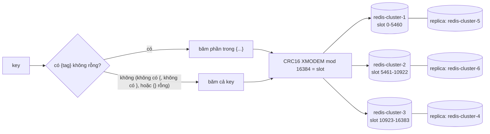
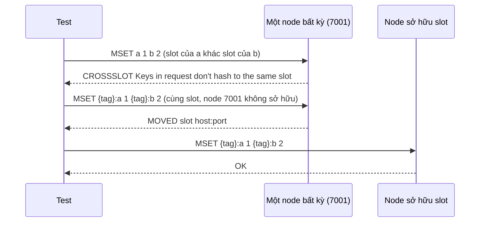

# Lab 02 - Cluster hash slot, hash tag và CROSSSLOT

## Mục tiêu

Hiểu Redis Cluster chia key thế nào bằng cách tự cài thuật toán và đối chiếu với server:

- `slotFor(key)` tính `CRC16(key) mod 16384` có xử lý hash tag, tự cài bằng tay ở cả TypeScript và Go.
  Test so kết quả với `CLUSTER KEYSLOT` trên cluster thật cho một bảng key, gồm các trường hợp biên của hash tag và key không phải ASCII.
- Các key có cùng hash tag nằm trong cùng một slot, nên lệnh multi-key chạy được.
- Lệnh multi-key trên key khác slot bị server từ chối với lỗi `CROSSSLOT`.
- Client trên host đi qua được cluster Docker, nơi các node khai tên Docker DNS (`redis-cluster-1:7001`).

Lab cần `make up PROFILE="sentinel cluster"`.
Test kiểm tra các port `7001` đến `7006` trước khi chạy và dừng ngay với thông báo rõ ràng nếu profile chưa chạy.
Lý thuyết nằm ở [theory.md](../theory.md).

## Kiến trúc



Đường lỗi: `MSET` với key khác slot trên một node bị từ chối, còn key cùng hash tag thì chỉ node sở hữu slot nhận được.



Lưu ý: ví dụ CROSSSLOT ở trên gửi tới một node cố định, và server kiểm tra `CROSSSLOT` trước khi kiểm tra `MOVED`, nên lỗi `CROSSSLOT` đến từ bất kỳ node nào, kể cả node không sở hữu slot nào của hai key.

## Giao diện

TypeScript (`ts/lab.ts`):

```ts
slotFor(key: string): number; // CRC16 mod 16384 với hash tag, tự cài
connectCluster(): Cluster; // ioredis Cluster với natMap cho 6 node
slotOwner(slot: number): Promise<Address>; // CLUSTER SLOTS, địa chỉ Docker DNS chưa map
hostAddress(announced: Address): Address; // redis-cluster-2:7002 -> 127.0.0.1:7002
```

Go (`go/lab.go`): `SlotFor(key string) int`, `ConnectCluster() *redis.ClusterClient` (có `Dialer`), `SlotOwner(ctx, slot) (string, error)`, `HostAddr`, `Dialer`, `ClusterPorts`.

## Cách `slotFor` hoạt động

CRC16 biến thể XMODEM: polynomial `0x1021`, giá trị khởi tạo 0, không reflect, xor output 0.
Lab dùng bảng 256 phần tử; check value của chuỗi `123456789` là `0x31C3`, và test kiểm tra điều này.

Phần được băm (`hashPart`) theo spec:

- Tìm `{` đầu tiên.
  Không có thì băm cả key.
- Tìm `}` đầu tiên sau nó.
  Không có thì băm cả key.
- Nếu `}` nằm ngay sau `{` (tag rỗng `{}`) thì băm cả key.
- Ngược lại băm phần giữa hai dấu ngoặc.

Các trường hợp biên mà test khóa lại: `foo{}{bar}` (cả key), `foo{{bar}}zap` (tag là `{bar`), `foo{bar}{zap}` (tag là `bar`), `{}foo`, `foo{bar` (không có `}`), `foo}bar{`, `{`, `}`, `{{}}` (tag là `{`) và key rỗng.

Không phải ASCII: Redis băm theo byte nên `slotFor` băm trên UTF-8.
TypeScript dùng `Buffer.from(key, "utf8")` thay vì `charCodeAt`, vì `charCodeAt` trả đơn vị UTF-16 và cho slot sai với `日本語` hay emoji.
Go lấy thẳng byte của string, nên key không hợp lệ UTF-8 như `"\xff\xfe"` cũng được test (chỉ có ở Go, vì chuỗi TypeScript không biểu diễn được byte lẻ).
Tìm `{` và `}` trên mảng byte cho cùng kết quả với tìm trên chuỗi vì hai ký tự này chỉ là một byte trong UTF-8.

## natMap và Dialer

`CLUSTER SLOTS` và `MOVED` chứa tên Docker DNS (`redis-cluster-2:7002`) vì node đặt `cluster-announce-hostname` và `cluster-preferred-endpoint-type hostname`.
Client trên host ánh xạ lại về `127.0.0.1` với cùng port:

- ioredis: `new Cluster(seeds, { natMap })`.
- go-redis không có `natMap`: `ClusterOptions.Dialer` nhận địa chỉ lấy từ slot map hoặc `MOVED` và dial địa chỉ đã ánh xạ.
  Test `cluster_client_writes_keys_spread_over_all_masters` (`TestClusterClientWritesKeysSpreadOverAllMasters`) ghi và đọc 60 key rải trên cả 3 master, nên nếu `Dialer` không thay được `natMap` trên go-redis v9.23.0 thì test này fail, và test này pass trên go-redis v9.23.0.

## Chạy

```bash
make up PROFILE="sentinel cluster"
pnpm vitest run 04-redis-advanced/lab-02-cluster/ts
go test -race ./04-redis-advanced/lab-02-cluster/go/...
make lab-ts LAB=04-redis-advanced/lab-02-cluster
make lab-go LAB=04-redis-advanced/lab-02-cluster
```

## Kết quả mong đợi

Test (cùng ý nghĩa ở TS và Go, Go dùng CamelCase):

| Test                                                  | Chứng minh                                                                                                                                    |
| ----------------------------------------------------- | --------------------------------------------------------------------------------------------------------------------------------------------- |
| `slot_for_matches_cluster_keyslot`                    | `slotFor` bằng `CLUSTER KEYSLOT` cho bảng key (hash tag, trường hợp biên, không phải ASCII) và `slotFor("123456789")` bằng `0x31C3 mod 16384` |
| `hash_tag_rules_follow_the_cluster_spec`              | Các cặp key cùng slot và khác slot theo ví dụ trong spec, không cần server                                                                    |
| `keys_with_same_hash_tag_share_a_slot`                | Ba key `{tag}:pending/processing/dead` cùng slot, `MSET` và `MGET` qua cluster client chạy được                                               |
| `multi_key_command_across_slots_fails_with_crossslot` | `MSET` key khác slot tới một node lỗi `CROSSSLOT`, cùng key với hash tag thành công trên node sở hữu slot, và node khác trả `MOVED`           |
| `cluster_client_writes_keys_spread_over_all_masters`  | 60 key ghi và đọc lại qua cluster client, rải trên 3 master (chứng minh `natMap` và `Dialer`)                                                 |

Mọi key của test có tên duy nhất (`uniqueName`) và bị xóa khi test kết thúc, từng key một vì `DEL` nhiều key khác slot sẽ lỗi `CROSSSLOT`.

## Bài tập mở rộng

1. Chạy `redis-cli --cluster reshard` chuyển một slot sang master khác (qua `docker compose exec`), rồi quan sát `MOVED` và `ASK` trong lúc client ghi.
2. Viết reliable queue của lab 03 chủ đề 03 với tên key `{jobs}` và `{jobs}:processing:A` và kiểm tra `BLMOVE` chạy trên Cluster, còn tên key không có hash tag thì lỗi `CROSSSLOT`.
3. Đếm phân phối slot của 10000 key ngẫu nhiên với `slotFor` và so với 3 master.
4. Thay `CLUSTER SLOTS` trong `slotOwner` bằng `CLUSTER SHARDS` (Redis 7.0 trở lên) và so hình dạng reply.
   Lab đã đo `SELECT 1` trên cluster trả `ERR SELECT is not allowed in cluster mode`.
