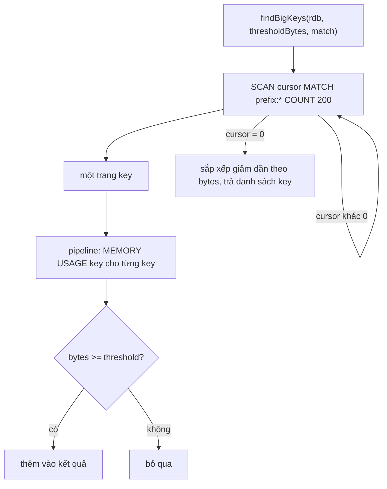
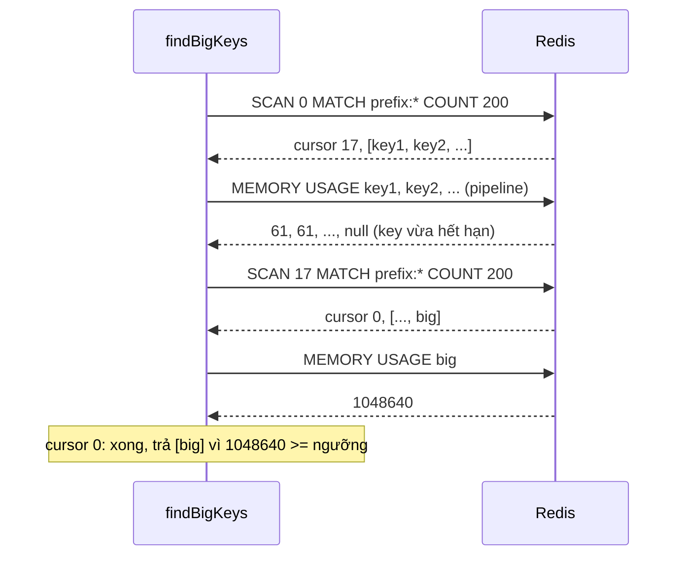

# Lab 03 - Tìm big key

## Mục tiêu

Viết `findBigKeys` tìm key tốn nhiều bộ nhớ mà không chặn server:

- Duyệt keyspace bằng `SCAN` (theo cursor, từng trang), không dùng `KEYS`.
- Hỏi `MEMORY USAGE` cho từng key của trang, gom trong một pipeline.
- Trả về các key có kích thước từ ngưỡng trở lên, key lớn nhất đứng đầu.

Lab chỉ làm big key.
Phát hiện hot key cần policy LFU (`OBJECT FREQ`, `redis-cli --hotkeys`), tức đổi `maxmemory-policy` của cả server, nên hot key chỉ nằm ở [theory.md](../theory.md) và lab không bao giờ đổi cấu hình server (không có `CONFIG SET`).

Lab chạy trên Redis cơ bản của `make up` tại `REDIS_URL` (mặc định `redis://127.0.0.1:6379`), không cần profile `sentinel` hay `cluster`.
Mọi key của lab nằm dưới một prefix duy nhất (`uniqueName`), `SCAN` chỉ quét `MATCH <prefix>:*`, và key được xóa bằng `UNLINK` khi test kết thúc.

## Kiến trúc



Đường lỗi: key hết hạn hoặc bị xóa giữa `SCAN` và `MEMORY USAGE` thì `MEMORY USAGE` trả nil, và `findBigKeys` bỏ qua key đó thay vì lỗi.



## Giao diện

TypeScript (`ts/lab.ts`):

```ts
findBigKeys(rdb: Redis, thresholdBytes: number, match = "*"): Promise<string[]>;
```

Go (`go/lab.go`):

```go
func FindBigKeys(ctx context.Context, rdb redis.UniversalClient, thresholdBytes int64, match string) ([]string, error)
```

Task gốc quy định `findBigKeys(rdb, thresholdBytes)`.
Lab thêm tham số `match` (glob, mặc định `*`) để mỗi test chỉ quét key do chính nó tạo.
Test không bao giờ khẳng định về kết quả quét toàn server, vì Redis dùng chung với các lab khác.

## Các điểm quan trọng

`MEMORY USAGE` tính theo byte cả key, value và overhead của allocator, còn `redis-cli --bigkeys` đếm theo số phần tử.
Một chuỗi 1 MiB và một list 10000 phần tử nhỏ (khoảng 1 MiB) đều là "big" theo bytes.
Con số `MEMORY USAGE` cao hơn dữ liệu thô vì allocator làm tròn lên: demo đo một chuỗi `x` lặp 1 MiB là 1310770 byte, còn key nhỏ là 64 byte.

`SCAN` không đảm bảo mỗi key xuất hiện đúng một lần, nên kết quả được loại trùng.
Ngưỡng nên tương đối với dữ liệu của bạn: lab dùng 512 KiB giữa nhóm key nhỏ (vài chục byte) và key lớn (1 MiB).

`MEMORY USAGE` với collection mặc định chỉ lấy mẫu 5 phần tử để ước lượng, nên con số là xấp xỉ, đủ để phân biệt key lớn với key nhỏ.
Muốn chính xác dùng `SAMPLES 0` (đọc hết, đắt hơn).

Cách xóa big key: `UNLINK` gỡ key khỏi keyspace ngay rồi giải phóng bộ nhớ ở thread khác, còn `DEL` chặn thread chính tới khi xong.
Test và demo xóa key của chúng bằng `UNLINK`.

## Chạy

```bash
make up
pnpm vitest run 04-redis-advanced/lab-03-hot-big-key/ts
go test -race ./04-redis-advanced/lab-03-hot-big-key/go/...
make lab-ts LAB=04-redis-advanced/lab-03-hot-big-key
make lab-go LAB=04-redis-advanced/lab-03-hot-big-key
```

## Kết quả mong đợi

Test (cùng ý nghĩa ở TS và Go, Go dùng CamelCase):

| Test                                       | Chứng minh                                                                                                                       |
| ------------------------------------------ | -------------------------------------------------------------------------------------------------------------------------------- |
| `find_big_keys_returns_key_over_threshold` | 300 key nhỏ cộng một chuỗi 1 MiB và một list khoảng 1 MiB: với ngưỡng 512 KiB kết quả đúng hai key lớn, chuỗi đứng trước list    |
| `find_big_keys_ignores_small_keys`         | 500 key nhỏ cộng một key 100 KiB: ngưỡng 512 KiB trả rỗng, ngưỡng 50 KiB trả đúng key 100 KiB, nên chỉ ngưỡng quyết định kết quả |

Demo in kích thước `MEMORY USAGE` của một key nhỏ và key lớn, kết quả của `findBigKeys` và thời gian quét 1001 key.

## Bài tập mở rộng

1. Thêm kiểu key vào kết quả (`TYPE`) và số phần tử (`STRLEN`, `LLEN`, `HLEN`...).
2. Thêm đối số `SAMPLES 0` và so sai số của ước lượng mặc định trên một hash 100000 field.
3. Chạy `redis-cli --memkeys -i 0.01` và `--bigkeys` trên Redis của lab với prefix demo đang giữ dữ liệu, so với `findBigKeys`.
4. Đo thời gian `DEL` và `UNLINK` trên một set 5 triệu phần tử bằng `LATENCY` hoặc `redis-cli --latency` ở một terminal khác (chỉ làm trên Redis riêng của bạn).
