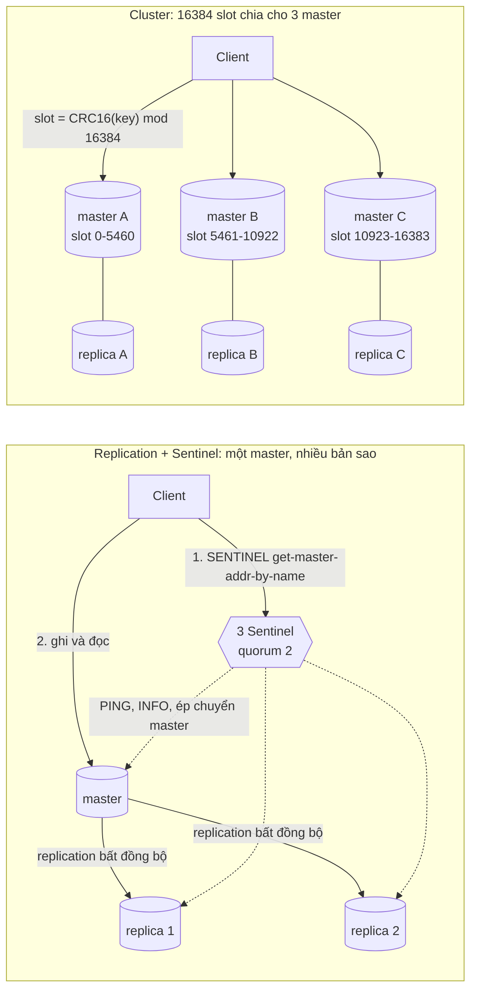
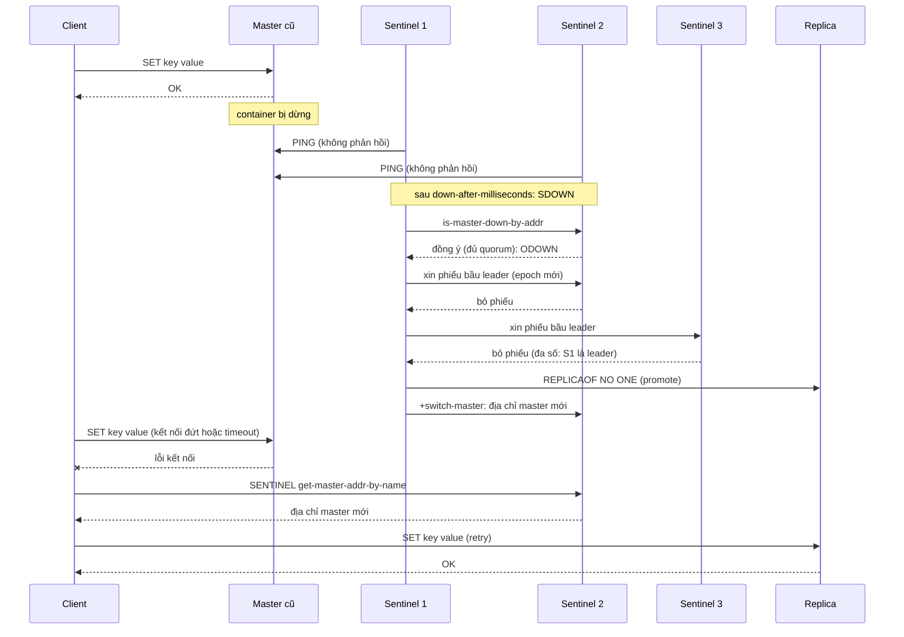

# Chủ đề 04 - Redis nâng cao

Một Redis đơn lẻ là một điểm hỏng duy nhất và bị giới hạn bởi RAM và CPU của một máy.
Chủ đề này đi qua ba mức nâng cấp, mỗi mức giải một bài toán khác nhau:

- Replication: có bản sao dữ liệu trên máy khác, nhưng tự nó không tự chuyển master.
- Sentinel: giám sát, bầu leader và failover tự động cho topology một master, không chia dữ liệu.
- Cluster: chia keyspace thành 16384 hash slot trên nhiều master, mỗi master có replica và tự failover.

Kèm theo là hai vấn đề vận hành thường gặp: hot key và big key.

Ba lab đi kèm cần cả hai topology chạy cùng lúc bằng `make up PROFILE="sentinel cluster"` (Redis 8.10.2, client ioredis 6.0.0 và go-redis v9.23.0):

- [Lab 01 - Sentinel failover với chaos test](./lab-01-sentinel/README.md)
- [Lab 02 - Cluster hash slot, hash tag và CROSSSLOT](./lab-02-cluster/README.md)
- [Lab 03 - Tìm big key](./lab-03-hot-big-key/README.md)

## Hai topology trên một hình

## Replication

Replication mặc định là bất đồng bộ: master gửi stream lệnh ghi cho replica, replica ack định kỳ lượng dữ liệu đã xử lý, và master không chờ replica cho từng lệnh.
Nguồn: https://redis.io/docs/latest/operate/oss_and_stack/management/replication/

Mỗi master có replication ID (replid) và offset tăng theo số byte đã gửi vào stream.
Khi replica kết nối lại, nó gửi `PSYNC` kèm replid và offset cuối cùng đã nhận.
Nếu replid khớp và phần thiếu vẫn còn trong replication backlog của master thì chỉ gửi phần thiếu, gọi là partial resync.
Nếu backlog không đủ hoặc replid lạ thì master làm full resync: `BGSAVE` ra RDB, buffer các lệnh ghi mới trong lúc đó, gửi RDB rồi gửi phần buffer.
Nguồn: https://redis.io/docs/latest/operate/oss_and_stack/management/replication/

Replica được promote sinh replid mới nhưng nhớ replid cũ, nên các replica khác thường vẫn partial resync được với master mới (từ Redis 4.0).
Nguồn: https://redis.io/docs/latest/operate/oss_and_stack/management/replication/

Vì bất đồng bộ, một write đã được master trả `OK` vẫn có thể mất nếu master chết trước khi replica nhận.
`WAIT` chỉ đảm bảo số replica đã ack, không biến Redis thành hệ CP.
`min-replicas-to-write` và `min-replicas-max-lag` làm master từ chối ghi khi không đủ replica còn lag trong ngưỡng, nhưng chỉ là best effort để thu hẹp cửa sổ mất dữ liệu.
Nguồn: https://redis.io/docs/latest/operate/oss_and_stack/management/replication/

Một số điểm cần nhớ:

- Replica mặc định read-only (`replica-read-only`) và bỏ qua `maxmemory` (`replica-ignore-maxmemory yes`): việc evict do master quyết định rồi gửi `DEL` xuống replica.
- Replica không tự expire key mà chờ `DEL` từ master, nhưng với lệnh đọc thì replica dùng logical clock để không trả key đã hết hạn.
- Nguy hiểm: master tắt persistence rồi tự restart sẽ khởi động rỗng, và replica sync theo sẽ bị xóa dữ liệu.
  Điều này xảy ra kể cả khi có Sentinel, nếu master restart nhanh hơn thời gian Sentinel phát hiện lỗi.
- Docker và NAT: `ROLE` và `INFO replication` liệt kê replica theo IP kết nối và port trong redis.conf, có thể sai.
  Dùng `replica-announce-ip` và `replica-announce-port` (từ 3.2.2) để node tự khai địa chỉ đúng.
  Compose của handbook dùng `--replica-announce-ip redis-master` và tương tự cho hai replica, nên Sentinel thấy các tên Docker DNS.

Nguồn: https://redis.io/docs/latest/operate/oss_and_stack/management/replication/

## Sentinel

Sentinel là một process riêng (`redis-sentinel`) làm bốn việc: giám sát master và replica, thông báo khi có sự cố, tự failover khi master chết, và là nơi client hỏi "master hiện giờ ở đâu".
Cần ít nhất 3 Sentinel đặt trên các máy hỏng độc lập.
Sentinel kết hợp với replication bất đồng bộ không đảm bảo giữ lại write đã ack khi failover.
Nguồn: https://redis.io/docs/latest/operate/oss_and_stack/management/sentinel/

### Quorum và các bước failover

`quorum` chỉ dùng để phát hiện lỗi: đủ quorum Sentinel cùng báo master không trả lời thì master bị đánh dấu ODOWN (objectively down).
Để thực sự failover, một Sentinel phải được bầu làm leader bằng đa số (majority) của tất cả Sentinel, nên phía thiểu số của một network partition không failover được.
Nguồn: https://redis.io/docs/latest/operate/oss_and_stack/management/sentinel/

Các bước:

- Mỗi Sentinel `PING` master và replica.
  Sau `down-after-milliseconds` không có phản hồi hợp lệ, Sentinel đó đánh dấu master là SDOWN (subjectively down).
- Sentinel hỏi các Sentinel khác, và khi đủ quorum người đồng ý thì master thành ODOWN.
- Các Sentinel bầu một leader theo đa số, theo epoch cấu hình mới.
- Leader chọn replica tốt nhất (ưu tiên theo priority, offset replication, runid), gửi `REPLICAOF NO ONE` để promote.
- Leader cấu hình các replica còn lại theo master mới (`parallel-syncs` giới hạn số replica sync cùng lúc).
- Master cũ được ghi nhớ là replica: khi nó sống lại, Sentinel gửi lệnh biến nó thành replica của master mới.
- Sentinel đổi cấu hình một instance thì gửi `CLIENT KILL type normal` để ngắt client cũ và ép chúng hỏi lại địa chỉ master.

Nguồn: https://redis.io/docs/latest/operate/oss_and_stack/management/sentinel/ và https://redis.io/docs/latest/develop/reference/sentinel-clients/

Thời gian failover end to end không phải một con số cố định: nó phụ thuộc `down-after-milliseconds` cộng thời gian bầu leader, promote và reconfigure.
Giá trị mặc định trong `sentinel.conf` là `down-after-milliseconds 30000` và `failover-timeout 180000`, còn `parallel-syncs` mặc định 1.
`failover-timeout` được dùng cho nhiều việc: thời gian chờ trước khi một Sentinel thử lại failover với cùng master (gấp hai lần giá trị này), thời gian hủy một failover chưa tạo thay đổi cấu hình, và thời gian tối đa chờ các replica được cấu hình lại.
Compose của handbook đặt `down-after-milliseconds 2000`, `failover-timeout 10000` để failover diễn ra trong vài giây, và lab 01 đo thời gian thực tế thay vì giả định.
Nguồn: https://raw.githubusercontent.com/redis/redis/8.10/sentinel.conf

### Client phát hiện master như thế nào

Theo spec của Sentinel client, client duyệt danh sách Sentinel với timeout ngắn, hỏi `SENTINEL get-master-addr-by-name <name>`, kết nối rồi gọi `ROLE` để xác nhận đúng là master.
Mỗi lần reconnect phải hỏi lại Sentinel, và connection pool phải đóng mọi connection khi địa chỉ master đổi.
Pub/Sub của Sentinel (kênh `+switch-master`, `+sdown`) giúp client phản ứng nhanh, nhưng không thay thế bước hỏi lại vì không bảo đảm nhận đủ message.
Nguồn: https://redis.io/docs/latest/develop/reference/sentinel-clients/

Ở mức thư viện:

- ioredis dùng option `sentinels` và `name`, có `sentinelRetryStrategy` và `retryStrategy` (mặc định backoff mũ tối đa 5 giây cộng jitter), `maxRetriesPerRequest` mặc định 20.
- go-redis dùng `redis.NewFailoverClient` với `FailoverOptions{MasterName, SentinelAddrs}`.

Nguồn: https://github.com/redis/ioredis/blob/main/README.md và https://github.com/redis/go-redis/blob/v9.23.0/sentinel.go

### Sentinel trong Docker và client trên host

Sentinel khai báo địa chỉ node theo tên Docker DNS (`redis-master:6380`), mà client trên host không phân giải được tên này.
Port remapping còn làm hỏng cơ chế tự phát hiện Sentinel khác, nên cách sửa là map port 1:1, dùng `--net=host`, hoặc đặt `sentinel announce-ip` và `announce-port`, cùng `resolve-hostnames` và `announce-hostnames`.
Nguồn: https://redis.io/docs/latest/operate/oss_and_stack/management/sentinel/

Lab 01 làm phía client:

- ioredis có `natMap`: bảng ánh xạ địa chỉ đã khai sang địa chỉ truy cập được từ host.
  Bảng phải gồm cả Sentinel, vì ioredis học danh sách Sentinel khác từ `SENTINEL SENTINELS`.
- go-redis không có `natMap`, nhưng `FailoverOptions.Dialer` nhận địa chỉ Sentinel trả về và có thể dial địa chỉ khác.
  Research ghi cách dùng này chỉ là suy ra từ chữ ký hàm, và lab 01 kiểm chứng bằng test (kết quả nằm trong README lab 01).

### Giới hạn và split-brain

Sentinel không loại bỏ được split-brain mà chỉ thu hẹp nó.
Nếu master bị cô lập ở phía thiểu số của một partition, nó vẫn nhận ghi từ client ở cùng phía cho tới khi partition hết, trong khi phía đa số đã bầu master mới.
Khi partition lành, master cũ trở thành replica của master mới và các write nó nhận trong thời gian bị cô lập bị bỏ đi.
Giảm thiểu bằng `min-replicas-to-write 1` và `min-replicas-max-lag 10`: master ở phía thiểu số ngừng nhận ghi sau 10 giây không có replica.
Nguồn: https://redis.io/docs/latest/operate/oss_and_stack/management/sentinel/

## Cluster

### Hash slot

Keyspace chia thành 16384 slot, và `HASH_SLOT = CRC16(key) mod 16384`.
CRC16 là biến thể XMODEM (còn gọi CRC-16/ACORN): polynomial 0x1021, giá trị khởi tạo 0, không reflect input hay output, xor output 0, và CRC16 của chuỗi `123456789` là `0x31C3`.
Mỗi master sở hữu một tập slot, và client lưu slot map để gửi lệnh thẳng tới đúng master.
Nguồn: https://redis.io/docs/latest/operate/oss_and_stack/reference/cluster-spec/

Lab 02 cài `slotFor` bằng tay ở cả hai ngôn ngữ và so với `CLUSTER KEYSLOT`.
`CLUSTER KEYSLOT <key>` trả slot của một key, và đây là cách kiểm chứng hash tag.
Nguồn: https://redis.io/docs/latest/develop/using-commands/multi-key-operations/

### Hash tag

Nếu key có `{`, có `}` bên phải nó, và có ít nhất một ký tự giữa `{` đầu tiên và `}` đầu tiên sau nó, thì chỉ phần giữa được hash.
Các trường hợp biên theo spec:

| Key                                            | Phần được hash                 |
| ---------------------------------------------- | ------------------------------ |
| `{user1000}.following`, `{user1000}.followers` | `user1000` (hai key cùng slot) |
| `foo{}{bar}`                                   | cả key (tag rỗng)              |
| `foo{{bar}}zap`                                | `{bar`                         |
| `foo{bar}{zap}`                                | `bar` (tag đầu tiên thắng)     |
| `{}foo`                                        | cả key (bắt đầu bằng `{}`)     |
| `foo{bar`                                      | cả key (không có `}`)          |

Nguồn: https://redis.io/docs/latest/operate/oss_and_stack/reference/cluster-spec/

Redis hash theo byte, nên key không phải ASCII được hash trên chuỗi UTF-8.
Ký tự `{` và `}` là một byte trong UTF-8 nên tìm trên byte hay trên chuỗi đều ra cùng một tag.
Đừng lạm dụng hash tag: gom quá nhiều key vào một slot làm một master quá tải còn các master khác rảnh.
Nguồn: https://redis.io/docs/latest/develop/using-commands/keyspace/

### MOVED, ASK và CROSSSLOT

- `MOVED <slot> <host:port>`: slot đã thuộc node khác.
  Client nên cập nhật slot map (ví dụ bằng `CLUSTER SLOTS`) rồi gửi lại tới node đó.
- `ASK`: xuất hiện trong lúc đang migrate slot, chỉ áp dụng cho lệnh này, không cập nhật slot map.
- `TRYAGAIN`: lỗi tạm thời trong lúc migrate.
- `CROSSSLOT`: lệnh multi-key (`MSET`, `DEL`, `SUNION`, `LMOVE`, `BLMOVE`, `BLPOP`, `ZUNIONSTORE`, `XREAD` nhiều stream), lệnh trong `MULTI/EXEC` và script `EVAL` mà các key khác slot.
  Server trả lỗi `CROSSSLOT Keys in request don't hash to the same slot`.
  Dùng hash tag để gom key, ví dụ `{queue}:pending` và `{queue}:processing` cho reliable queue của chủ đề 03.

Nguồn: https://redis.io/docs/latest/operate/oss_and_stack/reference/cluster-spec/ và https://redis.io/docs/latest/develop/using-commands/multi-key-operations/

### Những điều cần biết thêm

- Cluster không có nhiều database: chỉ có database 0, lệnh `SELECT` khác 0 bị từ chối.
- Cluster dùng replication bất đồng bộ nên vẫn có cửa sổ mất write ("last failover wins").
  Một master bị failover khi đa số master coi nó là không liên lạc được trong ít nhất `cluster-node-timeout`.
  Cluster bus dùng port dữ liệu cộng 10000.
- Mặc định trong redis.conf 8.10: `cluster-node-timeout 15000`, `cluster-require-full-coverage yes` (một slot không có master thì cả cluster ngừng nhận lệnh), `cluster-allow-reads-when-down no`.
  Compose của handbook đặt `cluster-node-timeout 5000` cho lab.
- Resharding là di chuyển slot giữa các master bằng `redis-cli --cluster reshard` và `rebalance`.
  Từ Redis 8.10 hai lệnh này dùng server-side atomic slot migration, còn chi tiết giao thức: chưa xác minh trong tài liệu research.
- Cluster trong Docker cần các node tự khai địa chỉ truy cập được: `cluster-announce-ip`, `cluster-announce-port`, `cluster-announce-bus-port` hoặc `cluster-announce-hostname`.
  Hướng dẫn từng bước cho docker-compose không có trong tài liệu chính thức, nên compose của handbook dùng `cluster-announce-hostname` với `cluster-preferred-endpoint-type hostname` và lab tự kiểm chứng.

Nguồn: https://raw.githubusercontent.com/redis/redis/8.10/redis.conf và https://redis.io/docs/latest/develop/whats-new/8-10/

### Client cluster trên host

- ioredis `Cluster`: `maxRedirections` mặc định 16, `retryDelayOnFailover` 100 ms, `retryDelayOnClusterDown` 100 ms, `retryDelayOnMoved` 0, `scaleReads` mặc định `master`.
  Tài liệu yêu cầu `retryDelayOnFailover * maxRedirections > cluster-node-timeout` để không lệnh nào lỗi khi failover.
  `natMap` ánh xạ địa chỉ node tự khai sang địa chỉ truy cập được và tài liệu nói rõ hữu ích khi chạy trong Docker.
- go-redis `ClusterOptions`: `MaxRedirects` mặc định 3, không có `natMap`.
  Có `Dialer` (ưu tiên hơn `Addr`) và `ClusterSlots` để tự cung cấp topology.
  Dùng `Dialer` để remap là suy ra từ chữ ký, và lab 02 kiểm chứng bằng test.

Nguồn: https://github.com/redis/ioredis/blob/main/README.md và https://github.com/redis/go-redis/blob/v9.23.0/osscluster.go

## So sánh ba mô hình HA

| Tiêu chí             | Một instance                | Replication + Sentinel                                | Cluster                                              |
| -------------------- | --------------------------- | ----------------------------------------------------- | ---------------------------------------------------- |
| Chống lỗi            | Không, chết là mất dịch vụ  | Có, Sentinel tự failover sang replica                 | Có, mỗi shard tự failover                            |
| Dữ liệu tối đa       | RAM một máy                 | RAM một máy (replica chỉ là bản sao)                  | Cộng dồn RAM các master                              |
| Ghi mở rộng          | Một máy                     | Một master                                            | Nhiều master, ghi song song theo slot                |
| Multi-key, Lua       | Tự do                       | Tự do                                                 | Chỉ khi cùng slot, nếu không `CROSSSLOT`             |
| Số database          | 16 (mặc định)               | 16                                                    | Chỉ database 0                                       |
| Client               | Đơn giản                    | Phải hỗ trợ Sentinel (hỏi master, reconnect)          | Phải hỗ trợ Cluster (slot map, MOVED, ASK)           |
| Mất write            | Mất khi crash và không AOF  | Có cửa sổ mất do replication bất đồng bộ              | Có cửa sổ mất do replication bất đồng bộ             |
| Độ phức tạp vận hành | Thấp                        | Trung bình: 3 Sentinel và ít nhất 1 replica           | Cao: tối thiểu 3 master (nên có replica), resharding |
| Khi dùng             | Cache dev, dữ liệu mất được | Dữ liệu vừa RAM một máy, cần HA, dùng multi-key nhiều | Dữ liệu hoặc throughput vượt một máy                 |

Nguồn: https://redis.io/docs/latest/operate/oss_and_stack/management/replication/ và https://redis.io/docs/latest/operate/oss_and_stack/management/sentinel/ và https://redis.io/docs/latest/operate/oss_and_stack/reference/cluster-spec/

## Hot key và big key

Hai vấn đề này thường bị nhầm với nhau nhưng khác bản chất:

- Big key là một key quá lớn (chuỗi hàng MB, collection hàng triệu phần tử).
  Triệu chứng: lệnh trên key đó chặn server nhiều mili giây đến giây (Redis xử lý lệnh trên một thread), latency spike, replication và failover chậm, một node trong Cluster đầy bộ nhớ hơn các node khác.
- Hot key là một key nhận lượng truy cập áp đảo.
  Triệu chứng: CPU hoặc băng thông của một node cao trong khi các node khác rảnh.
  Trong Cluster mỗi slot thuộc đúng một master, nên thêm node không giải quyết được hot key đơn lẻ.
  Đây là suy luận từ mô hình slot, tài liệu không có câu trực tiếp nên coi là chưa xác minh.

Nguồn: https://redis.io/docs/latest/operate/oss_and_stack/reference/cluster-spec/ và https://redis.io/docs/latest/develop/using-commands/keyspace/

### Phát hiện

- Big key: `redis-cli --bigkeys` (theo số phần tử), `--memkeys` (theo bộ nhớ) và `--keystats` (kết hợp).
  Các chế độ này dùng `SCAN` nên chạy được trên server bận, và `-i 0.01` làm chậm bớt để giảm tải.
  Lab 03 làm lại ý tưởng này bằng `SCAN` cộng `MEMORY USAGE`.
- Hot key: `redis-cli --hotkeys`, chỉ hoạt động khi `maxmemory-policy` là một policy LFU, vì nó dựa vào `OBJECT FREQ`.
  Đổi policy là đổi cấu hình toàn server, nên lab 03 không làm phần này và hot key chỉ nằm ở mức lý thuyết.
- Tránh `KEYS` và `SMEMBERS` trên collection lớn vì chúng chặn server, hãy dùng `SCAN`, `SSCAN`, `HSCAN`, `ZSCAN`.

Nguồn: https://redis.io/docs/latest/develop/tools/cli/ và https://redis.io/docs/latest/develop/using-commands/keyspace/

### Giảm thiểu

- Big key: chia nhỏ thành nhiều key (ví dụ bucket theo hash của field hoặc theo thời gian), nén giá trị, đặt TTL, và đọc từng phần bằng `HSCAN`, `SSCAN`, `LRANGE` có giới hạn.
- Xóa big key bằng `UNLINK`: nó gỡ key khỏi keyspace ngay rồi thu hồi bộ nhớ ở thread khác, còn `DEL` chặn thread chính cho tới khi giải phóng xong.
  `UNLINK` có từ Redis 4.0.0, và cleanup của lab 03 dùng `UNLINK`.
- Hot key: cache cục bộ trong process của app (TTL ngắn), nhân bản key thành nhiều bản `key:1` đến `key:N` rồi đọc ngẫu nhiên, hoặc đọc từ replica khi chấp nhận dữ liệu cũ.
- Cluster: kiểm tra hash tag có dồn quá nhiều key vào một slot không.

Nguồn: https://redis.io/docs/latest/commands/unlink/ và https://redis.io/docs/latest/develop/tools/cli/

## Lỗi thường gặp

- Chỉ chạy 2 Sentinel hoặc đặt cả 3 trên cùng một máy.
  Triệu chứng: không failover được hoặc failover sai ở phía thiểu số.
  Khắc phục: 3 Sentinel trên 3 máy độc lập, nhớ `quorum` chỉ để phát hiện còn bầu leader cần đa số.
- Failover quá chậm trong lab vì `down-after-milliseconds` mặc định 30000 ms.
  Khắc phục: đặt giá trị nhỏ cho lab và đo thời gian failover thực tế.
- Mất write sau failover dù đã nhận `OK`.
  Nguyên nhân: replication bất đồng bộ.
  Khắc phục: `WAIT` giảm xác suất nhưng không loại bỏ, `min-replicas-to-write` giới hạn cửa sổ ở master phía thiểu số.
- Sentinel trong Docker bridge network: Sentinel không thấy nhau hoặc replica bị liệt kê sai địa chỉ nên không bao giờ failover.
  Khắc phục: map port 1:1, `--net=host`, hoặc `announce-ip`, `announce-port`, `replica-announce-ip`.
- Client chạy ngoài network Docker nối seed node được nhưng sau `CLUSTER SLOTS` lại nối tới tên nội bộ, gây timeout hoặc `ECONNREFUSED`.
  Khắc phục: ioredis dùng `natMap`, go-redis dùng `Dialer`, hoặc cấu hình node tự khai địa chỉ truy cập được.
- `CROSSSLOT` khi dùng `MSET`, `SUNION`, `BLMOVE`, `MULTI/EXEC`, script, `XREADGROUP` nhiều stream.
  Khắc phục: hash tag trong tên key (`{orders}:pending`, `{orders}:processing`) và kiểm tra bằng `CLUSTER KEYSLOT`.
- Đặt hash tag cho mọi key (`{app}:...`): một master quá tải, các node khác rảnh.
  Khắc phục: chỉ gom những key thực sự cần multi-key operation.
- ioredis Cluster báo lỗi trong lúc failover vì `retryDelayOnFailover * maxRedirections` nhỏ hơn `cluster-node-timeout`.
- ioredis: lệnh pending bị flush lỗi sau 20 lần retry (`maxRetriesPerRequest`), hoặc đặt `null` thì chờ vô hạn.
  Chọn có chủ đích theo SLA.
- Xóa big key bằng `DEL` làm server đứng hình.
  Khắc phục: `UNLINK`.

Nguồn: https://redis.io/docs/latest/operate/oss_and_stack/management/sentinel/ và https://redis.io/docs/latest/operate/oss_and_stack/management/replication/ và https://github.com/redis/ioredis/blob/main/README.md

## Nguồn tham khảo

Phiên bản đã dùng: Redis 8.10.2 (image `redis:8.10.2`), ioredis 6.0.0, go-redis v9.23.0.
Mọi nguồn được đọc ngày 2026-10-06.
Các phần research ghi "chưa xác minh" được nêu rõ trong bài hoặc được lab kiểm chứng: giao thức atomic slot migration của 8.10, hướng dẫn Cluster-trong-Docker chính thức, và cách dùng `Dialer` của go-redis.

- Redis docs: Replication
  Nguồn: https://redis.io/docs/latest/operate/oss_and_stack/management/replication/
- Redis docs: High availability with Redis Sentinel
  Nguồn: https://redis.io/docs/latest/operate/oss_and_stack/management/sentinel/
- Redis docs: Sentinel client spec
  Nguồn: https://redis.io/docs/latest/develop/reference/sentinel-clients/
- Redis docs: Cluster specification
  Nguồn: https://redis.io/docs/latest/operate/oss_and_stack/reference/cluster-spec/
- Redis docs: Multi-key operations
  Nguồn: https://redis.io/docs/latest/develop/using-commands/multi-key-operations/
- Redis docs: Keyspace
  Nguồn: https://redis.io/docs/latest/develop/using-commands/keyspace/
- Redis docs: `redis-cli` (`--bigkeys`, `--memkeys`, `--keystats`, `--hotkeys`)
  Nguồn: https://redis.io/docs/latest/develop/tools/cli/
- Redis docs: `UNLINK`
  Nguồn: https://redis.io/docs/latest/commands/unlink/
- Redis 8.10 what's new (atomic slot migration)
  Nguồn: https://redis.io/docs/latest/develop/whats-new/8-10/
- Redis 8.10 `sentinel.conf` (giá trị mặc định)
  Nguồn: https://raw.githubusercontent.com/redis/redis/8.10/sentinel.conf
- Redis 8.10 `redis.conf` (giá trị mặc định của cluster)
  Nguồn: https://raw.githubusercontent.com/redis/redis/8.10/redis.conf
- ioredis README (Sentinel, Cluster, `natMap`, retry)
  Nguồn: https://github.com/redis/ioredis/blob/main/README.md
- go-redis v9.23.0: `sentinel.go`, `osscluster.go`, `options.go`
  Nguồn: https://github.com/redis/go-redis/blob/v9.23.0/sentinel.go
  Nguồn: https://github.com/redis/go-redis/blob/v9.23.0/osscluster.go
  Nguồn: https://github.com/redis/go-redis/blob/v9.23.0/options.go
