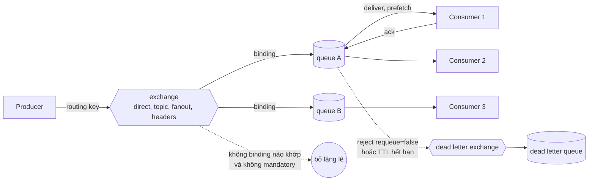
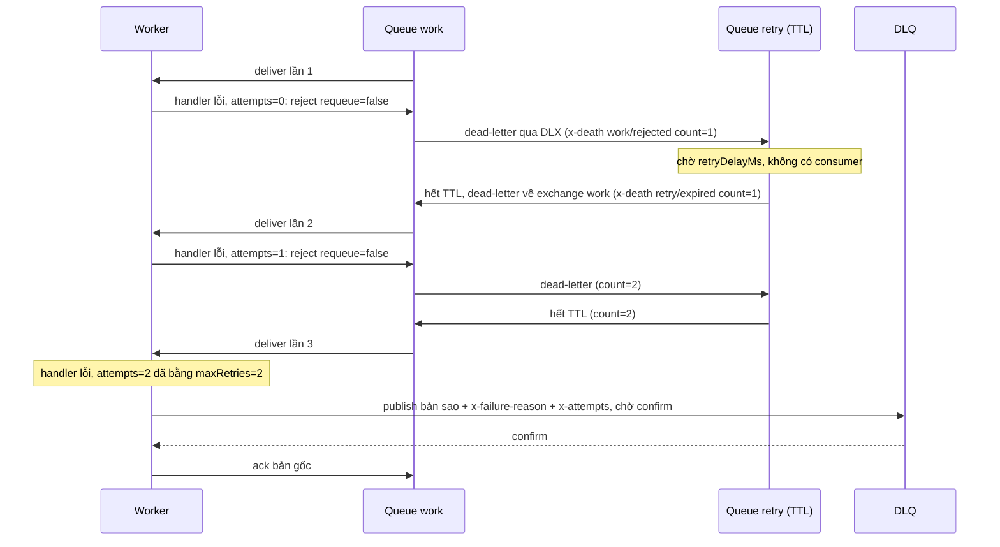
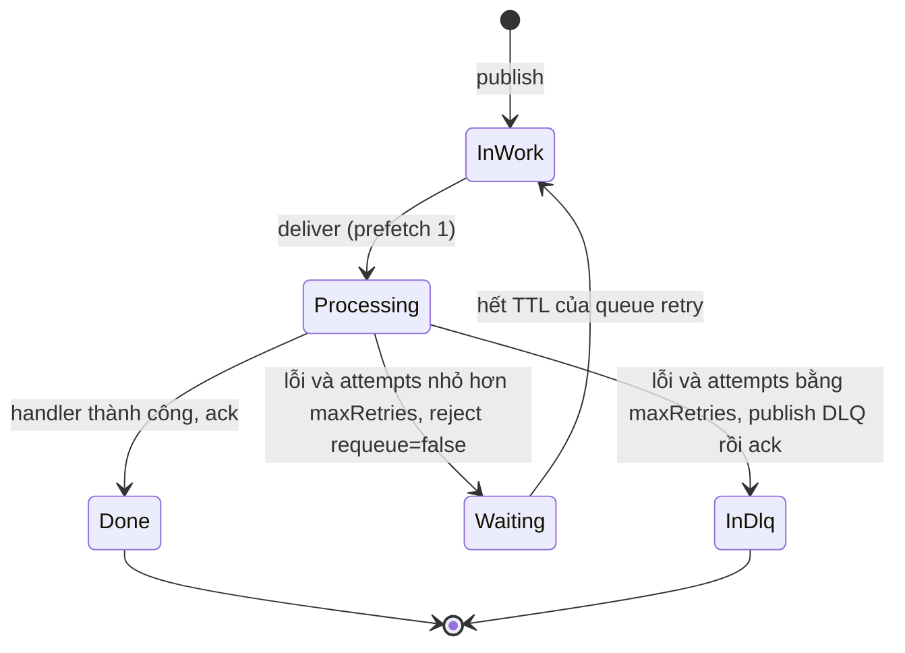

# Chủ đề 05 - RabbitMQ

RabbitMQ là message broker dùng giao thức AMQP 0-9-1: producer không gửi thẳng vào queue mà gửi vào exchange, exchange route message theo binding vào một hay nhiều queue, và consumer đọc từ queue rồi ack.
Khác với Redis (chương 03), broker lo việc route, ack, requeue, TTL và dead letter, nên phần lớn độ tin cậy là cấu hình thay vì code tự dựng.

Ba lab đi kèm cần RabbitMQ chạy bằng `make up` (RabbitMQ 4.3.6, client amqplib 2.2.0 và amqp091-go v1.15.0):

- [Lab 01 - Work queue: prefetch, ack và redelivery](./lab-01-work-queue/README.md)
- [Lab 02 - Topic routing và message không route được](./lab-02-topic-routing/README.md)
- [Lab 03 - Retry với DLX, TTL và dead letter queue](./lab-03-retry-dlx/README.md)

Series 4.3 có community support đến 2026-11-30 theo trang release information, tức là rất gần thời điểm viết (2026-10-06).
Khi dùng ngoài lab, hãy theo dõi series mới hơn và đọc lại trang release information.

## Topology trên một hình

## Mô hình AMQP 0-9-1

Một connection là một kết nối TCP sống lâu.
Channel là "lightweight connection" chạy trên cùng một TCP connection, và hầu hết thao tác (publish, consume, ack) diễn ra trên channel.
Hãy dùng connection và channel sống lâu, một channel cho mỗi thread hoặc publisher, và đừng mở channel cho từng message.
Không publish đồng thời trên một channel dùng chung.

Exchange nhận message từ producer và route theo binding.
Binding là rule gắn một queue với một exchange, kèm routing key đóng vai trò filter.
Default exchange là direct exchange không tên (chuỗi rỗng) do broker khai báo sẵn, và mọi queue tự động bind vào nó với routing key bằng tên queue.
Lab 01 dùng default exchange qua `sendToQueue`.

Queue có các thuộc tính name, durable, exclusive, auto-delete và arguments (message TTL, length limit, dead letter, kiểu queue...).
Tên queue tối đa 255 byte UTF-8, và tên bắt đầu bằng `amq.` dành cho broker.
Khai báo lại queue với thuộc tính khác bản đang có gây channel exception `406 PRECONDITION_FAILED`, còn khai báo cùng thuộc tính thì idempotent.

Nguồn: https://www.rabbitmq.com/tutorials/amqp-concepts
Nguồn: https://www.rabbitmq.com/docs/queues
Nguồn: https://www.rabbitmq.com/docs/channels

Bốn kiểu exchange:

| Kiểu      | Cách route                                                                                                       |
| --------- | ---------------------------------------------------------------------------------------------------------------- |
| `direct`  | Routing key khớp chính xác với binding key                                                                       |
| `topic`   | Routing key khớp pattern của binding: `*` thay đúng một từ, `#` thay không hoặc nhiều từ                         |
| `fanout`  | Gửi tới mọi queue đã bind và bỏ qua routing key                                                                  |
| `headers` | Khớp theo header của message, với `x-match` là `all` (mọi giá trị phải khớp) hoặc `any` (một giá trị khớp là đủ) |

Nếu message không route được vào queue nào, nó bị drop (hoặc đưa sang alternate exchange nếu có), hoặc được trả về publisher nếu publish với cờ `mandatory`.
Publish tới một exchange không tồn tại không phải trường hợp này: broker đóng cả channel với lỗi `404 NOT_FOUND`.

Nguồn: https://www.rabbitmq.com/tutorials/amqp-concepts
Nguồn: https://www.rabbitmq.com/docs/publishers

## Ack, nack, reject và redelivery

Với manual ack, broker giữ message ở trạng thái "unacked" tới khi consumer ack.
`basic.ack` xác nhận xong và broker xóa message.
`basic.nack` là phần mở rộng của RabbitMQ có thêm cờ `multiple`, còn `basic.reject` là negative ack không có `multiple`.
Với `requeue=true` message quay lại queue, còn `requeue=false` thì message bị drop hoặc dead-letter nếu queue có DLX.
Message được giao lại có cờ `redelivered = true`, lần giao đầu tiên là `false`.

Delivery tag là số nguyên tăng dần và có phạm vi theo channel, nên phải ack trên đúng channel nhận message.
Ack sai channel hoặc ack hai lần gây channel error `PRECONDITION_FAILED - unknown delivery tag`.

Mọi delivery chưa ack sẽ tự động được requeue khi channel hoặc connection nhận chúng bị đóng, kể cả khi mất TCP, consumer crash hay channel exception.
Lab 01 chứng minh bằng test `unacked_message_is_redelivered_after_worker_disconnects`: worker A nhận message rồi connection đóng, worker B nhận lại đúng message đó với `redelivered = true`.
Hệ quả là consumer phải idempotent, vì nó có thể nhận lại message đã xử lý dở.
Hủy consumer (`basic.cancel`) thì không requeue các delivery đang bay, muốn requeue phải đóng channel.

Consumer acknowledgement timeout mặc định là 30 phút.
Khi vượt quá, channel bị đóng với `PRECONDITION_FAILED` và mọi delivery đang chờ trên channel đó được requeue (chỉ nêu theo tài liệu, lab không thử).
Auto-ack được tài liệu coi là không an toàn: message coi như xong ngay khi gửi đi và consumer có thể bị quá tải.

Nguồn: https://www.rabbitmq.com/docs/confirms
Nguồn: https://www.rabbitmq.com/docs/consumers

Các header đếm giao hàng của quorum queue, đo trên RabbitMQ 4.3.6 ở lab 01:

- `reject` với `requeue=true`: lần giao lại đầu tiên có `x-delivery-count = 1` (không phải 0) cùng `x-acquired-count = 1`, lần giao lại thứ hai là 2 và 2.
- Lần giao đầu tiên không có hai header này.
- `nack` với `requeue=true` chỉ tăng `x-acquired-count`, không tạo `x-delivery-count`.
- Hệ quả của thay đổi này từ 4.3: delivery limit dựa trên delivery-count, nên một vòng `nack` requeue không bao giờ chạm limit.
  Hãy dùng `reject` khi muốn tính vào limit, hoặc `x-acquired-count` để đếm số lần assign.

Nguồn: https://www.rabbitmq.com/docs/quorum-queues
Nguồn: https://www.rabbitmq.com/blog/2024/08/28/quorum-queues-in-4.0

## Prefetch và fair dispatch

`basic.qos` giới hạn số message chưa ack mà broker giao cho consumer.
Giá trị 0 nghĩa là không giới hạn.
Mặc định broker giao message round-robin cho consumer kế tiếp, nên nếu không đặt prefetch thì worker chậm bị dồn việc như một hàng đợi mù.
Fair dispatch của tutorial work queue đạt được bằng `prefetch 1` cộng manual ack: broker chỉ giao message mới khi message trước đã được ack.

Lab 01 chứng minh bằng test `prefetch_1_gives_slow_worker_fewer_messages`: hai worker trên một queue với prefetch 1, worker chậm giữ message đầu tiên của nó mà không ack, và 9 message còn lại đều về worker nhanh.
Demo của lab đo cùng kịch bản với 12 task: prefetch không giới hạn chia 6 và 6 (tổng thời gian khoảng 1,8 giây vì worker chậm phải xử lý 6 message), prefetch 1 chia khoảng 10 và 2 (khoảng 0,6 giây).

Chi tiết về prefetch:

- Theo tài liệu, consumer không gọi `basic.qos` thì không bị giới hạn (0 là infinite), và broker có thể đặt prefetch mặc định bằng `rabbit.default_consumer_prefetch`.
  Giá trị built-in của setting đó chưa xác minh được, nên bài chỉ nêu hành vi đo được trên broker của compose.
- Đo bằng test `without_prefetch_quorum_queue_delivers_at_most_2000_unacked`: consumer không gọi `basic.qos` và không ack, quorum queue giao đúng 2000 message rồi dừng (cap 2000 của quorum queue), 100 message còn lại nằm ready.
- Cùng thử nghiệm với classic queue (đo một lần bằng script thử, không có test): consumer nhận hết 2600 message đã publish, tức là không có giới hạn.
- Quorum queue chỉ hỗ trợ per-consumer prefetch, không hỗ trợ global QoS.
- Tài liệu khuyến nghị giá trị 100 đến 300 thường cho throughput tốt, còn prefetch 1 là thận trọng nhất nhưng giảm throughput đáng kể.
- Với prefetch 1, nếu mọi worker đều bận thì queue có thể đầy.

Nguồn: https://www.rabbitmq.com/docs/consumer-prefetch
Nguồn: https://www.rabbitmq.com/tutorials/tutorial-two-javascript
Nguồn: https://www.rabbitmq.com/docs/quorum-queues

## Publisher confirms và mandatory

Publisher gửi `confirm.select` để bật confirm mode trên channel, rồi broker xác nhận từng message bằng `basic.ack` (hoặc `basic.nack` khi lỗi nội bộ).
Message persistent vào durable queue chỉ được confirm sau khi đã ghi đĩa.
Persistent cộng durable vẫn chưa đủ: có một khoảng ngắn broker đã nhận mà chưa ghi đĩa, nên muốn chắc chắn phải dùng confirm.
Ưu tiên confirm bất đồng bộ theo luồng thay vì chờ từng message (lab chờ confirm để test không cần sleep).

Điểm dễ nhầm là message không route được vẫn được broker confirm, nên confirm không chứng minh message đã vào queue.
Muốn phát hiện, hãy publish với `mandatory=true` và nghe `basic.return`:

- Broker gửi `basic.return` (reply code 312 `NO_ROUTE`) cho publisher TRƯỚC `basic.ack` của chính message đó.
- Vì vậy chỉ cần bật confirm và đọc danh sách return ngay khi confirm về, không cần timeout.
- amqplib: `channel.on('return', ...)`, amqp091-go: `Channel.NotifyReturn(chan amqp.Return)` với kênh có đệm.
- Không có `mandatory`, message không route được bị bỏ lặng lẽ và publisher không biết gì.

Lab 02 chứng minh bằng test `unrouted_message_is_dropped_without_mandatory_flag`: publish không mandatory thì có confirm, không có return và queue có 0 message ngay sau confirm, còn publish mandatory thì nhận return 312 `NO_ROUTE` rồi mới nhận confirm.

Nguồn: https://www.rabbitmq.com/docs/confirms
Nguồn: https://www.rabbitmq.com/docs/publishers

## Topic routing

Routing key của topic exchange là danh sách từ phân tách bằng dấu chấm, tối đa 255 byte.
`*` thay đúng một từ, `#` thay không hoặc nhiều từ.
Binding chỉ có `#` nhận mọi message như fanout, binding không có wildcard hoạt động như direct.

Lab 02 chứng minh hai quy tắc wildcard:

- Binding `orders.*.created` nhận `orders.eu.created`, không nhận `orders.created` (thiếu từ ở giữa) và `orders.eu.vn.created` (hai từ ở giữa).
- Binding `orders.#` nhận `orders` (không từ nào theo sau), `orders.eu` và `orders.eu.vn.created`, nhưng không nhận `payments.created`.

Nguồn: https://www.rabbitmq.com/tutorials/tutorial-five-javascript

## TTL và dead letter exchange

Message bị dead-letter (đưa sang một exchange khác) khi:

- bị `reject` hoặc `nack` với `requeue=false` (reason `rejected`),
- hết TTL (reason `expired`),
- queue vượt length limit (reason `maxlen`),
- vượt delivery limit của quorum queue (reason `delivery_limit`).

Dead-lettered message được route tới DLX với routing key là `x-dead-letter-routing-key` của queue, nếu không đặt thì dùng routing key gốc.
Hãy đặt `x-dead-letter-routing-key` tường minh để tránh vòng lặp qua default exchange.
Tài liệu khuyến nghị cấu hình DLX bằng policy thay vì x-arguments cứng, và khi cả hai cùng có thì argument thắng.
RabbitMQ phát hiện cycle và drop message nếu không có rejection nào trong cả vòng.

Dead-letter của classic queue là at-most-once, tức là không dùng publisher confirm nội bộ.
Quorum queue hỗ trợ `dead-letter-strategy: at-least-once` với điều kiện `overflow: reject-publish`, cần một DLX và feature flag `stream_queue`.
Lab 03 không bật chế độ này để giữ topology đơn giản, và không thử điều gì xảy ra khi exchange đích không tồn tại.

TTL có hai dạng: per-message TTL đặt ở thuộc tính `expiration` khi publish (chuỗi số mili giây), và per-queue `x-message-ttl`.
Message hết hạn chỉ bị loại hoặc dead-letter khi nó tới đầu queue, nên message TTL dài đứng trước message TTL ngắn sẽ chặn message sau.
Khi dead-letter, `expiration` bị xóa khỏi message để nó không hết hạn lần nữa ở queue kế tiếp, giá trị cũ được giữ trong `original-expiration` của `x-death`.
Quorum queue hỗ trợ cả hai dạng TTL với cùng quy tắc đầu queue, và tốn thêm 16 byte RAM cho mỗi message dùng TTL.

Nguồn: https://www.rabbitmq.com/docs/dlx
Nguồn: https://www.rabbitmq.com/docs/ttl
Nguồn: https://www.rabbitmq.com/docs/quorum-queues

## Retry bằng DLX và TTL

RabbitMQ không có retry có delay sẵn trong AMQP 0-9-1, nên cách kinh điển là ghép DLX với TTL:

- Work queue có DLX trỏ tới exchange retry.
- Queue retry (wait queue) không có consumer, có `x-message-ttl` bằng delay và `x-dead-letter-exchange` trỏ ngược về exchange work.
- Consumer `reject` với `requeue=false` khi lỗi, message sang queue retry, chờ hết TTL rồi tự quay lại work queue.
- Số lần đã thất bại đếm bằng header `x-death`, và khi hết lượt thì chuyển message sang DLQ (parking lot).

Dùng một queue retry cho mỗi mức delay với TTL cố định.
Khi mọi message trong queue cùng TTL thì quy tắc đầu queue không gây vấn đề, còn trộn nhiều per-message TTL trong một queue thì message ngắn bị chặn sau message dài.

Vòng đời của một message trong vòng retry:

Các quyết định thiết kế của lab 03 (mỗi điểm đều có test, trừ lựa chọn `reject` thay `nack` chỉ là sở thích về cờ `multiple`):

- `maxRetries` là số lần retry sau lần xử lý đầu tiên, nên khi không có crash và publish sang DLQ không thất bại thì handler chạy `maxRetries + 1` lần.
  `maxRetries = 0` nghĩa là lỗi đầu tiên đi thẳng vào DLQ.
- Worker dùng `reject(requeue=false)`, còn `nack(requeue=false)` dead-letter và tăng `x-death` y hệt (test `nack_without_requeue_dead_letters_and_raises_x_death_count`).
  Sự khác biệt `nack` và `reject` của 4.3 chỉ nằm ở `requeue=true`, như đã đo ở lab 01.
- Số lần đã thất bại là tổng `count` của entry `x-death` có `queue` là work queue và `reason` là `rejected`.
- Khi hết lượt, worker tự publish một bản sao sang DLQ rồi ack bản gốc sau khi nhận confirm, thay vì để broker dead-letter.
  Nhờ vậy chặng cuối không làm mất message (publish không được confirm thì `reject(requeue=true)`), và bản sao giữ nguyên `x-death` cộng `x-failure-reason` và `x-attempts`.
  Đổi lại, nếu worker chết giữa lúc confirm và ack thì DLQ có thể có hai bản (at-least-once).
  Các chặng work sang retry và retry sang work do broker dead-letter, mặc định at-most-once, nên bảo đảm "không mất" chỉ áp dụng cho chặng cuối.
- Test `retry_respects_retry_delay` chỉ khẳng định cận dưới của delay, vì tải máy chỉ làm thời gian dài ra.

Hai lựa chọn khác mà lab không làm:

- RabbitMQ 4.3 thêm delayed retry native cho quorum queue với linear back-off: argument `x-delayed-retry-type` (`disabled` mặc định, `all`, `failed`, `returned`), `x-delayed-retry-min` và `x-delayed-retry-max`, theo công thức `delay = min(min_delay * delivery_count, max_delay)`.
  Tài liệu khuyến nghị cách này thay vì dựa vào delivery limit để bắt poison message, nhưng lab không thử nên bài chỉ nêu như một hướng thay thế.
- Plugin delayed-message-exchange (exchange type `x-delayed-message`) đã bị RabbitMQ team ngừng maintain và repo đã archive.
  README của plugin ghi hạn chế: message delay chỉ nằm trên một node nên mất khi node hỏng, không hỗ trợ `mandatory`, và nó dựa trên Mnesia vốn đã bị gỡ trong chu kỳ 4.3.
  README đề xuất từ RabbitMQ 4.4 quorum queue hỗ trợ native message delivery delay, nhưng 4.4 chưa phát hành tại thời điểm viết nên bài không mô tả API đó.

Nguồn: https://www.rabbitmq.com/docs/dlx
Nguồn: https://www.rabbitmq.com/docs/ttl
Nguồn: https://www.rabbitmq.com/docs/quorum-queues
Nguồn: https://github.com/rabbitmq/rabbitmq-delayed-message-exchange

## x-death và delivery limit

`x-death` là header do broker thêm khi dead-letter (không có khi message chỉ bị requeue).
Nó là array các table, gom theo cặp {queue, reason}, và lần dead-letter gần nhất đứng đầu.
Mỗi phần tử có:

- `queue`, `reason` (`rejected`, `expired`, `maxlen` hoặc `delivery_limit`), `exchange`, `routing-keys` (array string),
- `count`: số lần message bị dead-letter từ queue đó với reason đó,
- `time`: thời điểm lần đầu tiên,
- `original-expiration`: tùy chọn, chỉ có khi message có per-message expiration.

Lần dead-letter đầu tiên còn thêm `x-first-death-queue`, `x-first-death-reason`, `x-first-death-exchange` (không bao giờ đổi) và `x-last-death-queue`, `x-last-death-reason`, `x-last-death-exchange` (cập nhật mỗi lần).

Hình dạng khi client giải mã, đo bằng test của lab 03 trên RabbitMQ 4.3.6:

| Trường         | amqplib 2.2.0                            | amqp091-go v1.15.0               |
| -------------- | ---------------------------------------- | -------------------------------- |
| `x-death`      | array các object                         | `[]interface{}` các `amqp.Table` |
| `count`        | `number`                                 | `int64`                          |
| `time`         | `{ '!': 'timestamp', value: <số giây> }` | `time.Time` (độ phân giải giây)  |
| `routing-keys` | array string                             | `[]interface{}` các string       |

Delivery limit của quorum queue mặc định là 20 từ RabbitMQ 4.0 (trước đó không giới hạn).
Khi message bị giao lại quá limit thì nó bị drop, hoặc dead-letter nếu có DLX với `reason = delivery_limit`.
Vì vậy hãy luôn cấu hình DLX cho quorum queue, và nếu muốn thì đặt lại hành vi cũ bằng `x-delivery-limit = -1` (không khuyến nghị).
Bảng "khi nào delivery count tăng" của tài liệu 4.3: `basic.nack` chỉ tăng acquired-count, `basic.reject` và client crash hoặc mất connection tăng cả hai, còn consumer timeout và network partition chỉ tăng acquired-count.

Nguồn: https://www.rabbitmq.com/docs/dlx
Nguồn: https://www.rabbitmq.com/docs/quorum-queues
Nguồn: https://www.rabbitmq.com/blog/2024/08/28/quorum-queues-in-4.0

## Quorum queue, classic queue và stream

Loại queue được chọn lúc declare bằng argument `x-queue-type`, và không thể đổi bằng policy hay sau khi đã tạo.
Loại mặc định của RabbitMQ không cấu hình là classic.
Handbook thì khác: `infra/docker-compose.yml` đặt `default_queue_type = quorum` cho broker của lab, nên queue khai báo không có `x-queue-type` sẽ là quorum ở đây nhưng là classic trên broker stock.
Vì vậy mọi lab đều truyền `x-queue-type: quorum` tường minh.
Declare lại cùng tên với type khác gây `406 PRECONDITION_FAILED` (suy ra từ tài liệu về queue type immutable, lab không thử).

Quorum queue là queue replicated dựa trên Raft.
Mirrored classic queue đã bị gỡ hoàn toàn từ RabbitMQ 4.0 (deprecated từ 2021), nên bài không dạy nó ngoài việc nhắc đây là lịch sử.
Hai cấu trúc dữ liệu replicated còn lại là quorum queue và stream, và mọi kịch bản HA trên 4.3 phải dùng một trong hai.

Quorum queue so với classic, theo feature matrix của tài liệu:

- Không hỗ trợ non-durable, exclusive hay server-named queue, nên lab dùng queue durable, tên cố định và xóa thủ công khi dọn dẹp.
- Không hỗ trợ global QoS (consume trên channel đã bật global QoS gây channel error) và chặn prefetch ở 2000.
- Message luôn persistent.
- Có xử lý poison message (delivery limit), và từ 4.3 có consumer timeout cấu hình được và delayed retry native.

Stream là append-only log: nhiều consumer đọc lặp lại cho tới khi message hết hạn (non-destructive), khác với queue xóa message sau ack.
Khai báo bằng `x-queue-type: stream` lúc declare.
Consumer qua AMQP 0-9-1 phải đặt prefetch và manual ack, chọn điểm đọc bằng `x-stream-offset` (`first`, `last`, offset số, timestamp, interval), và retention bằng `x-max-age` hoặc `x-max-length-bytes`.
Stream protocol riêng ở cổng 5552 (plugin `rabbitmq_stream`) cho throughput cao hơn.
Qua AMQP 0-9-1, stream không hỗ trợ non-durable, exclusive, global QoS, TTL, priority và dead-letter exchange.
Chương này chỉ giới thiệu stream, lab chính dùng quorum queue.

Nguồn: https://www.rabbitmq.com/docs/vhosts
Nguồn: https://www.rabbitmq.com/docs/quorum-queues
Nguồn: https://www.rabbitmq.com/docs/streams
Nguồn: https://www.rabbitmq.com/docs/3.13/ha

## So sánh classic, quorum và stream

| Tiêu chí                  | Classic                           | Quorum                                                       | Stream                                  |
| ------------------------- | --------------------------------- | ------------------------------------------------------------ | --------------------------------------- |
| Mặc định của broker stock | Có                                | Không (compose của handbook đặt làm mặc định)                | Không                                   |
| Replication               | Không (mirroring đã bị gỡ từ 4.0) | Có, dựa trên Raft                                            | Có                                      |
| Ngữ nghĩa đọc             | Xóa message sau ack               | Xóa message sau ack                                          | Non-destructive, đọc lại theo offset    |
| Exclusive, non-durable    | Hỗ trợ                            | Không hỗ trợ                                                 | Không hỗ trợ qua AMQP 0-9-1             |
| Poison message            | Tự xử lý                          | Delivery limit (mặc định 20), `x-delivery-count`             | Không áp dụng                           |
| Dead letter               | Có, at-most-once                  | Có, at-most-once hoặc at-least-once (`dead-letter-strategy`) | Không hỗ trợ qua AMQP 0-9-1             |
| Global QoS                | Hỗ trợ                            | Không, chặn prefetch ở 2000                                  | Không hỗ trợ                            |
| Dùng khi                  | Queue đơn giản, tạm thời          | Mặc định cho queue cần bền và HA                             | Cần replay, fan-out lớn, throughput cao |

Ô "Hỗ trợ" của classic ở các dòng exclusive, global QoS và "Tự xử lý" ở dòng poison message là nhận định đối lập với danh sách hạn chế của quorum trong tài liệu, không phải câu trích nguyên văn.

Gợi ý chọn kiểu exchange:

- `direct` khi route theo tên chính xác (ví dụ queue theo loại job).
- `topic` khi route theo họ routing key có phân cấp (`orders.eu.created`).
- `fanout` khi phát cho mọi bên, bỏ qua routing key.
- `headers` khi cần khớp theo nhiều thuộc tính không nằm gọn trong một chuỗi key.

## Lỗi thường gặp

- Quên ack hoặc ack sai channel: `messages_unacknowledged` tăng mãi, RAM broker tăng, message tự giao lại khi worker thoát, hoặc channel đóng với `PRECONDITION_FAILED - unknown delivery tag`.
  Hãy ack sau khi xử lý xong, ack đúng channel, không ack hai lần và giám sát `messages_unacknowledged`.
- Vòng requeue vô hạn với poison message: consumer `reject` hoặc `nack` với `requeue=true`, message quay lại đầu queue ngay và CPU tăng vọt.
  Hãy dùng DLX với queue retry có TTL (lab 03), hoặc delivery limit và delayed retry của quorum queue.
  Quorum queue không có DLX thì message bị drop sau khi vượt delivery limit.
- Retry bằng `nack` requeue từ 4.3: `nack` không tăng `x-delivery-count` nên không bao giờ chạm limit 20 (lab 01 đo).
  Hãy dùng `reject`, hoặc `x-acquired-count` để đếm số lần assign.
- Worker xử lý quá lâu: sau 30 phút (mặc định) channel bị đóng với `PRECONDITION_FAILED` và mọi delivery đang chờ trên channel đó được requeue.
  Hãy ack sớm hơn, tách tác vụ dài hoặc tăng timeout có chủ đích.
- Round-robin mù do không đặt prefetch: worker chậm giữ nhiều message còn worker khác rảnh (lab 01), hoặc consumer không giới hạn bị ngập RAM.
  Hãy đặt `basic.qos` (prefetch 1 cho việc nặng, 100 đến 300 cho throughput) và đừng dùng auto-ack với consumer chậm.
- Message biến mất vì unroutable: publish thành công, broker còn confirm, nhưng queue không nhận gì vì sai routing key hoặc chưa bind (lab 02).
  Hãy publish với `mandatory=true` cộng handler `basic.return`, hoặc cấu hình alternate exchange.
- Tin rằng persistent cộng durable là đủ: mất message nếu broker crash ngay sau publish.
  Hãy bật publisher confirms và xử lý `basic.nack`.
- Publish tới exchange không tồn tại hoặc declare lệch thuộc tính: channel đột ngột đóng với `404 NOT_FOUND` hoặc `406 PRECONDITION_FAILED`.
  Hãy declare topology idempotent với đúng thuộc tính, mở channel mới sau lỗi, và ưu tiên cấu hình DLX bằng policy để đổi được mà không xóa queue.
- Channel leak hoặc chia sẻ channel giữa thread: RAM và CPU broker tăng dần, hoặc lỗi lạ khi nhiều luồng publish chung một channel.
  Hãy dùng connection và channel sống lâu, một channel cho mỗi thread hoặc publisher, và tách connection publish khỏi connection consume.
- Dead-letter loop và mất message: message vòng giữa các queue rồi biến mất vì RabbitMQ drop khi phát hiện cycle không có rejection, hoặc mất khi đích dead-letter không sẵn sàng (dead-letter mặc định là at-most-once).
  Với dữ liệu quan trọng dùng quorum queue với `dead-letter-strategy: at-least-once` kèm `overflow: reject-publish`, và đặt `x-dead-letter-routing-key` rõ ràng.
- TTL đầu queue và mất TTL gốc: message TTL ngắn không hết hạn đúng giờ vì đứng sau message TTL dài, và message quay lại work queue không còn `expiration`.
  Hãy dùng một queue retry cho mỗi mức delay.
- Dùng plugin delayed-message-exchange cho delay: đã bị archive, delay mất khi node hỏng và không dùng được `mandatory`.
- Phụ thuộc queue type mặc định: cùng code nhưng queue là classic hay quorum tùy `default_queue_type` của vhost hoặc node.
  Hãy luôn đặt `x-queue-type` tường minh.
- Quên gắn listener `'error'` cho connection và channel của amqplib: lỗi làm sập cả process.
  Callback của `consume` còn nhận `null` khi broker cancel consumer, nên phải kiểm tra trước khi dùng message.

Nguồn: https://www.rabbitmq.com/docs/confirms
Nguồn: https://www.rabbitmq.com/docs/consumers
Nguồn: https://www.rabbitmq.com/docs/publishers
Nguồn: https://www.rabbitmq.com/docs/channels
Nguồn: https://www.rabbitmq.com/docs/dlx
Nguồn: https://www.rabbitmq.com/docs/quorum-queues

## Nguồn tham khảo

Phiên bản đã dùng, kiểm tra ngày 2026-10-06: RabbitMQ 4.3.6 (image `rabbitmq:4.3.6-management`, patch mới nhất của series 4.3, community support đến 2026-11-30), amqplib 2.2.0, amqp091-go v1.15.0.
Các lab đo trực tiếp trên RabbitMQ 4.3.6: `x-delivery-count` và `x-acquired-count` sau `reject` và `nack`, cap prefetch 2000 của quorum queue, return 312 `NO_ROUTE` và thứ tự return trước confirm, hình dạng `x-death` ở cả hai client, và độ trễ retry.
Các phần chưa xác minh được nêu rõ trong bài: giá trị built-in của `rabbit.default_consumer_prefetch`, lỗi 406 khi declare lại khác queue type, consumer acknowledgement timeout 30 phút, dead-letter at-least-once, delayed retry native của 4.3 và message delivery delay của 4.4.

- RabbitMQ release information (series 4.3 và ngày hết community support)
  Nguồn: https://www.rabbitmq.com/release-information
- RabbitMQ server releases trên GitHub (tag v4.3.6)
  Nguồn: https://github.com/rabbitmq/rabbitmq-server/releases
- Docker Hub: image rabbitmq
  Nguồn: https://hub.docker.com/_/rabbitmq
- amqplib trên npm (2.2.0)
  Nguồn: https://registry.npmjs.org/amqplib/latest
- amqplib: mã nguồn và CHANGELOG
  Nguồn: https://github.com/amqp-node/amqplib
- amqp091-go: tài liệu API (v1.15.0)
  Nguồn: https://pkg.go.dev/github.com/rabbitmq/amqp091-go
- amqp091-go: mã nguồn
  Nguồn: https://github.com/rabbitmq/amqp091-go
- RabbitMQ docs: AMQP 0-9-1 concepts
  Nguồn: https://www.rabbitmq.com/tutorials/amqp-concepts
- RabbitMQ docs: Queues
  Nguồn: https://www.rabbitmq.com/docs/queues
- RabbitMQ docs: Virtual hosts (default queue type)
  Nguồn: https://www.rabbitmq.com/docs/vhosts
- RabbitMQ docs: Quorum queues
  Nguồn: https://www.rabbitmq.com/docs/quorum-queues
- RabbitMQ blog: Quorum queues trong 4.0
  Nguồn: https://www.rabbitmq.com/blog/2024/08/28/quorum-queues-in-4.0
- RabbitMQ docs 3.13: Classic queue mirroring (đã bị gỡ ở 4.0)
  Nguồn: https://www.rabbitmq.com/docs/3.13/ha
- RabbitMQ docs: Consumer acknowledgements và publisher confirms
  Nguồn: https://www.rabbitmq.com/docs/confirms
- RabbitMQ docs: Consumers
  Nguồn: https://www.rabbitmq.com/docs/consumers
- RabbitMQ docs: Consumer prefetch
  Nguồn: https://www.rabbitmq.com/docs/consumer-prefetch
- RabbitMQ docs: Publishers
  Nguồn: https://www.rabbitmq.com/docs/publishers
- RabbitMQ docs: Connections
  Nguồn: https://www.rabbitmq.com/docs/connections
- RabbitMQ docs: Channels
  Nguồn: https://www.rabbitmq.com/docs/channels
- RabbitMQ docs: Dead letter exchanges
  Nguồn: https://www.rabbitmq.com/docs/dlx
- RabbitMQ docs: Time-to-live và expiration
  Nguồn: https://www.rabbitmq.com/docs/ttl
- RabbitMQ docs: Streams
  Nguồn: https://www.rabbitmq.com/docs/streams
- RabbitMQ tutorial 2: Work queues (JavaScript)
  Nguồn: https://www.rabbitmq.com/tutorials/tutorial-two-javascript
- RabbitMQ tutorial 5: Topics (JavaScript)
  Nguồn: https://www.rabbitmq.com/tutorials/tutorial-five-javascript
- rabbitmq-delayed-message-exchange (đã archive)
  Nguồn: https://github.com/rabbitmq/rabbitmq-delayed-message-exchange
