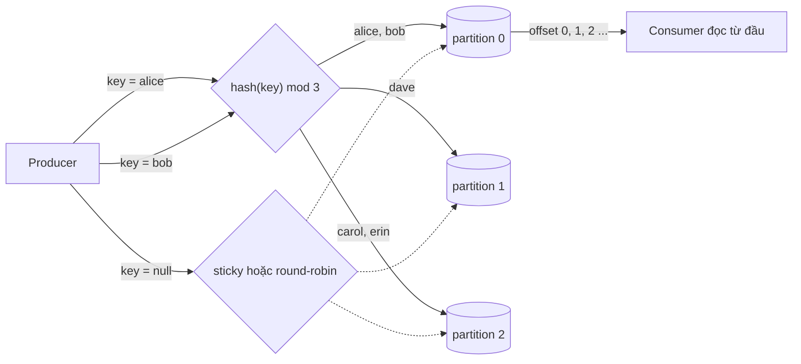
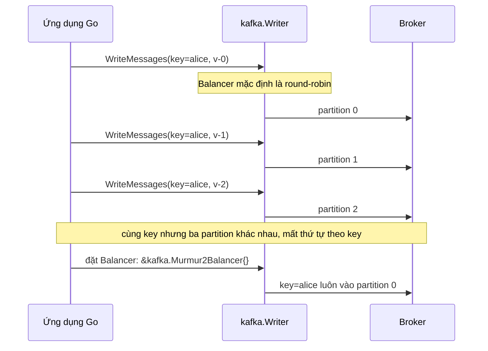

# Lab 01 - Partitioning: key, partition và thứ tự

## Mục tiêu

Tạo topic 3 partition và chứng minh bằng test ba điều về cách Kafka chia message vào partition:

- Cùng key luôn vào cùng partition: producer hash key rồi lấy phần dư theo số partition, và partition lấy từ ack của broker khi produce.
- Thứ tự được giữ trong một partition: offset của các message cùng key tăng dần, và đọc lại topic từ đầu thì value của từng key ra đúng thứ tự đã produce.
- Message có key null không bị dồn mãi vào một partition: gửi đủ nhiều message riêng lẻ thì chúng rơi vào hơn một partition (không bảo đảm phân phối đều).

Lab còn cho thấy một bẫy của Go: `kafka.Writer` không đặt `Balancer` sẽ round-robin, nên cùng một key vẫn bị rải ra nhiều partition.

Lab cần Kafka chạy bằng `make up` (Kafka 4.3.1, một node KRaft).
Lab đọc `KAFKA_BROKERS` (mặc định `127.0.0.1:9092`).
Mỗi test tạo topic có tên duy nhất bằng admin API (3 partition, replication factor 1) và xóa nó khi kết thúc, kể cả khi test fail.
Lý thuyết nằm ở [theory.md](../theory.md).

## Kiến trúc



Đường lỗi: bẫy balancer mặc định của kafka-go.
Không đặt `Balancer` thì writer round-robin, và cùng một key bị rải qua mọi partition.
Khi đó thứ tự theo key mất đi, vì chỉ có thứ tự trong một partition được bảo đảm.



## Giao diện

TypeScript (`ts/lab.ts`, `@confluentinc/kafka-javascript` 1.10.1, API `KafkaJS`):

```ts
createTopic(topic, partitions): Promise<void>; // admin API, replicationFactor 1, chờ đủ leader
deleteTopic(topic): Promise<void>; // topic không tồn tại không phải lỗi
produceKeyed(topic, key, value): Promise<{ partition: number; offset: string }>; // lấy từ ack
produceUnkeyed(topic, value): Promise<{ partition: number; offset: string }>; // key null
readTopic(topic): Promise<{ partition; offset; key; value }[]>; // group mới, fromBeginning, dừng theo watermark
closeProducer(): Promise<void>; // ngắt producer dùng chung
```

Go (`go/lab.go`, `github.com/segmentio/kafka-go` v0.4.51):

```go
CreateTopic(ctx, topic, partitions) error
DeleteTopic(ctx, topic) error
NewProducer(balancer kafka.Balancer) *Producer // nil là balancer mặc định (round-robin)
(*Producer).ProduceKeyed(ctx, topic, key, value) (Result, error) // Result{Partition, Offset} lấy từ Completion của writer
(*Producer).ProduceUnkeyed(ctx, topic, value) (Result, error)
ReadTopic(ctx, topic) ([]Record, error) // reader không group, từng partition, dừng theo ListOffsets
```

Hai bên khác nhau ở chỗ `produceKeyed` của TypeScript là hàm dùng một producer chung (đúng chữ ký của đề bài), còn Go cần giữ một `Producer` để chọn balancer, nên `ProduceKeyed` là method.
`produceUnkeyed` và `ProduceUnkeyed` là phần thêm cho test key null.

## Các điểm quan trọng

Partitioner của mỗi client khác nhau, đây là nguồn lỗi hay gặp khi trộn nhiều ngôn ngữ trên một topic:

- Java client dùng murmur2 cho message có key.
- librdkafka thuần mặc định `consistent_random` (CRC32), không tương thích với Java.
- Wrapper `KafkaJS` của kafka-javascript tự đặt `murmur2_random`, nên khớp Java.
- kafka-go mặc định round-robin, và `kafka.Hash` dùng FNV-1a nên cho partition khác Java.
  Lab Go đặt `&kafka.Murmur2Balancer{}` để khớp TypeScript.

Đã đo trên Kafka 4.3.1 với topic 3 partition: cả TypeScript và Go đều đưa `alice` và `bob` vào partition 0, `dave` vào partition 1, `carol` và `erin` vào partition 2.
Đây là kết quả của một lần chạy trên máy tác giả, hàm hash là xác định nên các lần chạy sau lặp lại, nhưng đổi số partition thì mapping đổi.
Vì mapping xác định, test khẳng định năm key này dùng hơn một partition.

Key null dùng sticky partitioning ở Java và librdkafka: các message gửi sát nhau trong cùng một batch có thể cùng partition, rồi đổi partition sau đó.
Vì vậy test `null_key_spreads_across_partitions` không assert phân phối đều.
Test gửi từng message một (mỗi lần chờ ack) trong `eventually` tới khi thấy ít nhất hai partition khác nhau, với timeout 45 giây.
Demo TypeScript đo hai cách gửi:

- Gửi 12 message từng cái một: partition ra `2 2 1 1 1 1 2 2 2 2 2 1` trong một lần chạy, tức có đổi partition nhưng không đều và không dùng hết partition.
- Gửi 12 message trong một lần `send` (một batch): tất cả vào cùng một partition (partition 0 trong lần chạy đó).

Go dùng `RoundRobin` tường minh cho test này nên luân phiên `0 1 2 0 1 2 ...`.
`Murmur2Balancer` và `CRC32Balancer` chọn ngẫu nhiên cho key nil, còn `Hash` luân phiên.

Cấu hình producer của lab:

- TypeScript: `acks: -1` và `idempotent: true`.
  Mặc định của kafka-javascript là `idempotent: false`, khác Java client 4.x.
- Go: `RequiredAcks: kafka.RequireAll` (mặc định của `kafka.Writer` là `RequireNone`, không chờ ack) và `BatchTimeout: 10ms` (mặc định 1 giây làm mỗi `WriteMessages` đơn lẻ chậm tới 1 giây).
  Lab không dùng `Async` vì nó nuốt lỗi.
- Go lấy partition và offset từ `Writer.Completion`: callback nhận lại message đã được điền `Partition` và `Offset`.
  `WriteMessages` thường không trả hai giá trị này.

Ack của wrapper TypeScript đặt offset trong trường `baseOffset` (không phải `offset`), và lab gửi mỗi lần một message nên `baseOffset` chính là offset của nó.

Producer và consumer TypeScript đặt `allowAutoTopicCreation: false` (mặc định của kafka-javascript là `true`).
Không đặt thì một consumer còn chạy sau khi topic bị xóa trong teardown có thể tạo lại topic với 1 partition và để rác trên broker: lab đã gặp đúng chuyện này ở test đọc lại topic (cơ chế chính xác chưa xác minh).

Test đọc lại topic không dùng sleep: điều kiện dừng so sánh số message đã nhận với high watermark trừ low watermark (TypeScript) hoặc đọc tới `LastOffset` mà `ListOffsets` báo (Go).
Tạo topic xong, lab chờ metadata báo đủ 3 partition và mọi partition có leader trước khi produce, vì wrapper TypeScript chưa hỗ trợ `waitForLeaders`.

Hậu quả khi tăng số partition của topic đang dùng key: hash modulo số partition đổi, nên cùng key chuyển sang partition khác và thứ tự theo key bị phá.
Lab không chứng minh điều này bằng test (chưa xác minh bằng chạy thật), chỉ nêu ở bài tập.

## Chạy

```bash
make up
pnpm vitest run 06-kafka/lab-01-partitioning/ts
go test -race ./06-kafka/lab-01-partitioning/go/...
make lab-ts LAB=06-kafka/lab-01-partitioning
make lab-go LAB=06-kafka/lab-01-partitioning
```

## Kết quả mong đợi

Test (cùng tên ở TS và Go, Go dùng CamelCase):

| Test                                                             | Chứng minh                                                                                                       |
| ---------------------------------------------------------------- | ---------------------------------------------------------------------------------------------------------------- |
| `same_key_always_goes_to_same_partition`                         | Năm key, mỗi key produce năm lần: mỗi key nằm đúng một partition (đọc từ ack), và năm key dùng hơn một partition |
| `order_is_preserved_within_a_partition`                          | Offset của từng key tăng dần, đọc topic từ đầu thì value và offset của từng key đúng thứ tự đã produce           |
| `null_key_spreads_across_partitions`                             | Gửi message key null từng cái một thì sớm muộn rơi vào ít nhất hai partition (không assert phân phối đều)        |
| `default_balancer_does_not_keep_a_key_on_one_partition` (chỉ Go) | Balancer mặc định của kafka-go round-robin: sáu message cùng key đi qua cả ba partition                          |

Không test nào dùng sleep cố định: test chờ bằng ack của broker, `eventually` và watermark.
Demo in key nào vào partition nào, so sánh balancer mặc định với `Murmur2Balancer` ở Go, và so sánh key null gửi từng cái với gửi cả batch ở TypeScript.

## Bài tập mở rộng

1. Tạo topic 3 partition, produce 10 key rồi dùng `kafka-topics.sh --alter --partitions 6` và produce lại cùng 10 key.
   Ghi lại key nào đổi partition.
2. Thử `kafka.Hash{}` và `kafka.CRC32Balancer{}` ở Go và so sánh mapping với `Murmur2Balancer`.
   Hai balancer này có khớp TypeScript không?
3. Đặt `rdKafka: { partitioner: 'consistent_random' }` cho producer TypeScript và quan sát mapping đổi.
4. Gửi message key null trong một `send` có nhiều message, rồi tăng `sticky.partitioning.linger.ms` và quan sát sticky partitioning.
