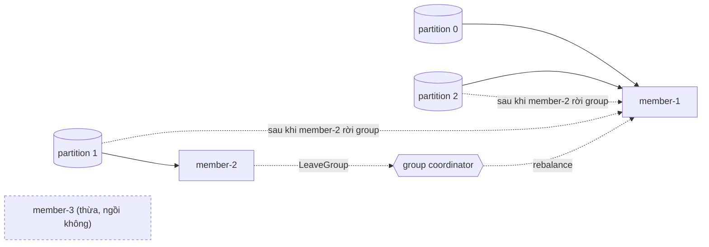
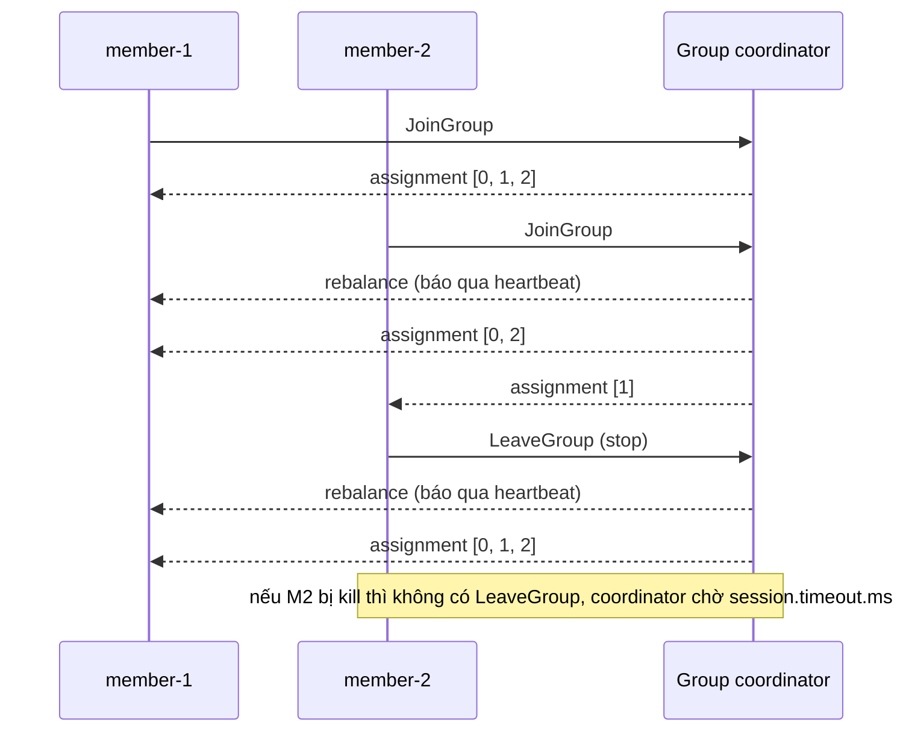

# Lab 02 - Consumer group: chia partition và rebalance

## Mục tiêu

Chạy nhiều member trong cùng một consumer group trên topic 3 partition và chứng minh bằng test ba điều:

- Partition được chia cho các member: với hai member, assignment rời nhau và hợp lại đủ ba partition, và message của mỗi partition chỉ tới member đang sở hữu nó.
- Rebalance chuyển partition khi một member rời group: member còn lại cuối cùng giữ cả ba partition và nhận message của mọi partition.
- Member vượt quá số partition ngồi không: bốn member trên ba partition thì đúng một member có assignment rỗng và không nhận message nào.

Lab cần Kafka chạy bằng `make up` (Kafka 4.3.1, một node KRaft, `group.initial.rebalance.delay.ms=0`).
Lab đọc `KAFKA_BROKERS` (mặc định `127.0.0.1:9092`).
Mỗi test tạo topic và group có tên duy nhất, rồi dừng member, xóa group và xóa topic khi kết thúc, kể cả khi test fail.
Lý thuyết nằm ở [theory.md](../theory.md).

## Kiến trúc



Đường lỗi: một member rời group.
Rời có chủ đích (`disconnect` hoặc `Stop`) gửi `LeaveGroup`, nên rebalance chạy ngay.
Nếu member chết đột ngột thì coordinator chỉ phát hiện sau tối đa `session.timeout.ms`, và trong thời gian đó partition của nó không có ai đọc.



## Giao diện

TypeScript (`ts/lab.ts`, `@confluentinc/kafka-javascript` 1.10.1):

```ts
startGroupMember(
  topic,
  groupId,
  onAssign: (partitions: number[]) => void,
  onMessage: (m: { partition: number; value: string }) => void,
): Promise<{ stop(): Promise<void> }>;
createTopic(topic, partitions); deleteTopic(topic); deleteGroup(groupId);
produceToPartition(topic, partition, value); closeProducer();
```

Go (`go/lab.go`, `github.com/segmentio/kafka-go` v0.4.51):

```go
StartGroupMember(topic, groupID string, onAssign func(partitions []int), onMessage func(Message)) (*Member, error)
(*Member).Stop() error
CreateTopic, DeleteTopic, DeleteGroup(ctx, ...)
NewProducer() *Producer; (*Producer).ProduceToPartition(ctx, topic, partition, value) error
```

Ánh xạ giữa hai ngôn ngữ: callback `onAssign` và `onMessage` giữ nguyên, Promise của TypeScript thành giá trị trả về `(*Member, error)` và `stop()` thành `Stop()`.
Callback của Go chạy ở goroutine của member nên test bảo vệ trạng thái bằng mutex.

## Các điểm quan trọng

`onAssign` được gọi với toàn bộ assignment mới của mỗi lần rebalance, kể cả mảng rỗng cho member thừa.
Cả hai client dùng giao thức classic eager trong lab:

- kafka-javascript mặc định assignor `roundRobin` (eager).
  Có thể bật `cooperativeSticky`, khi đó callback chỉ báo phần thay đổi (incremental) và code của lab phải đổi.
- kafka-go chỉ có `RangeGroupBalancer`, `RoundRobinGroupBalancer` và `RackAffinityGroupBalancer`, tất cả là eager.
  kafka-go v0.4.51 không có cooperative-sticky và không có giao thức consumer KIP-848.

Vì rebalance eager đi qua các trạng thái trung gian (ví dụ member-1 giữ cả ba partition trước khi member-2 vào), test không bao giờ assert trên trạng thái trung gian.
Test chờ bằng `eventually` tới khi mọi member đã được gán ít nhất một lần, assignment rời nhau và hợp lại đúng ba partition, rồi mới kiểm tra.
Demo cho thấy rõ điều này: member-1 lần lượt được gán `[0, 1, 2]` rồi `[0, 2]`.

Kiểm tra "message chỉ tới chủ của partition" dùng assignment cuối cùng.
Message được ghi thẳng vào từng partition (TypeScript đặt `partition` trong message, Go dùng `BalancerFunc` đọc số partition từ key).
Member thừa được kiểm tra bằng cách chờ đủ ba message tới ba member có partition, nên khi kiểm tra member thừa chắc chắn không có message nào để nhận, không cần sleep.

Test rebalance dùng rời group có chủ đích, không dựa vào phát hiện lỗi bằng timeout:

- TypeScript: `consumer.disconnect()` (wrapper chưa cài `consumer.stop()`).
- Go: `ConsumerGroup.Close()` sau khi hủy context đọc.
- Cả hai gửi `LeaveGroup`, nên coordinator rebalance ngay.
- Member chết đột ngột (kill -9, mất mạng) không gửi `LeaveGroup`.
  Coordinator chỉ phát hiện sau tối đa `session.timeout.ms`: 45 giây ở Java client, 30 giây ở wrapper kafka-javascript và ở kafka-go.
  Các con số này lấy từ tài liệu và mã nguồn, lab không đo việc chờ timeout (chưa xác minh bằng chạy thật).

Đã đo trên Kafka 4.3.1: từ lúc member-2 dừng tới lúc member-1 giữ cả ba partition mất khoảng 2,8 đến 3,2 giây ở cả TypeScript và Go (sáu lần chạy demo Go, một lần chạy TypeScript).
Đây là kết quả của vài lần chạy trên máy tác giả, không phải cam kết.
Con số gần với `heartbeat.interval.ms` mặc định 3 giây của cả hai client, và nguyên nhân có thể là member còn lại chỉ biết rebalance qua heartbeat kế tiếp.
Lab không kiểm chứng giả thuyết này (chưa xác minh).

Lỗi đã gặp khi viết lab Go: `ConsumerGroup.Next` trả cả lỗi tạm thời như `RebalanceInProgress` qua kênh lỗi, và thư viện vẫn tự thử lại join.
Vòng lặp coi mọi lỗi của `Next` là dừng member sẽ làm member mất mọi generation sau đó, khi nhiều member join cùng lúc (member đó không bao giờ được gán partition).
Lab chỉ thoát khi context bị hủy hoặc gặp `ErrGroupClosed`, còn lại thì gọi `Next` tiếp.

Lab Go dùng `kafka.ConsumerGroup` thay cho `kafka.Reader` với `GroupID`, vì `Reader` giấu assignment bên trong còn `ConsumerGroup` đưa assignment cho ứng dụng qua `Generation.Assignments`.
Mỗi partition được đọc bằng một `Reader` riêng không có `GroupID`, bắt đầu từ offset đã commit (hoặc `FirstOffset` khi chưa có), và offset được commit sau mỗi message bằng `Generation.CommitOffsets`.

KIP-848 (`group.protocol=consumer`, giao thức rebalance mới, GA từ Kafka 4.0, broker tự bật) chỉ nằm ở theory.
Một lần thử nhanh với kafka-javascript 1.10.1 cho kết quả không rõ ràng: callback chuyển sang incremental và hai consumer chưa hội tụ trong 8 giây của lần thử đó, nên lab giữ giao thức classic và coi KIP-848 là chưa xác minh.

Vì cleanup dùng `deleteGroup`, group phải rỗng: hàm thử lại tới khi member cuối đã rời group (`NON_EMPTY_GROUP`).

## Chạy

```bash
make up
pnpm vitest run 06-kafka/lab-02-consumer-group/ts
go test -race ./06-kafka/lab-02-consumer-group/go/...
make lab-ts LAB=06-kafka/lab-02-consumer-group
make lab-go LAB=06-kafka/lab-02-consumer-group
```

## Kết quả mong đợi

Test (cùng tên ở TS và Go, Go dùng CamelCase):

| Test                                                | Chứng minh                                                                                              |
| --------------------------------------------------- | ------------------------------------------------------------------------------------------------------- |
| `partitions_are_split_across_group_members`         | Hai member: assignment rời nhau, hợp lại đủ 3 partition, mỗi message tới đúng chủ của partition         |
| `rebalance_reassigns_partitions_when_member_leaves` | Sau khi một member rời group, member còn lại giữ cả 3 partition và nhận message của cả 3 partition      |
| `members_beyond_partition_count_stay_idle`          | Bốn member trên ba partition: kích thước assignment là 0, 1, 1, 1 và member rỗng không nhận message nào |

Không test nào dùng sleep cố định: test chờ bằng `eventually` trên assignment cuối cùng và trên số message đã nhận.
Mỗi test mất vài giây tới khoảng 10 giây vì rebalance chờ heartbeat.
Demo in từng lần được gán partition của mỗi member, message mỗi member nhận, thời gian rebalance sau khi một member rời group, và assignment của bốn member trên ba partition.

## Bài tập mở rộng

1. Kill đột ngột một member (ví dụ `process.kill(process.pid, 'SIGKILL')` trong một process con) và đo thời gian tới khi partition của nó được gán lại, rồi so với `session.timeout.ms`.
2. Hạ `sessionTimeout` của wrapper TypeScript xuống mức tối thiểu của broker (6000 ms) và lặp lại bài 1.
3. Đổi assignor của kafka-javascript sang `cooperativeSticky` và quan sát `onAssign` chỉ báo phần thay đổi.
4. Thêm `group.instance.id` (static membership, KIP-345) và quan sát việc restart nhanh một member không gây rebalance.
