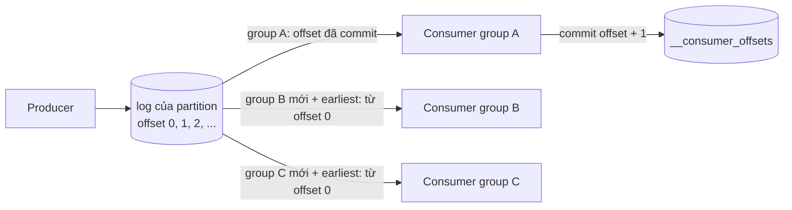
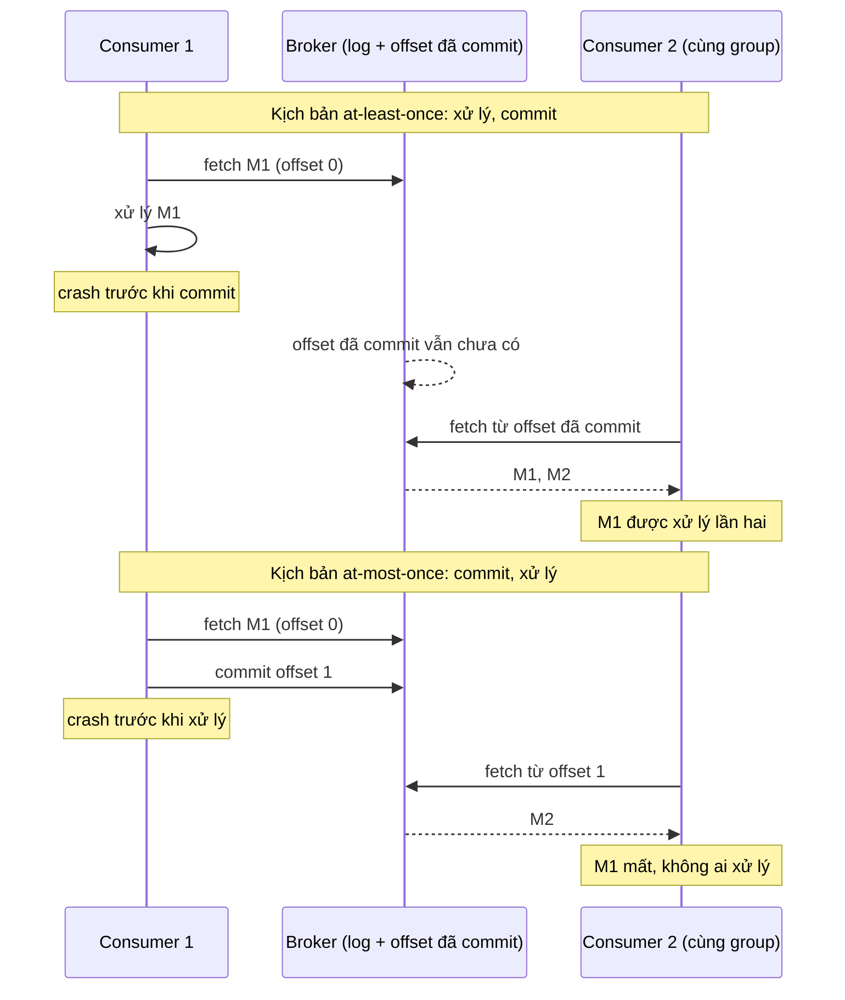

# Lab 03 - Offset, replay và commit khi crash

## Mục tiêu

Dùng offset commit của consumer group để chứng minh bằng test ba điều:

- Group mới với `earliest` đọc lại toàn bộ log: publish N message, một group mới nhận đủ N, và một group mới thứ hai cũng nhận đủ N, vì Kafka không xóa message sau khi đọc.
- Xử lý xong rồi mới commit thì không mất message: consumer xử lý message rồi crash trước khi commit, consumer thay thế trong cùng group nhận lại message đó (at-least-once).
- Commit trước rồi mới xử lý thì mất message: consumer commit rồi crash trước khi xử lý, consumer thay thế bắt đầu sau offset đã commit và không bao giờ thấy message đó (at-most-once).

Lab cần Kafka chạy bằng `make up` (Kafka 4.3.1, một node KRaft).
Lab đọc `KAFKA_BROKERS` (mặc định `127.0.0.1:9092`).
Mỗi test tạo topic 3 partition và dùng group id mới (tên duy nhất), rồi xóa group và topic khi kết thúc, kể cả khi test fail.
Lý thuyết nằm ở [theory.md](../theory.md).

## Kiến trúc



Đường lỗi: consumer crash giữa hai bước xử lý và commit.
Thứ tự của hai bước quyết định hậu quả.



## Giao diện

TypeScript (`ts/lab.ts`, `@confluentinc/kafka-javascript` 1.10.1):

```ts
replayFromBeginning(topic, groupId): Promise<string[]>; // group mới, earliest, không commit, dừng theo watermark
consumeOneThenCrash(topic, groupId, order: "process-then-commit" | "commit-then-process", process): Promise<{ partition; offset; value }>;
receiveUntil(topic, groupId, lastValue): Promise<string[]>; // consumer thay thế trong cùng group
produce(topic, key, value); createTopic; deleteTopic; deleteGroup; closeProducer;
```

Go (`go/lab.go`, `github.com/segmentio/kafka-go` v0.4.51):

```go
ReplayFromBeginning(ctx, topic, groupID) ([]string, error)
ConsumeOneThenCrash(ctx, topic, groupID, order CommitOrder, process func(string)) (Message, error) // ProcessThenCommit | CommitThenProcess
ReceiveUntil(ctx, topic, groupID, last) ([]string, error)
NewProducer() *Producer; (*Producer).Produce(ctx, topic, key, value) error
CreateTopic, DeleteTopic, DeleteGroup
```

## Các điểm quan trọng

Auto commit tắt ở cả hai client, nên offset chỉ được lưu khi code gọi commit tường minh:

- TypeScript: `autoCommit: false` và `consumer.commitOffsets([...])`.
- Go: chỉ dùng `FetchMessage` và `CommitMessages`. `ReadMessage` tự commit nên lab không dùng nó.
- Offset commit lên broker là offset của message đã xử lý cộng 1, vì Kafka lưu "offset kế tiếp cần đọc".

Cách mô phỏng crash: sau điểm crash, consumer bị đóng ngay (`disconnect()` ở TypeScript, `Reader.Close()` ở Go) và không commit thêm gì.
Đây không phải kill -9 thật, vì đóng consumer gửi `LeaveGroup` nên consumer thay thế vào group ngay, còn process bị kill thật không gửi `LeaveGroup` và phải chờ `session.timeout.ms` (30 đến 45 giây).
Điều test cần kiểm chứng là offset mà group đã lưu, và nó giống hệt nhau trong cả hai cách.
Hai test tránh chờ timeout đúng vì lý do này.

Test crash dùng topic chỉ có đúng một message (M1) trước khi consumer đầu tiên chạy, để message đầu tiên mà consumer nhận chắc chắn là M1.
Message tiếp theo M2 được publish sau crash và dùng cùng key với M1, nên cùng partition và đến sau M1.
Vì Kafka giữ thứ tự trong một partition, consumer thay thế đọc tới M2 là biết M1 hoặc đã được trả lại, hoặc chắc chắn không bao giờ tới.
Nhờ vậy test khẳng định "M1 không xuất hiện" mà không cần chờ một khoảng thời gian bất kỳ.
Demo cũng dùng topic riêng cho từng kịch bản: nếu dùng chung topic với phần replay thì message mà consumer "crash" là một `event-N` bất kỳ chứ không phải M1.

`replayFromBeginning` và `ReplayFromBeginning` dùng group id mới để group chưa có offset đã commit.
`auto.offset.reset` (TypeScript: `fromBeginning: true`) chỉ có tác dụng khi group chưa có offset đã commit hoặc offset đã hết hạn, còn nếu đã có offset đã commit thì consumer luôn đọc tiếp từ đó.
Mặc định `auto.offset.reset` của Java và librdkafka là `latest`, còn `StartOffset` mặc định của kafka-go là `FirstOffset`, nên lab đặt cả hai tường minh.

Điều kiện dừng của replay không dùng sleep: tổng (offset cuối - offset đầu) của các partition lúc bắt đầu là số message phải đọc.
TypeScript lấy từ `admin.fetchTopicOffsets` (high trừ low), Go lấy từ `ListOffsets` (`LastOffsetOf` trừ `FirstOffsetOf`).
Topic rỗng cho 0 nên hàm trả về mảng rỗng ngay mà không join group, và test `replay_of_an_empty_topic_returns_an_empty_list` (thêm vào ngoài đề bài) kiểm tra điều đó.
Thứ tự của kết quả replay không xác định giữa các partition nên test so sánh sau khi sắp xếp.

Lab không commit trong `replayFromBeginning`, nên chạy lại với cùng group id vẫn đọc lại từ đầu.
Muốn đọc lại một group đã commit thì phải reset offset của group đó, ví dụ `kafka-consumer-groups.sh --reset-offsets --to-earliest --execute` khi mọi consumer của group đã dừng.
Offset đã commit cũng hết hạn: `offsets.retention.minutes` mặc định 10080 phút (7 ngày) tính từ lúc group trở nên rỗng, sau đó group bắt đầu lại theo `auto.offset.reset`.

Lab này đo ba hành vi bằng test, và chỉ ba hành vi đó.
Exactly-once (transaction, `sendOffsetsToTransaction`) nằm ở theory và chỉ bao phủ chuỗi đọc, xử lý, ghi trong Kafka.
kafka-go v0.4.51 không có API transaction hay idempotent producer trong `Writer`, nên lab Go không có phần đó.

## Chạy

```bash
make up
pnpm vitest run 06-kafka/lab-03-offsets-replay/ts
go test -race ./06-kafka/lab-03-offsets-replay/go/...
make lab-ts LAB=06-kafka/lab-03-offsets-replay
make lab-go LAB=06-kafka/lab-03-offsets-replay
```

## Kết quả mong đợi

Test (cùng tên ở TS và Go, Go dùng CamelCase):

| Test                                                    | Chứng minh                                                                                             |
| ------------------------------------------------------- | ------------------------------------------------------------------------------------------------------ |
| `new_group_with_earliest_replays_all_messages`          | Publish 12 message, hai group mới (earliest) mỗi group đọc đủ 12 message                               |
| `replay_of_an_empty_topic_returns_an_empty_list` (thêm) | Topic rỗng cho kết quả rỗng, không treo                                                                |
| `commit_after_processing_loses_nothing_on_crash`        | Xử lý rồi crash trước commit: consumer thay thế nhận `[M1, M2]`, M1 được xử lý lần hai (at-least-once) |
| `commit_before_processing_loses_message_on_crash`       | Commit rồi crash trước xử lý: consumer thay thế nhận `[M2]`, M1 mất (at-most-once)                     |

Không test nào dùng sleep cố định: test chờ bằng điều kiện dừng theo watermark và theo giá trị message cuối.
Demo in kết quả replay của hai group mới, rồi hai kịch bản crash với những gì consumer 1 đã xử lý và consumer 2 nhận được.

## Bài tập mở rộng

1. Cho consumer 1 xử lý rồi commit M1 xong hẳn mới dừng (không crash giữa chừng) và xác nhận consumer thay thế không nhận lại M1.
2. Dùng `kafka-consumer-groups.sh --describe` để xem `CURRENT-OFFSET`, `LOG-END-OFFSET` và lag của một group sau mỗi kịch bản crash.
3. Reset offset của một group về earliest bằng `kafka-consumer-groups.sh --reset-offsets --to-earliest` và xác nhận nó đọc lại toàn bộ log.
4. Làm consumer idempotent bằng cách lưu id của message đã xử lý, rồi chạy lại kịch bản at-least-once và xác nhận M1 không bị xử lý hai lần.
