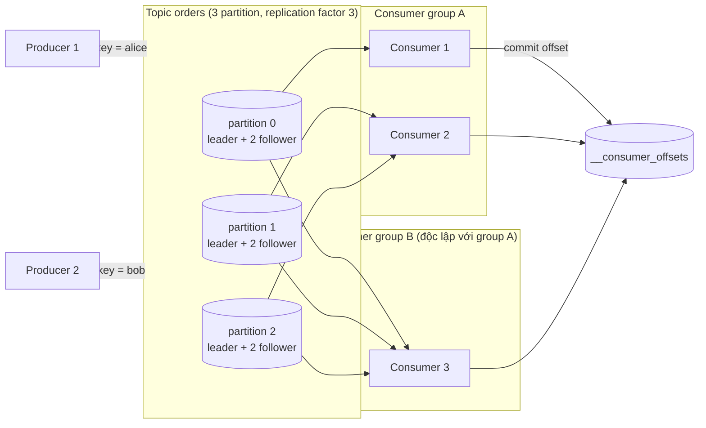
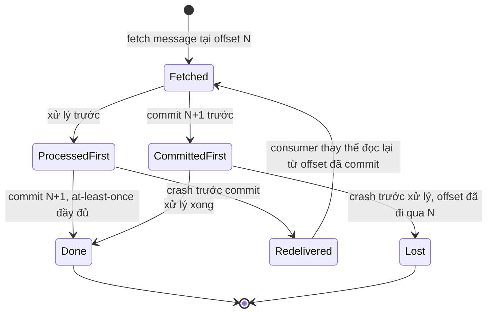
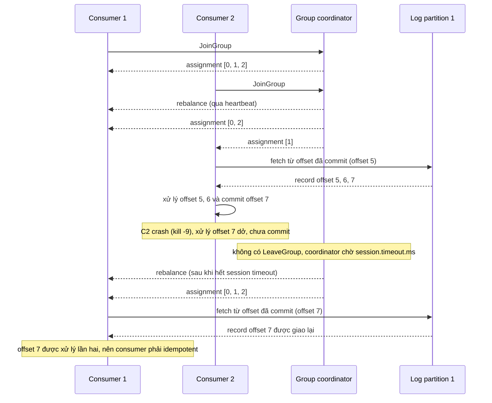

# Chủ đề 06 - Kafka

Kafka là nền tảng event streaming xây quanh một ý tưởng: **log**.
Producer append event vào cuối một log, consumer tự giữ vị trí (offset) của mình trong log đó, và event không bị xóa khi được đọc mà chỉ bị loại bỏ khi hết thời gian retention.
Khác với RabbitMQ (chương 05), broker không theo dõi từng message đã giao hay chưa, mà consumer là bên nhớ mình đã đọc tới đâu.

Ba lab đi kèm cần Kafka chạy bằng `make up` (Kafka 4.3.1 một node KRaft, client `@confluentinc/kafka-javascript` 1.10.1 và `github.com/segmentio/kafka-go` v0.4.51):

- [Lab 01 - Partitioning: key, partition và thứ tự](./lab-01-partitioning/README.md)
- [Lab 02 - Consumer group: chia partition và rebalance](./lab-02-consumer-group/README.md)
- [Lab 03 - Offset, replay và commit khi crash](./lab-03-offsets-replay/README.md)

## Kafka trên một hình

Mỗi consumer group đọc toàn bộ topic độc lập với group khác.
Trong một group, mỗi partition tại một thời điểm chỉ thuộc về một consumer.

## Log, topic, partition và offset

Kafka lưu dữ liệu như một log: event được append vào một partition của topic, và sau khi consumer đọc thì event không bị xóa.
Topic được chia thành nhiều partition, và mỗi event mới được append vào đúng một partition.
Offset là định danh duy nhất của record trong một partition, tăng dần theo thứ tự ghi.
Offset không nhất thiết liên tục: compaction hoặc transaction có thể tạo khoảng trống.

Các event có cùng key được ghi vào cùng một partition, và consumer của một partition luôn đọc event của partition đó đúng thứ tự đã ghi.
Hệ quả cần nhớ: thứ tự chỉ được đảm bảo trong một partition, không đảm bảo giữa các partition khác nhau của cùng topic.
Đừng kỳ vọng thứ tự toàn cục của topic (lab 01 đọc lại topic và so sánh thứ tự theo từng key, không so toàn topic).

Consumer tự kiểm soát position của mình.
Position là offset của record kế tiếp sẽ được trả về, còn committed position là offset cuối cùng đã lưu an toàn và là điểm consumer quay lại sau khi crash.
Vì Kafka lưu "offset kế tiếp cần đọc", offset commit lên broker phải là offset của message đã xử lý cộng 1.

## Replication, ISR, acks và min.insync.replicas

Nhân bản (replication) làm ở mức topic-partition, và cấu hình production phổ biến là replication factor 3.
Mỗi partition có một leader nhận đọc ghi và các follower sao chép log của leader.
Kafka không bầu leader bằng đa số phiếu mà duy trì động tập in-sync replicas (ISR) gồm các replica đã bắt kịp leader, và chỉ thành viên ISR mới đủ điều kiện làm leader.
`replica.lag.time.max.ms` (mặc định 30000) là thời gian tối đa một follower được phép tụt lại trước khi bị loại khỏi ISR.

Producer chọn chờ ack từ 0, 1 hay all (-1) replica:

- `acks=0`: không chờ gì, nhanh nhất và có thể mất message mà không biết.
- `acks=1`: chờ leader ghi, mất message nếu leader chết trước khi follower kịp sao chép.
- `acks=all`: chờ mọi replica đang trong ISR.
  "All" là tất cả replica đang trong ISR, không phải toàn bộ replica được gán.
  Nếu ISR co lại còn 1 replica thì `acks=all` vẫn thành công với chỉ 1 bản.

`min.insync.replicas` (mặc định 1) chỉ có tác dụng với `acks=all`: nếu ISR nhỏ hơn ngưỡng này thì partition từ chối ghi.
Cấu hình khuyến nghị trong tài liệu chính thức là replication factor 3, `min.insync.replicas=2` và `acks=all`, đổi lại partition mất khả năng ghi khi ISR dưới 2.
`unclean.leader.election.enable` mặc định `false`: nếu toàn bộ ISR chết thì partition không khả dụng cho tới khi một replica ISR quay lại, đổi availability lấy consistency.

Lab chạy trên một broker duy nhất, nên topic dùng replication factor 1 và các topic nội bộ (`__consumer_offsets`, transaction state) được hạ về 1 replica trong compose.
Mặc định các topic nội bộ cần 3 broker, nên quên bước này thì consumer group và transaction không hoạt động trên một node.
Lab không kiểm chứng việc mất message khi leader chết vì cần nhiều broker (chưa xác minh bằng chạy thật).

## Producer: key, partitioner, idempotence và batching

Producer chọn partition bằng partitioner.
Có key thì hash key rồi lấy phần dư theo số partition, nên cùng key luôn vào cùng partition miễn số partition không đổi.
Không có key (null) thì Java client và librdkafka dùng sticky partitioning: các record gửi sát nhau cùng một batch có thể dồn vào một partition rồi đổi sang partition khác sau đó.
Vì vậy đừng assert phân phối đều cho key null (lab 01 chỉ assert rằng message rơi vào nhiều hơn một partition).

Partitioner mặc định của mỗi client khác nhau, và đây là nguồn lỗi hay gặp khi trộn nhiều ngôn ngữ trên một topic:

| Client                                         | Hash cho key                               | Key null                                                    |
| ---------------------------------------------- | ------------------------------------------ | ----------------------------------------------------------- |
| Java client 4.x                                | murmur2                                    | sticky, đổi partition sau khoảng `batch.size` byte          |
| librdkafka thuần                               | CRC32 (`consistent_random`)                | ngẫu nhiên                                                  |
| `@confluentinc/kafka-javascript` (API KafkaJS) | murmur2 (`murmur2_random`, wrapper tự đặt) | ngẫu nhiên, kèm sticky theo `sticky.partitioning.linger.ms` |
| `kafka-go` `Writer` không đặt `Balancer`       | không hash, round-robin                    | round-robin                                                 |
| `kafka-go` với `&kafka.Murmur2Balancer{}`      | murmur2                                    | ngẫu nhiên                                                  |
| `kafka-go` với `&kafka.Hash{}`                 | FNV-1a                                     | round-robin                                                 |

Bẫy của kafka-go: `Writer` mặc định round-robin, nên message có key cũng KHÔNG nằm cùng partition nếu không đặt `Balancer` tường minh.
Lab 01 chứng minh điều này (test chỉ có ở Go): sáu message cùng key đi qua cả ba partition.
Muốn Go và TypeScript đưa cùng key vào cùng partition thì phải dùng `Murmur2Balancer`, và trong lab hai bên cho cùng mapping (một lần đo trên topic 3 partition: `alice` và `bob` vào partition 0, `dave` vào 1, `carol` và `erin` vào 2).
Đổi số partition của topic đã dùng key làm vỡ quan hệ key-partition, nên hãy tính dư partition từ đầu.

Idempotent producer: broker gán producer ID và khử trùng bằng sequence number, nên retry không tạo bản ghi trùng trong log của partition.
Điều kiện là `acks=all`, `retries > 0` và `max.in.flight.requests.per.connection <= 5`, khi đó thứ tự được giữ.
Idempotence chỉ phủ một producer session và một partition; muốn xuyên session phải có `transactional.id`.
Producer Java 4.x mặc định bật idempotence, nhưng librdkafka và kafka-javascript mặc định tắt (lab TypeScript bật tường minh), và kafka-go không có idempotent producer.

Batching: producer gom record thành batch theo `linger.ms` và `batch.size`.
Java client 4.x đặt `linger.ms` mặc định 5 và `batch.size` 16384 byte.
kafka-go `Writer` có `BatchTimeout` mặc định 1 giây và `BatchSize` 100, nên một `WriteMessages` đơn lẻ có thể chậm tới 1 giây; lab đặt `BatchTimeout` 10 ms.
`RequiredAcks` của kafka-go `Writer` mặc định là `RequireNone` (không chờ ack), nên lab đặt `RequireAll`.

## Consumer group và offset

Consumer group chia việc đọc các partition của topic cho các thành viên: mỗi partition tại một thời điểm chỉ được gán cho một consumer trong group.
Thêm consumer vượt quá số partition thì consumer thừa ngồi không (lab 02 đo: bốn member trên ba partition thì kích thước assignment là 0, 1, 1, 1).
Vì vậy số partition là giới hạn của mức song song hóa trong một group.

Group coordinator là một broker, chọn bằng hash của `group.id` theo số partition của `__consumer_offsets`.
Coordinator theo dõi thành viên và lưu offset đã commit của group vào topic nội bộ `__consumer_offsets`.
Mỗi group có offset độc lập, nên hai group cùng đọc một topic không ảnh hưởng nhau (lab 03: hai group mới đều đọc đủ N message).

`auto.offset.reset` chỉ áp dụng khi group chưa có offset đã commit hoặc offset hiện tại không còn trên server.
Mặc định của Java và librdkafka là `latest`, còn `StartOffset` mặc định của kafka-go là `FirstOffset`, nên một consumer group kafka-go mới tạo sẽ đọc từ đầu topic.
Nếu đã có offset đã commit thì consumer luôn tiếp tục từ đó, và muốn đọc lại thì phải reset offset (ví dụ `kafka-consumer-groups.sh --reset-offsets --to-earliest --execute` khi mọi consumer của group đã dừng) hoặc dùng group id mới.
Offset đã commit cũng hết hạn: `offsets.retention.minutes` mặc định 10080 (7 ngày) tính từ lúc group trở nên rỗng.

## Commit offset: trước hay sau khi xử lý

Thứ tự của hai bước "xử lý" và "commit offset" quyết định đảm bảo giao:

- Xử lý xong rồi mới commit: crash giữa hai bước thì consumer thay thế đọc lại message, tức at-least-once.
  Đây là mặc định hợp lý của Kafka, và consumer phải idempotent vì message có thể được xử lý hai lần.
- Commit trước rồi mới xử lý: crash giữa hai bước thì message mất, tức at-most-once.
- Auto commit (`enable.auto.commit=true`, chu kỳ 5000 ms ở Java) coi offset đã consumed ngay khi `poll()` trả về, nên crash có thể làm mất xử lý.
  Với xử lý có side effect hãy tắt auto commit và commit thủ công sau khi xử lý xong.

Lab 03 mô phỏng cả hai crash: sau điểm crash consumer bị đóng và không commit thêm gì.
Cách mô phỏng này khác kill -9 thật ở chỗ đóng consumer gửi `LeaveGroup`, nhưng offset mà group lưu giống hệt, và đó là thứ test kiểm chứng.

## Rebalance: eager, cooperative và KIP-848

Group coordinator kích hoạt rebalance khi: số partition của topic đã subscribe đổi, topic được tạo hoặc xóa, một thành viên tắt hoặc lỗi, hoặc có thành viên mới vào group.
"Thành viên lỗi" gồm hai cơ chế phát hiện riêng: không có heartbeat trong `session.timeout.ms`, và không gọi `poll()` trong `max.poll.interval.ms` (khi đó client chủ động rời group).
Rời group có chủ đích (`disconnect`, `close`) gửi `LeaveGroup`, nên rebalance chạy ngay; process bị kill đột ngột thì coordinator chỉ phát hiện sau tối đa `session.timeout.ms`.

Giá trị mặc định khác nhau giữa các client:

| Client                   | `session.timeout.ms`              | `heartbeat.interval.ms` |
| ------------------------ | --------------------------------- | ----------------------- |
| Java client              | 45000 (KIP-735, tăng từ 10000)    | 3000                    |
| wrapper kafka-javascript | 30000 (librdkafka thuần là 45000) | 3000                    |
| kafka-go                 | 30000                             | 3000                    |

Broker trong compose đặt `group.initial.rebalance.delay.ms=0`, còn mặc định là 3000 ms (group mới chờ thêm consumer vào trước lần rebalance đầu).
Lab 02 không chờ timeout (chưa xác minh bằng đo thực tế thời gian phát hiện member chết): test dùng rời group có chủ đích.
Đo trên Kafka 4.3.1, từ lúc một member rời group tới lúc member còn lại giữ cả ba partition mất khoảng 2,8 đến 3,2 giây ở cả hai client, gần với heartbeat 3 giây (vài lần chạy trên một máy, không phải cam kết, nguyên nhân chưa xác minh).

Rebalance eager (stop-the-world): khi rebalance bắt đầu mọi thành viên thu hồi toàn bộ partition đang giữ rồi chờ assignment mới.
Cooperative (KIP-429): chỉ thu hồi các partition thật sự phải đổi chủ, qua thêm một vòng rebalance cho phần đó, và assignor phải "sticky".
Java client mặc định `[RangeAssignor, CooperativeStickyAssignor]` (eager, cho phép nâng cấp lên cooperative bằng một rolling bounce).
kafka-javascript mặc định assignor `roundRobin` (eager) và hỗ trợ `cooperativeSticky`; kafka-go chỉ có Range, RoundRobin và RackAffinity, tất cả eager.
Vì vậy test không bao giờ assert trên trạng thái trung gian: demo lab 02 cho thấy member-1 lần lượt giữ `[0, 1, 2]` rồi `[0, 2]`.

KIP-848 (giao thức consumer mới, `group.protocol=consumer`) là GA từ Kafka 4.0: rebalance hoàn toàn incremental, không còn global synchronization barrier, broker điều khiển heartbeat và session timeout, assignment do server quyết định.
Broker 4.x tự bật, nhưng client Java không bật mặc định (mặc định `classic`), và dự kiến chỉ đổi mặc định ở Kafka 5.0.
kafka-go v0.4.51 không có giao thức này.
Một lần thử nhanh với kafka-javascript 1.10.1 cho kết quả không rõ ràng (chưa xác minh), nên lab giữ giao thức classic.
Static membership (KIP-345, `group.instance.id`) giảm rebalance do restart ngắn.

## Retention và compaction

`cleanup.policy` mặc định là `delete`, và giá trị hợp lệ là `compact` và `delete`.
Với `delete`, `retention.ms` quy định thời gian tối đa giữ log (broker mặc định 168 giờ), và `retention.bytes` mặc định -1 (không giới hạn).
Retention xóa theo segment chứ không theo từng record, và segment đang ghi chỉ bị đóng sau khi đủ lớn hoặc quá `segment.ms` (mặc định 7 ngày), nên dữ liệu có thể sống lâu hơn `retention.ms` (suy ra từ định nghĩa, chưa xác minh bằng chạy thật).
Replay ở lab 03 chỉ đọc lại được dữ liệu còn trong retention.

Log compaction bảo đảm Kafka luôn giữ ít nhất giá trị cuối cùng của mỗi key trong một partition, nên log chứa snapshot đầy đủ giá trị cuối của mọi key.
Record có key và payload null là tombstone: nó xóa các record trước đó cùng key, và chính nó bị dọn khỏi log sau `delete.retention.ms` (mặc định 1 ngày).
Compaction chạy nền bởi log cleaner khi tỷ lệ dirty đạt `min.cleanable.dirty.ratio` (mặc định 0.5), và segment đang ghi không bị compaction.
Offset của record không đổi sau compaction, nên offset có thể có khoảng trống.

## Transaction và exactly-once: phạm vi thật sự

Kafka có ba mức: at most once, at least once và exactly once.
Mặc định Kafka cho at-least-once; idempotent producer chỉ bảo đảm retry không tạo bản ghi trùng trong log; transaction cho phép ghi nguyên tử vào nhiều partition, hoặc tất cả cùng thành công hoặc không có gì.

Exactly-once của Kafka bao phủ chuỗi đọc từ Kafka, xử lý, rồi ghi lại vào Kafka.
Cơ chế là producer ghi output và cả offset của consumer (qua `sendOffsetsToTransaction`) trong cùng một transaction, nên nếu abort thì offset quay về giá trị cũ và output không hiển thị cho consumer `read_committed`.
Cấu hình bắt buộc: producer đặt `transactional.id`, consumer đặt `isolation.level=read_committed` và `enable.auto.commit=false`.
Consumer `read_committed` chỉ đọc tới last stable offset, nên một transaction treo làm tăng lag của nó.

Exactly-once KHÔNG bao phủ ghi ra hệ thống ngoài Kafka (database, HTTP API, email), và không bao phủ side effect trong code xử lý, vì khi rebalance hoặc abort bước xử lý có thể chạy lại.
Với đích ngoài Kafka, hãy dùng khóa idempotent ở đích hoặc lưu offset cùng transaction với output ở hệ thống đích.
KIP-890 (server-side defense, từ Kafka 4.0) làm tăng độ bền của giao thức transaction, không mở rộng phạm vi ra ngoài Kafka.
Mặc định transaction cần cụm tối thiểu 3 broker, ở dev phải hạ `transaction.state.log.replication.factor` như compose.
kafka-javascript hỗ trợ transaction, còn kafka-go `Writer` không có API transaction hay idempotence, nên lab không có phần exactly-once (lý thuyết, chưa chạy thật).

## KRaft: không còn ZooKeeper

ZooKeeper mode đã bị gỡ từ Kafka 4.0, và vẫn đúng ở 4.3: Kafka chỉ hỗ trợ KRaft.
Mỗi server đặt `process.roles` là `broker`, `controller` hoặc cả hai; server vừa broker vừa controller (combined) đơn giản cho dev nhưng không khuyến nghị cho môi trường quan trọng, vì không thể roll hay scale controller tách khỏi broker.
Controller tham gia metadata quorum và cần đa số controller sống (3 controller chịu 1 lỗi, 5 chịu 2 lỗi).
Compose của lab chạy một node combined với `KAFKA_PROCESS_ROLES=broker,controller`.
Hướng dẫn cũ dùng `KAFKA_ZOOKEEPER_CONNECT` hoặc `--zookeeper` không chạy trên 4.x, và `advertised.listeners` phải là địa chỉ mà client thực sự dùng được (lab dùng `127.0.0.1:9092`).

## Consumer lag

Lag của một partition là `LOG-END-OFFSET` trừ `CURRENT-OFFSET` (offset đã commit của group).
Xem bằng `kafka-consumer-groups.sh --bootstrap-server localhost:9092 --describe --group <group>`.
Lag tăng đều nghĩa là consumer không theo kịp producer, và lag của consumer `read_committed` còn tăng khi có transaction treo.
Với kafka-go khi dùng `GroupID`, `Reader.Lag()` luôn trả -1 nên phải tính lag bằng CLI hoặc admin API (lab 03 dùng `ListOffsets` để tính số message đang có).

## Đảm bảo thứ tự

- Trong một partition: thứ tự ghi được giữ, và consumer đọc đúng thứ tự (lab 01 đo).
- Cùng key: cùng partition (nếu số partition không đổi và mọi producer dùng cùng partitioner), nên thứ tự theo key được giữ.
- Giữa các partition: không có đảm bảo thứ tự.
- Retry của producer có thể đảo thứ tự nếu tắt idempotence mà `max.in.flight.requests.per.connection > 1`.
- Rebalance và commit: sau rebalance, message có thể được giao lại cho consumer khác, nên thứ tự xử lý phía ứng dụng không phải lúc nào cũng khớp thứ tự trong log.

## So sánh RabbitMQ và Kafka

| Tiêu chí                | RabbitMQ (chương 05)                                     | Kafka                                                         |
| ----------------------- | -------------------------------------------------------- | ------------------------------------------------------------- |
| Mô hình                 | Queue: message được giao rồi xóa sau ack                 | Log: message ở lại tới hết retention, consumer giữ offset     |
| Ai theo dõi tiến độ đọc | Broker (ack, requeue theo từng message)                  | Consumer (offset commit theo partition)                       |
| Đọc lại                 | Không đọc lại message đã ack                             | Đọc lại bằng cách tua offset hoặc dùng group mới (lab 03)     |
| Routing                 | Exchange và binding (direct, topic, fanout, headers)     | Topic và key hash vào partition                               |
| Thứ tự                  | Trong một queue với một consumer, requeue làm đổi thứ tự | Trong một partition                                           |
| Mở rộng đọc             | Nhiều consumer trên một queue (competing consumers)      | Nhiều consumer trong group, tối đa bằng số partition          |
| Retry và dead letter    | DLX, TTL, delivery limit có sẵn                          | Không có sẵn: tự dựng topic retry và dead letter              |
| Đảm bảo giao            | At-least-once với ack, publisher confirms                | At-least-once mặc định, exactly-once chỉ trong Kafka          |
| Khi chọn                | Task queue, routing linh hoạt, retry và delay            | Event stream, replay, nhiều consumer độc lập, thông lượng lớn |

Chọn dựa trên mô hình, không phải "cái nào nhanh hơn": cần xử lý một việc đúng một lần bởi một worker và retry tinh vi thì queue hợp hơn, cần giữ lịch sử event cho nhiều bên đọc độc lập và đọc lại thì log hợp hơn.

## Lỗi thường gặp

- Topic tự tạo chỉ có 1 partition: test "nhiều consumer chia partition" không thấy phân tán và consumer thứ hai ngồi không.
  Hãy tạo topic tường minh với N partition bằng admin client (mọi lab làm vậy).
- Cùng key rơi vào partition khác nhau giữa các dịch vụ: mỗi client dùng hash khác nhau, và kafka-go mặc định round-robin.
  Hãy thống nhất một thuật toán cho mọi producer (`Murmur2Balancer` ở Go để khớp Java và kafka-javascript) và ghi vào hợp đồng của topic.
- Tăng số partition làm vỡ quan hệ key-partition: cùng key chuyển sang partition khác, và với `auto.offset.reset=latest` message vào partition mới có thể bị bỏ qua.
  Hãy tính dư partition từ đầu, hoặc tạo topic mới rồi migrate.
- Auto commit gây mất hoặc lặp xử lý: crash giữa chừng thì message bị bỏ lỡ hoặc xử lý lặp.
  Hãy tắt auto commit, commit offset + 1 sau khi xử lý xong, và làm consumer idempotent.
- Xử lý quá lâu vượt `max.poll.interval.ms`: consumer bị đá khỏi group, partition chuyển qua lại và message bị xử lý lặp.
  Hãy giảm lượng việc mỗi lần poll, tăng `max.poll.interval.ms` hoặc tách xử lý nặng ra worker.
- Rebalance storm khi deploy rolling: rebalance eager thu hồi mọi partition mỗi lần.
  Hãy dùng cooperative-sticky, static membership, `session.timeout.ms` hợp lý, hoặc KIP-848 nếu client hỗ trợ (kafka-go chưa có cả hai).
- Mất message do `acks` hoặc `min.insync.replicas`: producer báo thành công nhưng message biến mất sau khi leader chết.
  Hãy dùng replication factor 3, `min.insync.replicas=2`, `acks=all`, và ở kafka-go đặt `RequiredAcks: kafka.RequireAll`.
- Tin rằng exactly-once bao phủ database hay API ngoài: bản ghi hoặc email bị lặp dù đã bật transaction.
  Hãy dùng khóa idempotent ở đích hoặc lưu offset cùng transaction với output.
- Offset đã commit hết hạn: group không chạy hơn 7 ngày thì khi khởi động lại đọc lại từ đầu hoặc bỏ qua message cũ tùy `auto.offset.reset`.
  Hãy tăng `offsets.retention.minutes` và đặt `auto.offset.reset` có chủ đích.
- Hot partition: key lệch, hoặc dùng biến thể `consistent` hash key nil vào cùng một partition.
  Hãy chọn key phân tán cao và dùng biến thể `_random` cho message không có key.
- Mặc định của kafka-go dễ gây hiểu nhầm: `WriteMessages` đơn lẻ chậm tới 1 giây (`BatchTimeout`), `RequiredAcks` là `RequireNone`, `Balancer` là round-robin, và `Async` nuốt lỗi.
  Hãy đặt các giá trị này tường minh.
- Vòng lặp xử lý lỗi của `ConsumerGroup.Next` ở kafka-go: `Next` trả cả lỗi tạm thời như `RebalanceInProgress`.
  Thoát vòng lặp ở mọi lỗi làm member mất mọi generation sau đó (lab 02 gặp lỗi này khi bốn member join cùng lúc).
- Ngay sau khi tạo topic, `ListOffsets` có thể báo `NotLeaderForPartition` dù metadata đã có leader: hãy thử lại thay vì coi là lỗi (lab 01 và 03 làm vậy).
- Dùng kafka-go quá cũ với Kafka 4.x: kafka-go v0.4.47 gặp lỗi `JoinGroup` phiên bản không hỗ trợ trên broker 4.0, nên dùng từ v0.4.48 trở lên (lab dùng v0.4.51 và đã chạy đúng trên 4.3.1).
- Port code KafkaJS sang kafka-javascript: cấu hình phải bọc trong khối `kafkaJS`, `acks` đặt ở cấp producer thay vì từng `send()`, `fromBeginning` đặt ở cấp consumer, không có `createPartitioner` và `consumer.stop()`.
  Ack của `send` có `baseOffset` chứ không có `offset`.

## Nguồn tham khảo

Phiên bản đã dùng, kiểm tra ngày 2026-10-06: Apache Kafka 4.3.1 (image `apache/kafka:4.3.1`, phát hành 2026-06-25), `@confluentinc/kafka-javascript` 1.10.1 (librdkafka 2.15.1), `github.com/segmentio/kafka-go` v0.4.51.
Các lab đo trực tiếp trên Kafka 4.3.1: kafka-go v0.4.51 làm việc đúng với broker 4.3.1 (tạo topic, produce, group, commit, xóa), mapping key sang partition (murmur2) giống nhau ở TypeScript và Go, hành vi key null ở TypeScript, bẫy balancer mặc định của kafka-go, thời gian rebalance khi một member rời group, và hai kịch bản crash at-least-once và at-most-once.
Các phần chưa xác minh được nêu rõ trong bài: thời gian phát hiện member chết bằng `session.timeout.ms`, KIP-848 với kafka-javascript, mất message khi leader chết (cần nhiều broker), transaction và exactly-once, hành vi retention theo segment, và binary dựng sẵn của kafka-javascript cho linux-x64 trên CI.

- Apache Kafka: trang downloads (4.3.1 và các nhánh được hỗ trợ)
  Nguồn: https://kafka.apache.org/community/downloads/
- Apache Kafka 4.3: ghi chú nâng cấp (ZooKeeper bị gỡ, KIP-848, KIP-890, partitioner)
  Nguồn: https://kafka.apache.org/43/getting-started/upgrade/
- Apache Kafka 4.3: giới thiệu (log, topic, partition, thứ tự)
  Nguồn: https://kafka.apache.org/43/getting-started/introduction/
- Apache Kafka 4.3: design (replication, ISR, producer, delivery semantics, transaction, compaction)
  Nguồn: https://kafka.apache.org/43/design/design/
- Apache Kafka 4.3: cấu hình topic, broker, producer, consumer
  Nguồn: https://kafka.apache.org/43/configuration/topic-configs/
  Nguồn: https://kafka.apache.org/43/configuration/broker-configs/
  Nguồn: https://kafka.apache.org/43/configuration/producer-configs/
  Nguồn: https://kafka.apache.org/43/configuration/consumer-configs/
- Apache Kafka 4.3: KafkaConsumer javadoc (offset, rebalance, commit)
  Nguồn: https://kafka.apache.org/43/javadoc/org/apache/kafka/clients/consumer/KafkaConsumer.html
- Apache Kafka 4.3: giao thức rebalance consumer (KIP-848)
  Nguồn: https://kafka.apache.org/43/operations/consumer-rebalance-protocol/
- Apache Kafka 4.3: KRaft và vận hành cơ bản (consumer lag, reset offset)
  Nguồn: https://kafka.apache.org/43/operations/kraft/
  Nguồn: https://kafka.apache.org/43/operations/basic-kafka-operations/
- Apache Kafka 4.3: Docker và compose mẫu single node
  Nguồn: https://kafka.apache.org/43/getting-started/docker/
  Nguồn: https://github.com/apache/kafka/blob/4.3/docker/examples/docker-compose-files/single-node/plaintext/docker-compose.yml
- KIP-735: tăng `session.timeout.ms` mặc định
  Nguồn: https://cwiki.apache.org/confluence/display/KAFKA/KIP-735%3A+Increase+default+consumer+session+timeout
- KIP-429: incremental rebalance protocol
  Nguồn: https://cwiki.apache.org/confluence/display/KAFKA/KIP-429%3A+Kafka+Consumer+Incremental+Rebalance+Protocol
- KIP-345: static membership
  Nguồn: https://cwiki.apache.org/confluence/display/KAFKA/KIP-345%3A+Introduce+static+membership+protocol+to+reduce+consumer+rebalances
- Confluent: consumer group protocol
  Nguồn: https://developer.confluent.io/courses/architecture/consumer-group-protocol/
- Confluent: exactly-once semantics
  Nguồn: https://www.confluent.io/blog/exactly-once-semantics-are-possible-heres-how-apache-kafka-does-it/
- Confluent: kafka listeners explained
  Nguồn: https://www.confluent.io/blog/kafka-listeners-explained/
- librdkafka: cấu hình và CHANGELOG (partitioner, group.protocol)
  Nguồn: https://github.com/confluentinc/librdkafka/blob/master/CONFIGURATION.md
  Nguồn: https://github.com/confluentinc/librdkafka/blob/master/CHANGELOG.md
- `@confluentinc/kafka-javascript` 1.10.1: npm, CHANGELOG, MIGRATION, INTRODUCTION
  Nguồn: https://registry.npmjs.org/@confluentinc/kafka-javascript
  Nguồn: https://github.com/confluentinc/confluent-kafka-javascript/blob/master/CHANGELOG.md
  Nguồn: https://github.com/confluentinc/confluent-kafka-javascript/blob/master/MIGRATION.md
  Nguồn: https://github.com/confluentinc/confluent-kafka-javascript/blob/master/INTRODUCTION.md
- `@confluentinc/kafka-javascript` 1.10.1: mã nguồn producer, consumer, admin
  Nguồn: https://raw.githubusercontent.com/confluentinc/confluent-kafka-javascript/v1.10.1/lib/kafkajs/_producer.js
  Nguồn: https://raw.githubusercontent.com/confluentinc/confluent-kafka-javascript/v1.10.1/lib/kafkajs/_consumer.js
  Nguồn: https://raw.githubusercontent.com/confluentinc/confluent-kafka-javascript/v1.10.1/lib/kafkajs/_admin.js
- kafka-go v0.4.51: Go module proxy và mã nguồn
  Nguồn: https://proxy.golang.org/github.com/segmentio/kafka-go/@latest
  Nguồn: https://raw.githubusercontent.com/segmentio/kafka-go/v0.4.51/README.md
  Nguồn: https://raw.githubusercontent.com/segmentio/kafka-go/v0.4.51/balancer.go
  Nguồn: https://raw.githubusercontent.com/segmentio/kafka-go/v0.4.51/writer.go
  Nguồn: https://raw.githubusercontent.com/segmentio/kafka-go/v0.4.51/reader.go
  Nguồn: https://raw.githubusercontent.com/segmentio/kafka-go/v0.4.51/consumergroup.go
  Nguồn: https://raw.githubusercontent.com/segmentio/kafka-go/v0.4.51/groupbalancer.go
- kafka-go và Kafka 4.0: issue, pull request và release v0.4.48
  Nguồn: https://github.com/segmentio/kafka-go/issues/1378
  Nguồn: https://github.com/segmentio/kafka-go/pull/1384
  Nguồn: https://github.com/segmentio/kafka-go/releases/tag/v0.4.48
