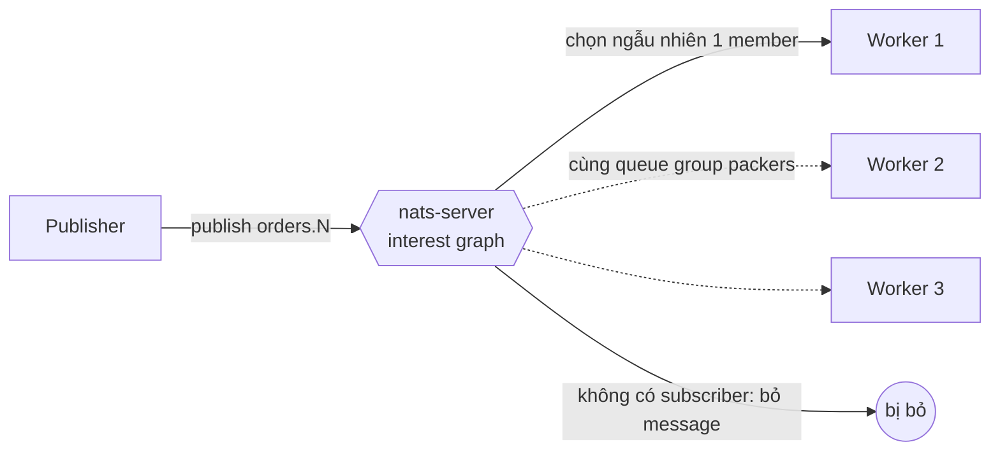
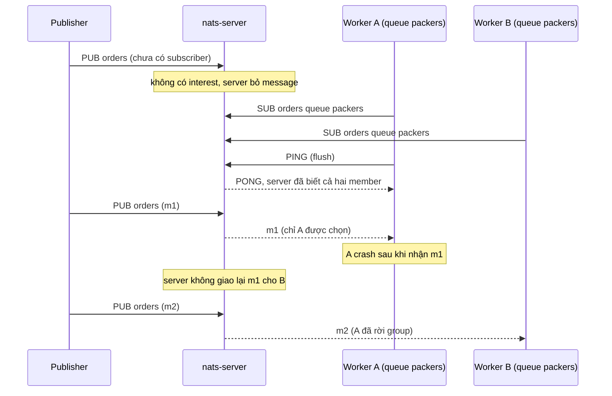

# Lab 01 - Core NATS: queue group và at-most-once

## Mục tiêu

Dùng core NATS (chưa có JetStream) để chứng minh bằng test hai điều:

- Queue group chia tải: ba member cùng một queue group, publish N message, mỗi message được giao cho đúng một member.
  Tổng số message nhận được bằng N, không message nào trùng, và hợp của ba member là toàn bộ message đã publish.
  Test không assert việc chia đều vì server chọn member ngẫu nhiên.
- Core NATS không lưu message: publish khi chưa có subscriber vẫn thành công nhưng message bị server bỏ.
  Subscriber đến sau không bao giờ thấy các message cũ, chỉ thấy message publish sau khi nó đăng ký.

Lab cần NATS chạy bằng `make up` (nats-server 2.15.0, bật JetStream bằng cờ `-js`, lab này chưa dùng tới).
Lab đọc `NATS_URL` (mặc định `nats://127.0.0.1:4222`).
Mọi subject và tên queue group đều dùng `uniqueName`, nên chạy lại trên server còn dữ liệu cũ không bị ảnh hưởng.
Lý thuyết nằm ở [theory.md](../theory.md).

## Kiến trúc



Đường lỗi: member được chọn chết sau khi nhận message, và subscriber đến muộn.
Core NATS là at-most-once nên cả hai trường hợp đều mất message, không có retry.



## Giao diện

TypeScript (`ts/lab.ts`, `@nats-io/transport-node` 3.4.0):

```ts
openConnection(): Promise<NatsConnection>;
subscribeCollect(nc, subject, queue?): Promise<Receiver>; // Receiver: subscription, received: string[], done
publishAll(nc, subject, bodies): Promise<void>; // publish rồi flush
```

Go (`go/lab.go`, `github.com/nats-io/nats.go` v1.54.0):

```go
Connect() (*nats.Conn, error)
SubscribeCollect(nc, subject, queue string) (*Receiver, error) // queue rỗng là subscriber thường
(*Receiver).Received() []string
PublishAll(nc, subject string, bodies []string) error // publish rồi flush
```

## Các điểm quan trọng

"Subscriber đã sẵn sàng" được làm deterministic bằng flush, không bằng sleep.
`SUB` chỉ được ghi vào buffer của client, nên `subscribeCollect` gọi `flush()` và chỉ return khi server đã trả `PONG`.
Từ lúc đó server đã biết subscriber, nên publish tiếp theo chắc chắn tới nó.
Publish cũng flush, để test kết luận "server đã xử lý xong ba message cũ" trước khi subscriber đến sau xuất hiện.

Test queue group dùng ba connection riêng cho ba member, giống ba process thật.
Test chờ tới khi tổng số message đạt N, rồi `drain` từng subscription: drain chờ client xử lý hết message còn trong buffer, nên một bản giao trùng đến muộn sẽ lộ ra thay vì lọt qua.
Chạy thử bỏ tên queue group thì tổng là 3N (mỗi subscriber thường nhận một bản), đó là lý do test kiểm tra tổng chứ không chỉ tập hợp.

Test "drops messages" dựa vào thứ tự trên một connection: nếu server giữ lại các message cũ thì chúng đã đến trước `new-1`.
Kết quả mong đợi là danh sách nhận được đúng bằng `["new-1"]`.

Queue group chỉ bảo đảm "không zero và không two" trong lúc member còn sống.
Member được chọn chết sau khi nhận thì message mất và server không giao lại cho member khác, nên đây không phải bảo đảm xử lý đúng một lần.
Lab không mô phỏng member chết (sơ đồ ở trên chỉ minh họa), vì kịch bản đó cần JetStream để cứu: xem lab 02.

## Chạy

```bash
make up
pnpm vitest run 07-nats-jetstream/lab-01-core-queue-group/ts
go test -race ./07-nats-jetstream/lab-01-core-queue-group/go/...
make lab-ts LAB=07-nats-jetstream/lab-01-core-queue-group
make lab-go LAB=07-nats-jetstream/lab-01-core-queue-group
```

## Kết quả mong đợi

Test (cùng tên ở TS và Go, Go dùng CamelCase):

| Test                                              | Chứng minh                                                                                      |
| ------------------------------------------------- | ----------------------------------------------------------------------------------------------- |
| `queue_group_delivers_each_message_to_one_member` | 60 message, 3 member: tổng 60, không trùng, hợp của ba member là toàn bộ, không assert chia đều |
| `core_nats_drops_messages_when_no_subscriber`     | Publish khi chưa có subscriber bị bỏ, subscriber đến sau chỉ nhận message mới                   |

Không test nào dùng sleep cố định: test chờ bằng `flush`, `eventually` và `drain`.
Demo in số message của từng worker (con số khác nhau mỗi lần chạy, ví dụ 11, 8, 11) và danh sách mà subscriber đến sau nhận được.

## Bài tập mở rộng

1. Thêm một subscriber thường (không queue) trên cùng subject và xác nhận nó nhận cả N message trong khi queue group vẫn chia nhau N message.
2. Thêm group thứ hai với tên khác và xác nhận mỗi group nhận đủ N message (gõ sai tên group tạo ra group thứ hai).
3. Đóng connection của một member giữa chừng và xác nhận các message sau đó chỉ về hai member còn lại.
4. Dùng `request` tới subject không có subscriber và quan sát lỗi no responders khác với timeout.
