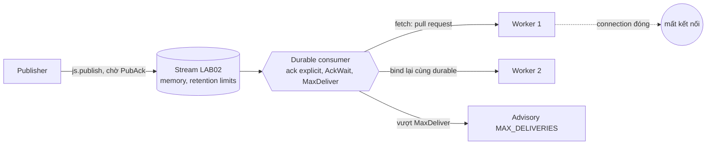
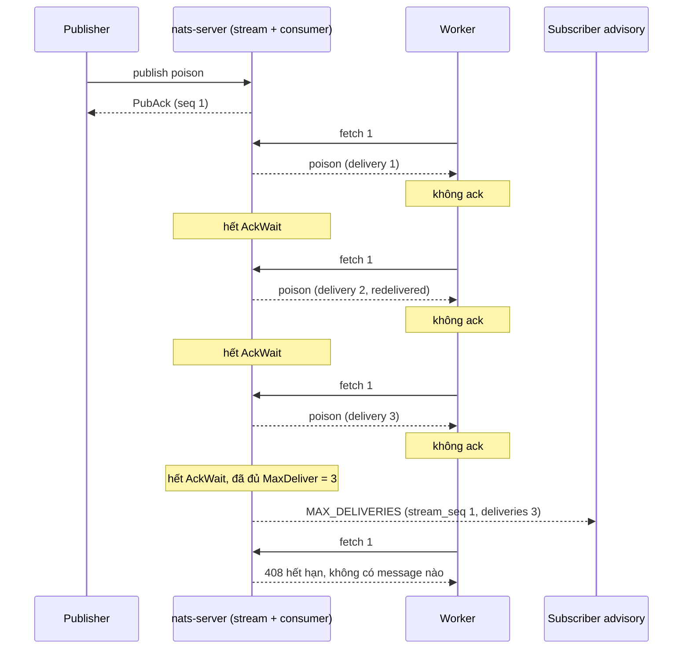

# Lab 02 - JetStream durable consumer: ack, AckWait và MaxDeliver

## Mục tiêu

Tạo một stream JetStream (storage memory) và một durable pull consumer với ack explicit, rồi chứng minh bằng test:

- Durable consumer resume sau khi mất kết nối: stream có N message, consumer nhận K message và ack, connection bị đóng, một connection mới bind vào cùng durable và nhận đúng N-K message còn lại, không nhận lại message đã ack.
- Message không ack được giao lại sau AckWait: worker nhận message mà không ack, hết AckWait thì server giao lại với delivery count 2 (`redelivered` là true).
- Message dừng được giao sau MaxDeliver: với `maxDeliver = 3`, handler thấy đúng 3 lần giao, sau đó server ngừng giao và phát advisory `MAX_DELIVERIES`.
- Ngoài đề bài (thêm vào): `maxDeliver` lớn hơn số lần thử thì không dừng sớm, fetch trên stream rỗng trả về rỗng trong thời gian có hạn, và `ackWaitMs` hoặc `maxDeliver` không hợp lệ bị từ chối rõ ràng.

Lab cần NATS chạy bằng `make up` (nats-server 2.15.0 với `-js`).
Lab đọc `NATS_URL` (mặc định `nats://127.0.0.1:4222`).
Stream, subject và durable consumer của mỗi test đều lấy từ `uniqueName`, và được xóa khi test kết thúc, kể cả khi test fail.
Lý thuyết nằm ở [theory.md](../theory.md).

## Kiến trúc



Đường lỗi: worker không ack, server giao lại cho tới khi chạm MaxDeliver rồi bỏ message khỏi consumer.
Message vẫn nằm trong stream, chỉ consumer này thôi không giao nữa.



## Giao diện

TypeScript (`ts/lab.ts`, `@nats-io/transport-node` 3.4.0 và `@nats-io/jetstream` 3.4.0):

```ts
createStreamAndConsumer(name, { ackWaitMs, maxDeliver }): Promise<Consumer>; // stream memory + durable pull consumer, ack explicit
bindConsumer(name): Promise<Consumer>; // connection mới, cùng durable
disconnect(name): Promise<void>; // đóng đột ngột mọi connection của name
publishMessages(name, bodies); fetchMessages(consumer, max, expiresMs); consumerInfo(name);
watchMaxDeliveries(name): Promise<{ advisories; flush() }>; teardown(name);
```

Go (`go/lab.go`, `github.com/nats-io/nats.go` v1.54.0, package `jetstream`):

```go
CreateStreamAndConsumer(ctx, name string, opts Options{AckWait, MaxDeliver}) (jetstream.Consumer, error)
BindConsumer(ctx, name) (jetstream.Consumer, error); Disconnect(name)
PublishMessages(ctx, name, bodies); FetchMessages(cons, max, expires); ConsumerInfo(ctx, name)
WatchMaxDeliveries(name) (*MaxDeliveriesWatch, error) // Advisories(), Flush()
Teardown(ctx, name) error
```

## Các điểm quan trọng

Hình dạng API của hai client khác nhau và đã được kiểm tra trên bản cài thật:

- TypeScript: `jsm.consumers.add` rồi `js.consumers.get(stream, durable)`.
  `ConsumerAPI` của 3.4.0 có `add` và `update` nhưng không có `createOrUpdate`.
  Config dùng key snake_case như JSON của server (`ack_wait`, `max_deliver`), kiểu `Nanos` nên đổi bằng `nanos(ms)`.
- Go: `js.CreateOrUpdateConsumer(ctx, stream, jetstream.ConsumerConfig{...})`, `AckWait` là `time.Duration`.
- Tên package TypeScript là `@nats-io/transport-node` và `@nats-io/jetstream`, không phải package `nats` cũ đã bị deprecate.

Chữ ký `createStreamAndConsumer(name, opts)` không nhận connection, nên lab giữ connection theo `name` trong một Map (TypeScript) hoặc map có mutex (Go).
`disconnect(name)` đóng chúng đột ngột, `teardown(name)` đóng hết rồi xóa stream bằng một connection mới nên chịu được stream chưa tạo xong.
Teardown chạy hết các bước dù một bước ném lỗi, rồi mới ném lỗi đầu tiên.

Ngưỡng và giá trị mặc định đã đo trên nats-server 2.15.0:

- Server nhận `ack_wait = 0` và im lặng đổi thành 30000000000 ns (30 giây), nhận `ack_wait = 1` ms.
- Server nhận `max_deliver = 0` hoặc `-2` và im lặng đổi thành -1 (không giới hạn).
- Vì vậy lab từ chối `ackWaitMs` không phải số nguyên dương và `maxDeliver` không phải số nguyên từ 1 trở lên hay -1, trước khi chạm vào server.

Tính deterministic, không sleep:

- Ack được xác nhận bằng `ackAck()` (TypeScript) và `DoubleAck(ctx)` (Go): đây là double ack, chờ server xác nhận đã ghi.
  Nhờ vậy không còn ack nào đang bay khi connection bị đóng.
- Chờ redelivery bằng `eventually` với fetch có hạn 1 giây, và chỉ khẳng định cận dưới của thời gian (80% AckWait, chừa dung sai vì timer của server chạy từ lúc giao).
  Đo trong demo: lần giao lại sau khoảng 1007 đến 1073 ms với AckWait 1000 ms (một lần đo, không phải cam kết).
- Chờ "message đã bị bỏ" bằng advisory chứ không đoán thời gian: `watchMaxDeliveries` subscribe subject `$JS.EVENT.ADVISORY.CONSUMER.MAX_DELIVERIES.<stream>.<consumer>` và flush trước khi publish.
  Advisory đến đúng một lần, khoảng một AckWait sau lần giao thứ ba, vì server chỉ kết luận "đã đủ lần giao" khi AckWait của lần thứ ba hết hạn.
- Sau advisory, test kiểm tra từ cả hai phía: handler thấy đúng `[1, 2, 3]`, một fetch có hạn không nhận gì, và `consumer info` báo `num_ack_pending = 0`, `num_pending = 0`, `delivered.consumer_seq = 3`.

Đo trên 2.15.0 sau khi message vượt MaxDeliver (một message duy nhất, không ack):

- `num_pending = 0`, `num_ack_pending = 0`, `num_redelivered = 1` (đếm message đã bị giao lại, không đếm số lần giao lại), `delivered.stream_seq = 1`, `delivered.consumer_seq = 3`.
- `ack_floor` vẫn là 0: message bị bỏ khỏi pending nhưng ack floor không nhích qua nó, khác với giả thiết ban đầu trong tài liệu nghiên cứu (nguyên nhân chưa xác minh).
- Message vẫn còn trong stream (`messages = 1`), chỉ consumer này không giao nữa.
  Đây là lý do app phải tự lưu message lỗi nếu cần: JetStream không có dead-letter queue sẵn.

Nak: `nak()` giao lại ngay, không chờ AckWait và không theo backoff.
Test `max_deliver_larger_than_attempts_does_not_stop_early` dùng nak để đi nhanh hai lần giao đầu rồi ack ở lần thứ ba, và xác nhận không có advisory và `ack_floor` nhích lên 1.
Subject advisory của nak trên server 2.15.0 là `$JS.EVENT.ADVISORY.CONSUMER.MSG_NAKED` (trang docs reference ghi `MSG_NAK`, source server ghi `MSG_NAKED`), lab không subscribe subject này.

Fetch rỗng là bình thường: stream rỗng thì fetch có `expires` trả về mảng rỗng khi hết hạn (server trả 408) thay vì ném lỗi.
Thư viện TypeScript yêu cầu `expires` tối thiểu 1000 ms, và mọi fetch của lab đều đặt `expires` rõ ràng để không treo theo mặc định 30 giây.

## Chạy

```bash
make up
pnpm vitest run 07-nats-jetstream/lab-02-jetstream-durable/ts
go test -race ./07-nats-jetstream/lab-02-jetstream-durable/go/...
make lab-ts LAB=07-nats-jetstream/lab-02-jetstream-durable
make lab-go LAB=07-nats-jetstream/lab-02-jetstream-durable
```

## Kết quả mong đợi

Test (cùng tên ở TS và Go, Go dùng CamelCase):

| Test                                                          | Chứng minh                                                                                                          |
| ------------------------------------------------------------- | ------------------------------------------------------------------------------------------------------------------- |
| `durable_consumer_resumes_after_reconnect`                    | Nhận 4 trên 10 và ack, đóng connection, bind lại: nhận đúng 6 message còn lại, delivery count 1                     |
| `unacked_message_is_redelivered_after_ack_wait`               | Không ack: giao lại sau AckWait với delivery count 2 và `redelivered` true                                          |
| `message_stops_after_max_deliver`                             | Handler thấy đúng `[1, 2, 3]`, advisory đúng một lần, rồi không giao nữa, `num_ack_pending` và `num_pending` bằng 0 |
| `max_deliver_larger_than_attempts_does_not_stop_early` (thêm) | 3 lần giao trên tối đa 5: không advisory, ack thành công                                                            |
| `fetch_on_empty_stream_returns_nothing_within_bound` (thêm)   | Stream rỗng: fetch trả về rỗng trong thời gian có hạn, không treo                                                   |
| `invalid_ack_wait_and_max_deliver_are_rejected` (thêm)        | `ackWaitMs` 0, âm, NaN và `maxDeliver` 0, -2 bị từ chối kèm thông báo rõ                                            |

Test mất vài giây vì chờ AckWait thật (500 ms đến 1 s mỗi lần giao lại), không có sleep cố định.
Demo in từng bước bằng tiếng Việt: worker 1 và worker 2, lần giao 1 và 2 kèm thời gian, ba lần giao của message độc, advisory và thông tin consumer.

## Bài tập mở rộng

1. Thêm `nak(5000)` (TypeScript) hoặc `NakWithDelay(5*time.Second)` (Go) và xác nhận message chỉ quay lại sau khoảng 5 giây.
2. Đặt `backoff: [nanos(500), nanos(2000)]` thay cho `ack_wait` và đo khoảng cách giữa các lần giao lại.
3. Gọi `m.term()` thay vì để message chạm MaxDeliver và quan sát advisory `MSG_TERMINATED` thay cho `MAX_DELIVERIES`.
4. Viết handler lưu message lỗi vào một stream thứ hai khi nhận advisory `MAX_DELIVERIES` (dead-letter queue do app tự quản lý).
5. Thử `m.working()` (in-progress) để kéo dài AckWait cho job chạy lâu và xác nhận message không bị giao lại.
