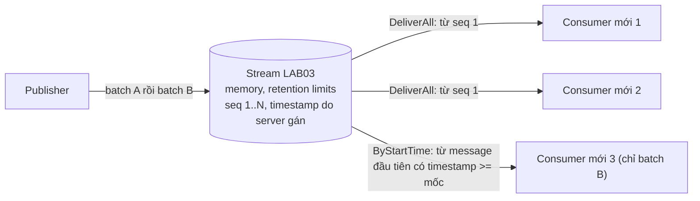
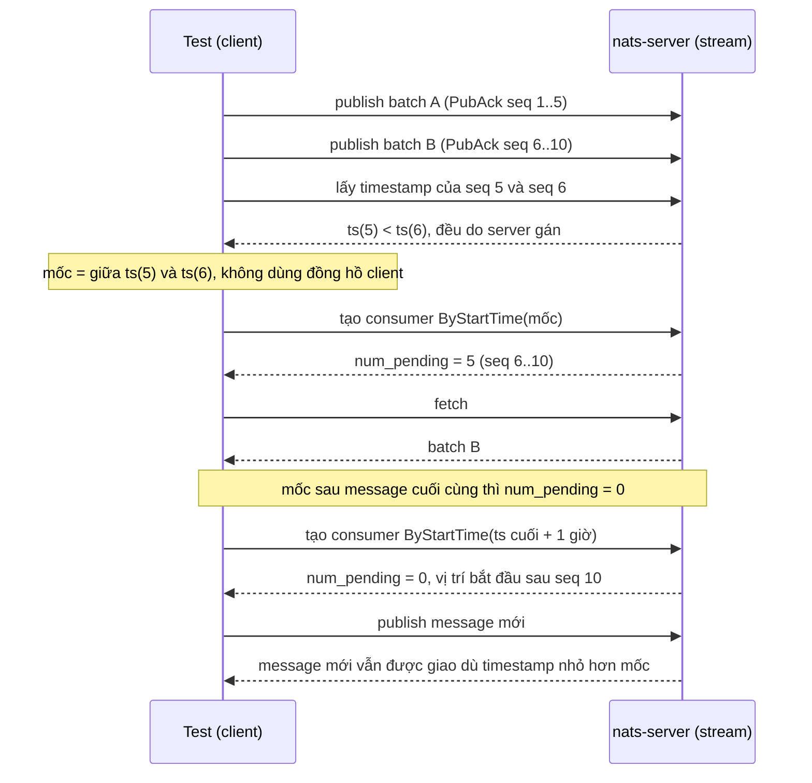

# Lab 03 - JetStream replay: DeliverAll và DeliverByStartTime

## Mục tiêu

Dùng deliver policy của consumer để đọc lại lịch sử của một stream JetStream (storage memory, retention limits), và chứng minh bằng test:

- `DeliverAll` replay toàn bộ lịch sử: publish N message, một consumer MỚI với `DeliverAll` nhận đủ N theo đúng thứ tự, và một consumer mới thứ hai cũng nhận đủ N, vì đọc không xóa message.
- `DeliverByStartTime` bỏ qua message cũ hơn mốc: publish batch A rồi batch B, consumer mới với mốc nằm giữa hai batch chỉ nhận batch B.
  Mốc được tính từ timestamp mà server gán cho message, không từ đồng hồ của client, nên test không phụ thuộc việc đồng hồ của VM Docker lệch với máy chạy test.
- Ngoài đề bài (đo thêm): hành vi khi không message nào có timestamp lớn hơn hoặc bằng mốc, điều mà tài liệu nghiên cứu ghi là chưa xác minh.

Lab cần NATS chạy bằng `make up` (nats-server 2.15.0 với `-js`).
Lab đọc `NATS_URL` (mặc định `nats://127.0.0.1:4222`).
Stream và subject của mỗi test đều lấy từ `uniqueName`, và stream (kéo theo consumer) được xóa khi test kết thúc, kể cả khi test fail.
Lý thuyết nằm ở [theory.md](../theory.md).

## Kiến trúc



Đường lỗi: mốc thời gian sai so với dữ liệu thật.
Mốc nằm sau message cuối cùng thì không có gì để replay, và đồng hồ client lệch đồng hồ server làm mốc rơi sai chỗ.



## Giao diện

TypeScript (`ts/lab.ts`, `@nats-io/transport-node` 3.4.0 và `@nats-io/jetstream` 3.4.0):

```ts
createReplayStream(name); publishBatch(name, bodies): Promise<number[]>; // trả về stream sequence từ PubAck
storedMessageTime(name, seq): Promise<string>; // timestamp server, độ phân giải nanosecond
startTimeBetween(older, newer): string; // mốc thỏa older < mốc <= newer
openReplay(name, { kind: "all" } | { kind: "by_start_time", startTime }): Promise<ReplayReader>; // pendingAtStart, read()
teardown(name);
```

Go (`go/lab.go`, `github.com/nats-io/nats.go` v1.54.0, package `jetstream`):

```go
CreateReplayStream(ctx, name); PublishBatch(ctx, name, bodies) ([]uint64, error)
StoredMessageTime(ctx, name, seq) (time.Time, error); StartTimeBetween(older, newer time.Time) time.Time
OpenReplay(ctx, name, DeliverAll() | DeliverByStartTime(t)) (*Reader, error) // PendingAtStart, Read(ctx)
Teardown(ctx, name) error
```

## Các điểm quan trọng

Deliver policy chỉ áp dụng một lần lúc consumer được tạo và không sửa được (server báo `deliver policy can not be updated`).
Muốn đọc lại từ chỗ khác thì tạo consumer mới, nên lab mở một consumer mới cho mỗi lần replay.
Consumer của replay là ephemeral pull consumer với ack none: replay chỉ đọc nên không cần pending list, AckWait hay redelivery.

Vì sao mốc không lấy từ đồng hồ client:

- Timestamp của message là thời điểm server lưu message, theo đồng hồ của server (trong Docker là đồng hồ của VM).
- Test lấy timestamp của message cuối batch A và message đầu batch B từ stream, rồi chọn mốc nằm giữa (`startTimeBetween`), nên mốc luôn nằm đúng chỗ dù hai đồng hồ lệch nhau.
- Test khẳng định điều kiện tiên quyết `ts(đầu B) > ts(cuối A)` trước khi tiếp tục, thay vì giả định rằng publish sau thì timestamp lớn hơn.
- Dùng timestamp chuỗi gốc của server (nanosecond) chứ không dùng `StoredMsg.time` ở TypeScript, vì `Date` chỉ có độ phân giải mili giây và sẽ làm mốc rơi sai chỗ khi hai batch cách nhau dưới 1 ms.
  Trong lần chạy demo, hai batch cách nhau khoảng 9 ms.

Cách đọc không sleep:

- `pendingAtStart` lấy từ `num_pending` của consumer ngay sau khi tạo: số message consumer sẽ giao.
- `read()` fetch đúng số đó (trả về ngay khi đủ), rồi chạy fetch dò có hạn 1 giây tới khi nhận rỗng.
  Message nào thừa so với `num_pending` sẽ lộ ra trong kết quả thay vì bị bỏ sót, nên test "chỉ batch B" kiểm tra cả hai phía.
- Mỗi `read()` tốn khoảng 1 giây cho fetch dò cuối cùng, đó là thời gian chờ có hạn của giao thức pull, không phải sleep trong test.

Đo trên nats-server 2.15.0 (điều mà tài liệu nghiên cứu ghi là chưa xác minh): khi không message nào có timestamp lớn hơn hoặc bằng mốc, server vẫn tạo consumer, `num_pending` bằng 0 và vị trí đã giao (`delivered.stream_seq`) đặt ở message cuối cùng, tức consumer bắt đầu ở message kế tiếp.
Message publish sau đó được giao dù timestamp của nó nhỏ hơn mốc, nên trường hợp này giống deliver policy `new` chứ không chờ tới khi đồng hồ chạm mốc.
Test `by_start_time_after_last_message_starts_at_next_message` ghim hành vi đã đo này (mốc là timestamp message cuối cộng 1 giờ, cũng lấy từ server), và kiểm tra rằng timestamp của message đến sau thực sự nhỏ hơn mốc.
Đây là hành vi đo được trên 2.15.0 chứ không phải hợp đồng trong tài liệu: quy tắc được tài liệu ghi chỉ là "message đầu tiên có timestamp >= mốc".

## Chạy

```bash
make up
pnpm vitest run 07-nats-jetstream/lab-03-jetstream-replay/ts
go test -race ./07-nats-jetstream/lab-03-jetstream-replay/go/...
make lab-ts LAB=07-nats-jetstream/lab-03-jetstream-replay
make lab-go LAB=07-nats-jetstream/lab-03-jetstream-replay
```

## Kết quả mong đợi

Test (cùng tên ở TS và Go, Go dùng CamelCase):

| Test                                                             | Chứng minh                                                                                           |
| ---------------------------------------------------------------- | ---------------------------------------------------------------------------------------------------- |
| `deliver_all_replays_history`                                    | 8 message: consumer mới thứ nhất và thứ hai đều nhận đủ 8 theo thứ tự, stream sequence 1 đến 8       |
| `deliver_by_start_time_skips_older_messages`                     | Mốc giữa hai batch (từ timestamp server): `pending` 5, consumer chỉ nhận batch mới                   |
| `by_start_time_after_last_message_starts_at_next_message` (thêm) | Mốc sau message cuối: `pending` 0, nhận rỗng, message đến sau vẫn được giao dù timestamp nhỏ hơn mốc |

Không test nào dùng sleep cố định và không test nào so sánh với đồng hồ của client.
Demo in timestamp server của hai batch, mốc được chọn, kết quả của từng consumer và hành vi của mốc sau message cuối cùng.

## Bài tập mở rộng

1. Thêm `DeliverLast` (chỉ message mới nhất rồi tiếp tục live) và `DeliverNew` (chỉ message đến sau khi tạo consumer) và so sánh với kết quả đo ở mốc sau message cuối.
2. Dùng `by_start_sequence` với `opt_start_seq` và xác nhận nó cho kết quả giống `by_start_time` ở bài test.
3. Đặt `max_msgs` nhỏ cho stream, publish nhiều hơn giới hạn rồi replay bằng `DeliverAll`: chỉ thấy phần message còn lại sau khi message cũ bị loại.
4. Tạo consumer `last_per_subject` trên stream có nhiều subject (đây là nền tảng của KV watch) và xem nó chỉ giao message mới nhất của từng subject.
5. Thử đổi deliver policy của consumer đã tạo bằng `consumers.update` và đọc thông báo lỗi của server.
