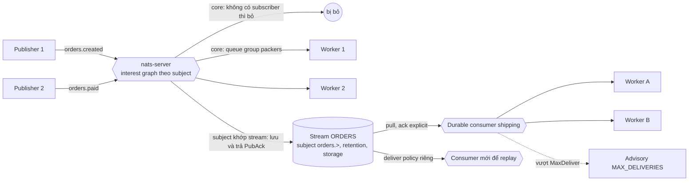
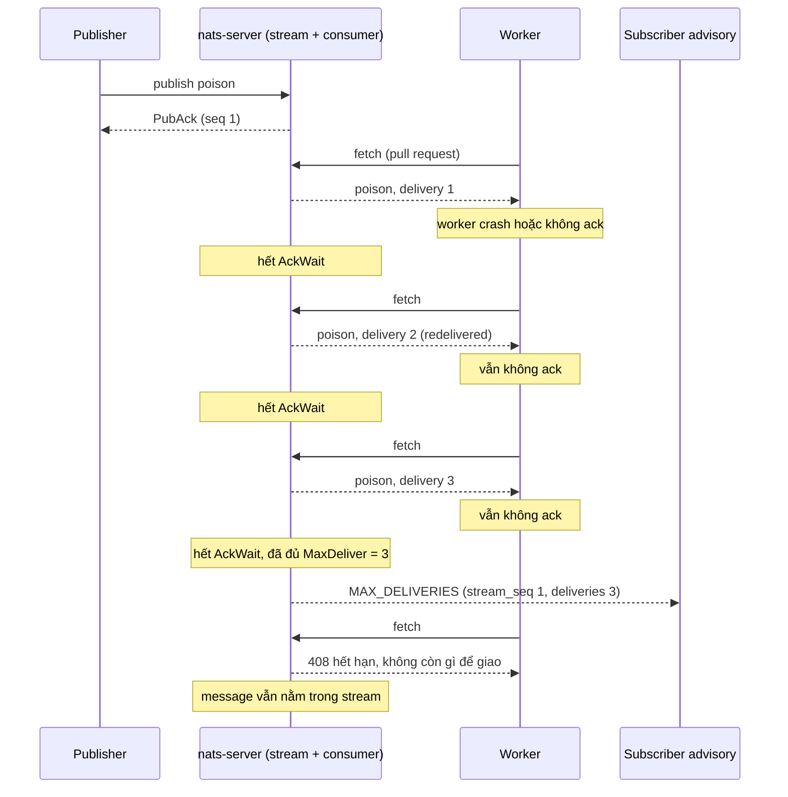
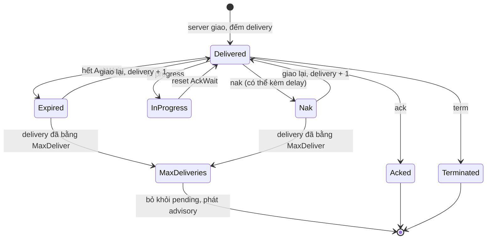

# Chủ đề 07 - NATS và JetStream

NATS là hệ thống messaging xây quanh subject: publisher gửi message tới một subject, server chuyển tới mọi subscriber đang quan tâm subject đó.
Lớp lõi (core NATS) rất nhanh và rất đơn giản, nhưng không lưu gì cả: message không có người nhận thì bị bỏ.
JetStream là lớp persistence chạy trong cùng server, thêm stream để lưu message và consumer để đọc có ack, redelivery và replay.
Khác với RabbitMQ (chương 05) và Kafka (chương 06), cùng một server NATS phục vụ cả hai chế độ: core at-most-once và JetStream at-least-once.

Ba lab đi kèm cần NATS chạy bằng `make up` (nats-server 2.15.0 với cờ `-js`, client `@nats-io/transport-node` và `@nats-io/jetstream` 3.4.0, `github.com/nats-io/nats.go` v1.54.0):

- [Lab 01 - Core NATS: queue group và at-most-once](./lab-01-core-queue-group/README.md)
- [Lab 02 - JetStream durable consumer: ack, AckWait và MaxDeliver](./lab-02-jetstream-durable/README.md)
- [Lab 03 - JetStream replay: DeliverAll và DeliverByStartTime](./lab-03-jetstream-replay/README.md)

## NATS trên một hình

Một subject có thể vừa có subscriber core vừa được một stream bắt: hai đường này độc lập nhau.
Subscriber core chỉ nhận khi đang kết nối, còn stream lưu message cho consumer đọc sau.

## Core NATS: subject, wildcard và pub/sub

Subject là chuỗi các token ngăn cách bởi dấu `.`, phân biệt hoa thường và không được chứa khoảng trắng, tab hay xuống dòng.
Subject bắt đầu bằng `$` dành riêng cho server (`$SYS`, `$JS`, `$KV`, `$O`, `$SRV`), và `_INBOX` dành cho reply subject do client sinh.
Subject không cần khai báo trước: server chỉ giữ entry trong interest graph khi có subscription.

Wildcard chỉ dùng ở phía subscriber:

- `*` khớp đúng một token, không phải không token hay hai token.
- `>` khớp một hoặc nhiều token và phải là token cuối, nên `orders.>.created` bị server từ chối.
- `orders.>` không khớp subject `orders`, và `orders.*.created` không khớp `orders.created`.
- Publish tới `orders.*.created` không báo lỗi mà coi `*` là ký tự literal, tạo ra một subject lạ.

Publish là fire-and-forget: lệnh publish trả về ngay, không chờ subscriber và không cho biết có bao nhiêu subscriber nhận.
Mỗi subscriber khớp subject nhận một bản copy độc lập, và việc fan-out do server thực hiện qua interest graph.
Publish chỉ ghi vào buffer của client rồi gửi ở background, nên client phải `flush` hoặc `drain` trước khi thoát.
Echo bật mặc định: một connection vừa publish vừa subscribe cùng subject sẽ nhận lại message của chính nó.
Subscriber chậm bị server ngắt với log `Slow Consumer Detected`, và `max_payload` mặc định là 1 MB (1048576 byte).

### At-most-once: không subscriber thì message bị bỏ

Publish vào subject không có subscriber vẫn thành công và message bị server bỏ: không lỗi, không backlog.
Publisher không phân biệt được "giao cho ba subscriber" với "giao cho không ai".
Core NATS là at-most-once: subscriber đang kết nối và quan tâm lúc publish nhận một lần, subscriber vắng mặt, chậm hay mất kết nối lúc đó nhận không lần nào, không retry và không dedup.
Lab 01 chứng minh: ba message publish trước khi có subscriber không bao giờ tới subscriber đến sau, chỉ message publish sau khi nó đăng ký mới tới.

Để test deterministic mà không sleep, lab dùng `flush`: lệnh `SUB` chỉ nằm trong buffer của client cho tới khi `flush` nhận được `PONG`, nên chỉ sau `flush` mới chắc chắn server đã biết subscriber.

### Request/reply

Request/reply dùng reply subject tạm dưới prefix `_INBOX.`: client subscribe một wildcard `_INBOX.<connection>.*` một lần cho cả connection, và mỗi request thêm một token riêng ở cuối.
Mỗi request phải có timeout, hết timeout mà không có reply thì trả lỗi và core NATS không giao câu trả lời trễ.
Request tới subject không có subscriber nhận ngay reply status `503` ("no responders"), nên client báo lỗi khác với timeout, nhưng client cần hỗ trợ header để nhận tín hiệu này.
Lab không có phần request/reply (nêu theo tài liệu, chưa chạy trong lab).

### Queue group

Queue group là tập subscriber cùng subject và cùng tên group: với mỗi message server chọn đúng một member và chỉ giao cho member đó.
Server chọn ngẫu nhiên chứ không round-robin, nên số message mỗi member có thể lệch nhau.
Lab 01 đo ba member nhận 11, 8 và 11 message trên 30 message, và test không assert việc chia đều.
Membership động, không cần cấu hình server.

Queue group bảo đảm "không zero và không two" trong phạm vi một group khi member còn sống, và đó vẫn là at-most-once.
Nếu member được chọn chết sau khi nhận thì message mất và server không giao lại cho member khác.
Vì vậy queue group là cách chia tải, không phải bảo đảm xử lý đúng một lần: việc không được mất phải dùng JetStream.

Các điểm cần nhớ:

- Nhiều group khác tên trên cùng subject mỗi group nhận một bản copy, và subscriber thường (không queue) vẫn nhận mọi message.
- Group chỉ chia tải sau khi subject đã khớp, nên gõ sai tên group (`packers` và `packer`) tạo ra group thứ hai và mỗi message bị xử lý hai lần.
- Lab 01 thử bỏ tên queue group thì ba subscriber thường nhận tổng cộng 3N message thay vì N.

## JetStream: stream

Stream là một log message có tên, bắt một hoặc nhiều subject: khi publish tới subject khớp, server lưu message vào stream rồi trả `PubAck`.
`PubAck` gồm tên stream, sequence (bắt đầu từ 1 và chỉ tăng) và cờ `duplicate`.
`PubAck` là bằng chứng duy nhất rằng message đã được lưu, nhưng không chứng minh có consumer nào đã nhận.
Subject không có stream nào bắt thì publish JetStream lỗi ngay (no responders), còn `nats pub` thường là core publish nên vẫn in `Published N bytes` dù không có stream.
Một subject chỉ thuộc đúng một stream và tên stream không đổi được: muốn subject chồng lấn thì dùng mirror hoặc source.

### Retention policy

Mỗi stream có đúng một retention policy, đặt lúc tạo:

| Policy      | Message bị xóa khi                                                                               | Dùng cho                                      |
| ----------- | ------------------------------------------------------------------------------------------------ | --------------------------------------------- |
| `limits`    | Chạm `MaxMsgs`, `MaxBytes` hoặc `MaxAge` (mặc định, ack không xóa message)                       | Lịch sử và replay (các lab dùng policy này)   |
| `interest`  | Mọi consumer có filter khớp đã ack, và subject không có consumer quan tâm thì message bị bỏ ngay | Message chỉ có giá trị khi có người đang đọc  |
| `workqueue` | Ack đầu tiên, cho tất cả                                                                         | Hàng đợi công việc, mỗi message một lần xử lý |

Limits vẫn áp dụng cho cả ba policy như một backstop khi consumer chậm.
Chỉ đổi được `limits` và `interest` qua lại trên stream đang chạy, còn đổi từ hoặc sang `workqueue` bị từ chối.
Stream `workqueue` từ chối consumer chồng lấn: consumer thứ hai không filter báo `multiple non-filtered consumers not allowed on workqueue stream`, nên muốn scale thì nhiều worker dùng chung một consumer.
Với `interest`, một consumer bị kẹt giữ lại mọi message nó chưa ack nên stream phình tới giới hạn, vì vậy vẫn phải đặt limits.

### Storage, discard và durability

- Storage `file` ghi xuống đĩa và sống sót qua server restart, còn `memory` chỉ ở RAM và mất khi restart.
  Lab dùng `memory` cho nhanh và vì stream bị xóa ngay sau test.
- Storage và retention cố định lúc tạo: đổi storage báo `stream configuration update can not change storage type`.
- Discard `old` (mặc định) xóa message cũ nhất khi chạm limit, còn `new` từ chối publish mới.
- Persist mode mặc định flush xuống storage rồi mới trả `PubAck`, còn `async` trả `PubAck` trước và flush nền, nên có thể mất message đã báo ack khi crash (chỉ nhận cho file storage với một replica).
- File storage không sync mọi lần ghi xuống đĩa ngay mà gom theo `sync_interval` (mặc định 2 phút), nên một ghi đã có `PubAck` vẫn có thể mất khi OS crash.
  Đặt `sync_interval: always` thì mỗi ghi được sync trước khi leader trả `PubAck`, đổi lại ghi chậm nhất.

### Dedup bằng Nats-Msg-Id

Server từ chối lưu hai lần cùng header `Nats-Msg-Id` trong duplicate window của stream, mặc định 2 phút.
Publish lặp trả `PubAck` với sequence ban đầu và `duplicate: true`, còn retry sau hơn 2 phút sẽ lưu bản thứ hai.
Cửa sổ dedup là cấu hình của stream chứ không phải header.
Nên dùng `Nats-Msg-Id` mà producer tính lại được, như order id, request id hoặc hash payload.
Timeout khi publish nghĩa là không có xác nhận chứ không có nghĩa là chưa ghi, nên retry cần `Nats-Msg-Id` ổn định.
Dedup chỉ bảo vệ phía publish, nên consumer vẫn cần idempotent.
Lab không có test cho dedup (nêu theo tài liệu, chưa chạy trong lab).

## JetStream: consumer

Consumer là object phía server (một cursor trên stream), không phải một phần của app.
Vị trí đọc nằm trên server, nên client ngắt kết nối rồi nối lại mà không mất chỗ.

### Push, pull, durable và ephemeral

- Push consumer: server chủ động đẩy message tới một deliver subject.
- Pull consumer: client chủ động xin message, và đây là kiểu các lab dùng.
  `fetch` xin một batch tối đa N message và trả về khi batch đầy hoặc hết `expires`, còn `consume` tạo luồng liên tục và thư viện tự gửi pull request ở background.
  Một pull request có `batch` (số message tối đa) và `expires` (thời gian server giữ request chờ message).
- Durable consumer có tên cố định và lưu vị trí gắn với tên đó.
  Bind lại cùng tên sau khi mất kết nối hoặc server restart thì đọc tiếp từ vị trí đã lưu.
  Durable không bị tự dọn trừ khi đặt `InactiveThreshold`.
- Ephemeral consumer (không có durable name) không giữ vị trí để quay lại: nó bị xóa khi idle, và nối lại thì phải tạo mới.
  Doc comment của nats.go v1.54.0 ghi `InactiveThreshold` mặc định của server là 5 giây cho consumer chỉ đặt `Name`, và lab 03 đặt tường minh 60 giây.

Fetch rỗng là bình thường: hết `expires` mà không có message thì server trả `408` (hoặc `404 No Messages` với no-wait), và worker không được coi đó là lỗi.
Lab 02 đo stream rỗng: fetch với `expires` 1 giây trả về mảng rỗng khoảng 1 giây sau, không treo và không ném lỗi.
Hãy luôn đặt `expires` tường minh: mặc định của thư viện là khoảng 30 giây, và thư viện TypeScript đòi tối thiểu 1000 ms.

### Ack policy

| Ack policy | Ý nghĩa                                                                                                                     |
| ---------- | --------------------------------------------------------------------------------------------------------------------------- |
| `explicit` | Ack từng message, có pending list, AckWait và redelivery (lab 02 dùng)                                                      |
| `none`     | Không cần ack, không có pending list, AckWait hay redelivery (lab 03 dùng vì chỉ đọc)                                       |
| `all`      | Một ack xác nhận cả các message trước đó: chỉ hợp với xử lý tuần tự, vì ack message 10 cũng xóa message 7 đang chờ giao lại |

Có giá trị thứ tư là `flow_control`, dành cho push consumer nội bộ của mirror và source.

Với `explicit`, client trả lời message bằng một trong bốn cách:

- `ack`: xong, không giao lại.
- `nak`: thất bại, giao lại ngay hoặc sau một delay do client chọn.
- `term`: không bao giờ giao lại message này nữa.
- `in progress` (`working`): reset timer AckWait, đây không phải câu trả lời cuối.

Ack thường là fire-and-forget, và nếu ack bị mất thì hết AckWait message bị giao lại.
Double ack (`ackAck()` ở TypeScript, `DoubleAck(ctx)` ở Go) chờ server xác nhận đã ghi ack, tốn thêm một round trip.
Lab 02 dùng double ack để chắc chắn không còn ack nào đang bay khi connection bị đóng.

### AckWait, MaxDeliver, MaxAckPending và backoff

- AckWait: mỗi message gửi cho consumer `explicit` nằm ở trạng thái in flight cho tới khi client trả lời, và server chạy một timer.
  Mặc định là 30 giây, hết timer mà không có ack, nak hay in-progress thì server coi worker đã chết và giao lại cho cùng worker hoặc worker khác trên cùng consumer.
  Redelivery là cơ chế giống nhau cho mọi consumer, kể cả pull consumer.
- MaxDeliver: số lần giao tối đa, mặc định `-1` (không giới hạn), nên message không ack có thể bị giao lại mãi mãi.
  Khi một message vượt MaxDeliver, server xóa nó khỏi pending list của consumer và không bao giờ giao lại cho consumer đó.
  Message vẫn nằm trong stream và JetStream không có dead-letter queue tích hợp sẵn.
- MaxAckPending: số message tối đa đang chờ ack mà consumer giao ra trước khi dừng chờ, mặc định 1000 (`-1` là không giới hạn).
  Giới hạn này dùng chung cho mọi worker của consumer chứ không phải mỗi worker, nên đặt thấp hơn số worker hay batch size sẽ làm worker nhàn rỗi.
- Backoff: danh sách delay theo từng lần giao, và nếu danh sách ngắn hơn MaxDeliver thì dùng lại phần tử cuối.
  Đặt backoff sẽ thay thế AckWait: phần tử đầu tiên vừa là delay trước lần giao lại đầu tiên vừa là ack deadline của lần giao đầu.
  Backoff chỉ định hình các lần giao lại do hết AckWait, còn nak trần vẫn giao lại ngay, nên muốn trì hoãn thì phải nak kèm delay.

Redelivery không giữ thứ tự stream: consumer có nhiều message in flight cùng lúc nên bản giao lại có thể đến sau các message có sequence cao hơn.
Muốn đúng thứ tự phải đặt `MaxAckPending = 1`, đổi lại mất song song (nêu theo tài liệu, chưa chạy trong lab).

### Sơ đồ: không ack, AckWait hết hạn, MaxDeliver vượt quá

### Sơ đồ: vòng đời một message trong consumer

Những gì lab 02 đo trên nats-server 2.15.0 (mỗi bullet là một lần đo, không phải cam kết):

- Giao lại sau AckWait: với AckWait 1 giây, lần giao lại có delivery count 2, cờ `redelivered` là true và đến sau khoảng 1,0 đến 1,07 giây.
- Vượt MaxDeliver: với `maxDeliver = 3` và AckWait 1 giây, ba lần giao đến lúc khoảng 0,01, 1,02 và 2,02 giây, còn advisory đến lúc khoảng 3,03 giây.
  Nghĩa là server chỉ kết luận "đã đủ lần giao" khi AckWait của lần giao cuối hết hạn.
- Advisory `MAX_DELIVERIES` đến đúng một lần, kèm `stream_seq` và `deliveries`.
- Sau đó consumer info báo `num_ack_pending = 0`, `num_pending = 0`, `delivered.consumer_seq = 3` và `num_redelivered = 1` (đếm số message bị giao lại, không đếm số lần giao lại).
- `ack_floor` vẫn là 0: message bị bỏ khỏi pending nhưng ack floor không nhích qua nó, khác với giả thiết đọc từ source ban đầu (nguyên nhân chưa xác minh).
- `maxDeliver` lớn hơn số lần thử thì không dừng sớm: với `maxDeliver = 5`, hai nak rồi ack ở lần giao thứ ba cho kết quả không có advisory và `ack_floor` lên 1.
- Server nhận `ack_wait = 0` và im lặng đổi thành 30 giây, nhận `max_deliver = 0` hoặc `-2` và im lặng đổi thành `-1`, nên lab từ chối các giá trị đó ở phía client.

Các advisory liên quan:

- `$JS.EVENT.ADVISORY.CONSUMER.MAX_DELIVERIES.<stream>.<consumer>` (type `io.nats.jetstream.advisory.v1.max_deliver`) khi message vượt MaxDeliver.
  App phải subscribe advisory này mới biết message bị bỏ.
- `$JS.EVENT.ADVISORY.CONSUMER.MSG_TERMINATED.<stream>.<consumer>` khi client `term`, kèm `reason` tùy chọn.
- Nak advisory: trang docs reference ghi `MSG_NAK`, còn source server v2.15.0 dùng hằng số `MSG_NAKED`.
  Hai nguồn không khớp, và lab chưa subscribe subject này nên chưa xác minh bằng đo thực tế: hãy dùng `MSG_NAKED` hoặc wildcard `$JS.EVENT.ADVISORY.CONSUMER.>`.

Poison message cần xử lý có chủ đích: gọi `term` khi chắc chắn không bao giờ thành công, đặt MaxDeliver hữu hạn kèm backoff, và subscribe advisory để tự lưu message lỗi vào một stream dead-letter do app quản lý.

### Deliver policy

Deliver policy chọn một lần lúc tạo consumer và không sửa được (server báo `deliver policy can not be updated`):

| Deliver policy      | Điểm bắt đầu                                                   |
| ------------------- | -------------------------------------------------------------- |
| `all`               | Từ message đầu tiên của stream (mặc định)                      |
| `last`              | Từ message mới nhất rồi tiếp tục live                          |
| `new`               | Chỉ message đến sau khi tạo consumer                           |
| `by_start_sequence` | Từ sequence `opt_start_seq`                                    |
| `by_start_time`     | Từ message đầu tiên có timestamp >= `opt_start_time`           |
| `last_per_subject`  | Message mới nhất của từng subject khớp (nền tảng của KV watch) |

Ack policy và replay policy cũng cố định khi tạo consumer, và tạo lại consumer thì mất vị trí đã lưu.
Deliver policy chỉ định nghĩa điểm bắt đầu lịch sử: durable tạo bằng `new` vẫn lưu vị trí, nên sau restart đọc tiếp từ vị trí đã lưu (kể cả backlog tích lũy), không nhảy tới live.

Lab 03 đo trên nats-server 2.15.0:

- `DeliverAll` trên consumer mới đọc lại đủ N message theo thứ tự stream, và consumer mới thứ hai cũng đọc đủ N, vì retention `limits` không xóa message khi đọc.
- `DeliverByStartTime` với mốc nằm giữa hai batch chỉ đọc batch sau.
  Timestamp là thời điểm server lưu message, nên lab lấy mốc từ timestamp server (không từ đồng hồ client, vì đồng hồ của VM Docker có thể lệch).
- Điều mà tài liệu nghiên cứu ghi là chưa xác minh: khi không message nào có timestamp >= mốc, server vẫn tạo consumer, `num_pending = 0` và consumer bắt đầu ở message kế tiếp.
  Message publish sau đó vẫn được giao dù timestamp của nó nhỏ hơn mốc, giống `new`.
  Đây là kết quả đo trên 2.15.0, không phải hợp đồng trong tài liệu.

## KV và Object Store

Key-Value bucket là một JetStream stream tên `KV_<bucket>` với subject `$KV.<bucket>.>`: key là token cuối của subject và value là message.
`put` thêm message, `get` đọc message cuối của subject qua direct get (không mở consumer, không có ack), còn `watch` mở một consumer.
History là `Maximum Per Subject` của stream, discard policy là `new` nên khi chạm limit thì ghi mới bị từ chối.
Purge dùng rollup, compare-and-swap (`update` theo revision) tránh mất ghi khi đồng thời, và có TTL theo key hoặc theo bucket.

Object Store bucket là stream `OBJ_<bucket>` với hai không gian subject: `$O.<bucket>.C.>` chứa chunk và `$O.<bucket>.M.>` chứa một `ObjectInfo` metadata cho mỗi object, kèm digest SHA-256.
Mỗi lần put, metadata mang header `Nats-Rollup: sub` nên chỉ giữ metadata mới nhất, không có lịch sử phiên bản như KV.
Cả hai chỉ là lớp tiện ích trên stream và consumer, nên mọi quy tắc ở trên áp dụng.
Lab không có phần KV hay Object Store (nêu theo tài liệu, chưa chạy trong lab).

## Replication và clustering cơ bản

Stream mặc định `Replicas: 1` (R=1) và không chịu được mất node.
R=3 là mức tối thiểu cho production và chịu được mất một server vì còn đa số (2 trên 3), còn R=5 là tối đa và chịu được mất hai server.
Các replica thống nhất thứ tự message bằng Raft: mọi ghi đi qua stream leader và `PubAck` chỉ trả khi đa số replica đã lưu, nên `PubAck` trên stream R=3 là cam kết durability.
Khi leader chết, replica còn lại tự bầu leader mới, ghi tạm dừng trong lúc bầu rồi tiếp tục, và không mất message đã có `PubAck`.
Message đang trên đường chưa tới đa số thì mất, nên client phải retry kèm `Nats-Msg-Id`.
Mất đa số (ví dụ hai trên ba server chết) thì không bầu được leader và ghi bị chặn.

Một số điểm khác:

- Consumer cũng được replicate: mặc định kế thừa số replica của stream, trên stream `limits` có thể đặt ít hơn nhưng không nhiều hơn, còn trên stream `interest` và `workqueue` phải bằng stream.
- Replica không tăng throughput vì ghi vẫn qua một leader và consumer cũng có một leader: muốn scale phải thêm worker dùng chung consumer hoặc tách subject sang nhiều stream.
- R=3 tốn xấp xỉ gấp ba lưu trữ và lưu lượng ghi so với R=1.
- Storage `memory` với R=3 sống sót khi một server crash nhưng mất hết khi cả group restart cùng lúc.
- Quorum commit bảo vệ khỏi mất server, không bảo vệ khỏi mất đĩa.
- Route là kết nối server-với-server trên route port riêng (ví dụ 6222, khác client port 4222), explicit route do cấu hình `routes` còn implicit route do server tự mở sau khi gossip qua INFO.
  Mỗi server chỉ cần một seed address, và gossip dựng full mesh.

Lab chạy một server đơn nên stream chỉ có thể R=1, và không minh họa được R=3 hay failover leader (nhận xét về lab, cần dựng cluster ba node mới thử được).
Từ server 2.15 mỗi stream mặc định giới hạn 1000 consumer nếu không đặt `max_consumers`, giới hạn này chỉ chặn tạo consumer mới chứ không xóa consumer cũ.

## So sánh

### Core NATS và JetStream

| Tiêu chí         | Core NATS                                          | JetStream                                                      |
| ---------------- | -------------------------------------------------- | -------------------------------------------------------------- |
| Lưu message      | Không, không có subscriber thì bị bỏ               | Có, trong stream theo retention policy                         |
| Đảm bảo giao     | At-most-once                                       | At-least-once với ack explicit, dedup phía publish có giới hạn |
| Xác nhận publish | Không (fire-and-forget)                            | `PubAck` có sequence                                           |
| Đọc lại          | Không                                              | Có, tạo consumer mới với deliver policy phù hợp (lab 03)       |
| Chia tải         | Queue group, server chọn ngẫu nhiên (lab 01)       | Nhiều worker dùng chung một consumer                           |
| Redelivery       | Không                                              | AckWait, nak, MaxDeliver, advisory (lab 02)                    |
| Chi phí vận hành | Thấp, không có trạng thái                          | Có trạng thái: stream, consumer, storage, replication          |
| Khi chọn         | Request/reply, tín hiệu tạm, dữ liệu mất cũng được | Việc không được mất, replay, nhiều consumer độc lập            |

### NATS JetStream, RabbitMQ và Kafka

Bảng dưới chỉ so sánh những gì đã có trong tài liệu nghiên cứu và hai chương trước, không phải benchmark.

| Tiêu chí             | NATS JetStream                                                | RabbitMQ (chương 05)                        | Kafka (chương 06)                                    |
| -------------------- | ------------------------------------------------------------- | ------------------------------------------- | ---------------------------------------------------- |
| Mô hình              | Stream có subject, consumer là cursor phía server             | Exchange route vào queue, xóa sau ack       | Log chia partition, consumer tự giữ offset           |
| Ai giữ vị trí đọc    | Server (consumer)                                             | Broker (ack, requeue theo từng message)     | Consumer (offset commit theo partition)              |
| Đọc lại              | Consumer mới với deliver policy (`all`, `by_start_time`, ...) | Không đọc lại message đã ack (trừ stream)   | Tua offset hoặc dùng group mới                       |
| Routing              | Subject và wildcard, filter ở consumer                        | Exchange và binding                         | Topic và key hash vào partition                      |
| Retry và dead letter | AckWait, MaxDeliver, backoff, advisory, DLQ tự dựng           | DLX, TTL, delivery limit có sẵn             | Không có sẵn, tự dựng topic retry và dead letter     |
| Mở rộng đọc          | Nhiều worker trên một consumer, giới hạn bởi MaxAckPending    | Nhiều consumer trên một queue               | Nhiều consumer trong group, tối đa bằng số partition |
| Thứ tự               | Theo sequence stream, redelivery có thể đảo thứ tự            | Trong một queue với một consumer            | Trong một partition                                  |
| Đảm bảo giao         | At-least-once (explicit ack), core là at-most-once            | At-least-once với ack và publisher confirms | At-least-once mặc định, exactly-once chỉ trong Kafka |

Chọn dựa trên mô hình: cần một server nhỏ gọn hỗ trợ cả request/reply, pub/sub tạm và stream bền thì NATS hợp, cần routing và retry tinh vi thì RabbitMQ hợp, cần log event thông lượng lớn với nhiều consumer độc lập thì Kafka hợp.

## Lỗi thường gặp

- Dùng core NATS mà tưởng có persistence: subscriber restart xong không thấy message publish lúc nó vắng mặt, và publisher không báo lỗi.
  Hãy dùng stream, publish bằng JetStream và đọc `PubAck` (hoặc `nats pub --jetstream`).
- Retry publish tạo bản trùng: timeout chỉ có nghĩa là mất ack, và retry sau hơn duplicate window cũng tạo bản trùng dù có `Nats-Msg-Id`.
  Hãy gắn `Nats-Msg-Id` ổn định cho mọi publish có thể retry, giữ khoảng retry trong duplicate window và làm consumer idempotent.
- Quên ack hoặc ack sau AckWait: cùng message quay lại mãi vì MaxDeliver mặc định `-1`, hoặc hai worker cùng xử lý một order.
  Hãy luôn ack trên đường thành công, tăng AckWait hoặc gọi in-progress cho job dài, và làm side effect idempotent theo id.
- Poison message bị bỏ im lặng sau MaxDeliver: không có dead-letter queue, và chỉ advisory là dấu vết.
  Hãy `term` khi chắc chắn không thành công, đặt MaxDeliver hữu hạn kèm backoff và subscribe advisory để lưu message lỗi (lab 02).
- Nak trần giao lại ngay, backoff không làm chậm nak: lỗi tạm thời làm message lặp liên tục trong vài mili giây và tốn hết MaxDeliver.
  Hãy dùng nak kèm delay (`nak(10_000)` ở TypeScript, `NakWithDelay(10*time.Second)` ở Go).
- `ack_wait = 0`, `max_deliver = 0` hoặc `-2` bị server im lặng đổi thành mặc định: hãy kiểm tra giá trị ở client như lab 02.
- Redelivery làm đảo thứ tự và `ack all` làm mất message: ack message 10 trong policy `all` cũng xóa message 7 đang chờ giao lại.
  Hãy đặt `MaxAckPending = 1` khi cần đúng thứ tự và dùng `explicit` cho việc không được mất.
- MaxAckPending quá thấp: có mười worker mà chỉ ba message được xử lý cùng lúc, vì giới hạn dùng chung cho cả consumer.
  Hãy đặt lớn hơn hoặc bằng số worker và batch size.
- Coi fetch rỗng là lỗi, hoặc không đặt `expires`: worker báo lỗi khi stream im lặng, hay treo theo mặc định khoảng 30 giây.
- Stream `interest` hoặc `workqueue` phình to hoặc bị từ chối: consumer chậm giữ message, và workqueue cấm consumer chồng lấn.
  Hãy luôn đặt limits làm backstop, và dùng một consumer chung cho nhiều worker.
- Cấu hình cố định lúc tạo bị đổi sau này: storage, persist mode, deliver, ack và replay policy, retention sang hoặc từ workqueue không sửa được.
  Hãy quyết định trước, và nếu sai thì tạo object mới rồi chuyển dữ liệu (mirror hoặc source), nhớ rằng tạo lại consumer mất vị trí đã lưu.
- Kỳ vọng sai về `new` và ephemeral: client restart đọc cả backlog dù consumer tạo với `new` vì durable giữ vị trí, hoặc ephemeral biến mất rồi đọc lại từ đầu.
- Tin `PubAck` bất chấp durability: stream `memory` trống sau restart, file storage chỉ sync theo `sync_interval`, R=1 mất khi mất node.
  Hãy dùng R=3 và file storage cho dữ liệu quan trọng, và không dùng persist mode `async` cho order log.
- Async publish không kiểm tra `PubAck`: mất ghi im lặng, hoặc retry làm đảo thứ tự.
  Hãy kiểm tra mọi `PubAck` và thêm `Nats-Expected-Last-Subject-Sequence` khi thứ tự quan trọng.
- Queue group gõ sai tên, kỳ vọng giao đúng một lần hoặc chia đều: `packers` và `packer` là hai group khác nhau, server chọn ngẫu nhiên, và member chết thì message mất.
- Slow consumer và quên flush khi thoát: pending buffer đầy thì subscriber bị ngắt, và publisher ngắn hạn thoát mà message chưa tới server.
  Hãy gọi `flush` hoặc `drain` trước khi thoát (các lab đều làm vậy).
- Giới hạn mới của server 2.15 và client Go: consumer thứ 1001 trên một stream bị từ chối nếu không đặt `max_consumers`, và nats.go v1.54.0 cần Go từ 1.26 (go.mod của repo là 1.26.0).
- Dùng gói npm `nats` cũ: `npm install nats` cài bản 2.29.x với API khác và đã bị deprecate, hãy dùng `@nats-io/transport-node` và `@nats-io/jetstream`.
- Docs có chỗ không khớp: subscribe nak advisory theo `MSG_NAK` không nhận gì vì source server dùng `MSG_NAKED`.
- Đồng hồ client lệch server khi dùng `by_start_time`: hãy lấy mốc từ timestamp của message trong stream (lab 03) thay vì `Date.now()`.

## Nguồn tham khảo

Phiên bản đã dùng, kiểm tra ngày 2026-10-06: nats-server 2.15.0 (image `nats:2.15.0-alpine`, bản stable mới nhất phát hành 2026-09-17), `@nats-io/transport-node` 3.4.0 và `@nats-io/jetstream` 3.4.0 (phát hành 2026-05-08), `github.com/nats-io/nats.go` v1.54.0 (phát hành 2026-09-18, cần Go từ 1.26).
Các lab đo trực tiếp trên nats-server 2.15.0: queue group chia mỗi message cho đúng một member, core NATS bỏ message khi chưa có subscriber, durable consumer resume sau khi mất kết nối, giao lại sau AckWait, dừng giao sau MaxDeliver kèm advisory và consumer info, deliver policy `all` và `by_start_time`, và hành vi của mốc sau message cuối cùng.
Các phần chưa xác minh hoặc chưa chạy trong lab được nêu rõ trong bài: nguyên nhân `ack_floor` không nhích sau MaxDeliver, subject của nak advisory (`MSG_NAKED` theo source, `MSG_NAK` theo docs), request/reply, dedup bằng `Nats-Msg-Id`, redelivery đảo thứ tự, KV và Object Store, và replication hay failover (cần cluster ba node).

- NATS docs: subject và wildcard, publish/subscribe, request/reply, queue group
  Nguồn: https://docs.nats.io/learn/core-nats/subjects-and-wildcards
  Nguồn: https://docs.nats.io/learn/core-nats/publish-subscribe
  Nguồn: https://docs.nats.io/learn/core-nats/request-reply
  Nguồn: https://docs.nats.io/learn/core-nats/queue-groups
- NATS docs: JetStream acknowledgment, delivery, pull consumer, policies, reading back
  Nguồn: https://docs.nats.io/learn/jetstream/acknowledgment
  Nguồn: https://docs.nats.io/learn/jetstream/delivery-and-acknowledgment
  Nguồn: https://docs.nats.io/learn/jetstream/pull-consumers
  Nguồn: https://docs.nats.io/learn/jetstream/policies
  Nguồn: https://docs.nats.io/learn/jetstream/reading-back
  Nguồn: https://docs.nats.io/learn/jetstream/worker-pool
- NATS docs: JetStream stream, publish, dedup, retention
  Nguồn: https://docs.nats.io/learn/jetstream/your-first-stream
  Nguồn: https://docs.nats.io/learn/jetstream/publishing
  Nguồn: https://docs.nats.io/learn/jetstream/advanced-publishing
  Nguồn: https://docs.nats.io/learn/jetstream/retention-policies
- NATS docs: replication, mất node, clustering
  Nguồn: https://docs.nats.io/learn/jetstream/surviving-node-loss
  Nguồn: https://docs.nats.io/learn/clustering/forming-a-cluster
  Nguồn: https://docs.nats.io/learn/clustering/replication-and-r3
- NATS docs: Key-Value, Object Store, slow consumer
  Nguồn: https://docs.nats.io/learn/key-value
  Nguồn: https://docs.nats.io/learn/key-value/under-the-hood
  Nguồn: https://docs.nats.io/learn/object-store
  Nguồn: https://docs.nats.io/learn/object-store/under-the-hood
  Nguồn: https://docs.nats.io/learn/resilient-clients/slow-consumers
- NATS docs: advisory của JetStream
  Nguồn: https://docs.nats.io/reference/jetstream/advisory/max-deliver
  Nguồn: https://docs.nats.io/reference/jetstream/advisory/nak
  Nguồn: https://docs.nats.io/reference/jetstream/advisory/terminated
- nats-server v2.15.0: release notes và source (consumer, advisory)
  Nguồn: https://github.com/nats-io/nats-server/releases/tag/v2.15.0
  Nguồn: https://github.com/nats-io/nats-server/blob/v2.15.0/server/consumer.go
  Nguồn: https://github.com/nats-io/nats-server/blob/v2.15.0/server/jetstream_api.go
- Docker image `nats:2.15.0-alpine`
  Nguồn: https://hub.docker.com/_/nats
- Client TypeScript: repo nats.js v3, release 3.4.0, npm
  Nguồn: https://github.com/nats-io/nats.js
  Nguồn: https://github.com/nats-io/nats.js/tree/main/jetstream
  Nguồn: https://github.com/nats-io/nats.js/releases/tag/v3.4.0
  Nguồn: https://registry.npmjs.org/@nats-io/transport-node
  Nguồn: https://registry.npmjs.org/@nats-io/jetstream
  Nguồn: https://registry.npmjs.org/nats
- Client Go: nats.go v1.54.0 và package jetstream
  Nguồn: https://github.com/nats-io/nats.go/releases/tag/v1.54.0
  Nguồn: https://github.com/nats-io/nats.go/tree/v1.54.0/jetstream
  Nguồn: https://github.com/nats-io/nats.go/blob/v1.54.0/jetstream/consumer_config.go
  Nguồn: https://github.com/nats-io/nats.go/blob/v1.54.0/jetstream/message.go
  Nguồn: https://pkg.go.dev/github.com/nats-io/nats.go/jetstream
